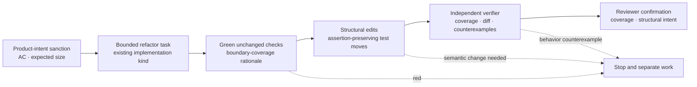

# ADR 0037: Sanctioned structural refactor task class

Status: accepted (2026-07-18; approval exercised by the session lead under the owner's recorded 2026-07-18 delegation — see the VUH-888 thread and run `2026-07-18-close-wave`).

Numbering: 0037 follows 0036, the highest ADR file present when this proposal is
authored. VUH-890 separately investigates the reported numbering drift around 0034.

## Context

The smallest-coherent-change rule keeps ordinary work reviewable, but it has no
sanctioned path for structural work whose safe boundary spans a large module or
several tightly coupled files. Applying the ordinary target mechanically either
leaves architecture debt in place or encourages oversized work with no explicit
guardrails.

Structural refactors use the same write-capable workers and runtime privileges
as implementation tasks. What differs is the planned change shape and the
strength of the evidence needed to show that the larger edit preserves
behavior.

## Decision

Doctrine defines `sanctioned structural refactor` as a planning and change-shape
class over the existing `implementation` task kind. The tracker issue and task
contract authorize the larger coherent boundary before execution; the class
does not create a new routing kind and does not silently waive compiled hard
limits.

The task contract records:

- a tracker issue whose sanction is authored or confirmed by the source bound
  to `product_intent`, plus structural intent and acceptance criteria;
- bounded write scope, affected boundaries, expected file count and
  changed-line range, and the reason a smaller slice is incoherent;
- the exact unchanged test and verification commands that are green before the
  edit and must remain green afterward, plus why they meaningfully exercise
  every affected boundary; and
- an explicit claim that no observable behavior or semantic diff is intended.

The class forbids combining the refactor with behavior changes or semantic test
changes to assertions, fixture contents, or expectations. It permits mechanical
test relocation and import-path updates only when the implementer reports them
separately and the verifier confirms that the test diff contains only relocation
and import-path updates. A failing baseline, changed verification command,
semantic test diff, newly required behavior change, or verifier-found behavior
counterexample fails the refactor until the conflicting work is separated into
its own task.

Independent verification remains mandatory. A distinct verifier reruns the
unchanged commands, confirms the stated boundary-coverage rationale, and looks
for behavior counterexamples. A reviewer confirms the same coverage claim and
signs off that the resulting structure matches the sanctioned intent before
integration. The class never ships a discovered semantic diff as an unintended
change.

The recorded size is an auditable contract expectation, not a claim of current
deterministic runtime enforcement. Exceeding its file count or changed-line
range requires a contract amendment or replan before integration; separately
enforced profile constraints remain in force.

The doctrine document is the normative home. The
`implement-bounded-task` skill carries the worker-facing projection of these
requirements.

## Alternatives considered

1. **Keep the smallest-change rule absolute.** Rejected because some structural
   boundaries cannot be split without intermediate duplication, unstable
   seams, or repeated review cost.
2. **Add `refactor` to the protocol `TaskKind` enum.** Rejected for this
   decision because refactors need implementation capabilities and routing; the
   distinguishing controls are planning, size, and evidence obligations. A
   future runtime schema may encode those obligations without inventing a
   second implementation route.
3. **Allow refactors to include opportunistic behavior fixes.** Rejected because
   changed behavior makes before/after equivalence ambiguous and defeats the
   class's review boundary.
4. **Treat tracker authorization as an unlimited size waiver.** Rejected because
   it would bypass compiled hard limits and turn the escape valve into a blank
   check.

## Consequences

- Necessary structural work has an explicit path without weakening the default
  for ordinary changes.
- Refactor proposals carry more up-front size and baseline evidence than normal
  implementation tasks.
- The current runtime schema does not deterministically validate this
  change-shape class; it remains a documented task-contract obligation until a
  separately scoped enforcement change lands. Until then, the lead and reviewer
  compare the actual diff with the recorded expectation before integration.
- VUH-892 is the first planned execution under this class after owner approval.
  That execution and its before/after evidence are outside VUH-888.
