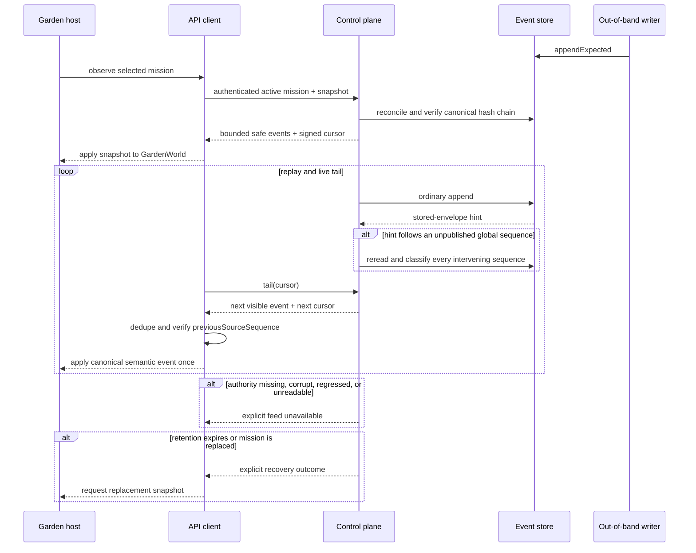

# ADR 0038: Authenticated mission-event snapshot and cursor authority

Status: accepted (VUH-909).

## Context

Garden needs the same semantic mission facts that drive the local control plane,
but `DomainEvent` is an internal additive envelope. Its open `data` object can
contain plan text, worker results, evidence, connector resources, or other fields
that are inappropriate for an app wire boundary. Sending it directly would make
the app a second redaction boundary and would expose provider/runtime details.

The app also needs a bounded current snapshot and deterministic resume. A cursor
based only on an array offset can silently cross mission replacement, while a
client-owned sequence can fork from the hash-chained event store. Raw terminal
bytes, provider streams, transcripts, private prompts, and chain-of-thought are
separate planes and never become mission-feed payloads.

## Decision

The durable event store remains the event and ordering authority. The control
plane builds a schema-v1 read projection from each canonical `StoredEvent` and
exposes only closed Garden-relevant variants. Every projected event preserves
the canonical event, mission, task, worker-run, correlation, causation, profile,
and event-store sequence identities. Its `previousSourceSequence` points to the
previous visible event, so a client detects a missing or reordered visible event
without treating intentionally filtered private events as gaps.

The projection reconstructs each allowed payload from typed fields. It never
copies `DomainEvent.data`. Worker prose and status questions become fixed bounded
summaries. Settlement exposes only its finite result state and up to 100
runner-redacted `artifact://` identifiers; labels, summaries, outputs, and other
worker result fields remain private. Provider names, model names, plan bodies,
runner claims, raw output, credentials, terminal bytes, private prompts, and
chain-of-thought are unrepresentable in the public schemas.

`@clankie/garden-model` owns the semantic interpretation of every visible
worker variant. It accepts leased identity, sanitized summaries, resolved
state and attention, and every finite settlement result directly. The app
adapter performs only the envelope rename from `eventId` to the Garden
projection's `id`; it does not recreate internal event shapes or carry a
second state mapping. Terminal failed, blocked, and offline outcomes therefore
replace working state deterministically.

The feed serializes store-returned append hints with reads of the complete
authoritative log. A contiguous hint advances only when its envelope hash and
previous-hash link extend the reconciled chain. A hint beyond the next global
sequence forces an authoritative read; the feed never skips or classifies the
gap from event names. Discovery, snapshot, and tail-open reads also reconcile
before answering, so an `appendExpected` writer or any future out-of-band writer
cannot leave those surfaces silently stale. Reconciliation verifies the full
hash chain and exact event-id/sequence bindings. Missing, forked, corrupt,
regressed, or unreadable authority fails explicitly with an unavailable feed.
Filtered events still advance the reconciled global watermark without becoming
public records.

The latest canonical `mission.execution.started` event selects the current
mission. The event id is that mission execution's generation. A newer start
replaces the selection; terminal mission events remain visible until that
replacement so Garden can show completed workers. Discovery returns this
selection, and an old mission/generation cursor receives an explicit
`mission_replaced` outcome.

Each mission keeps two bounded structures:

- a 1,024-event retained delivery window for replay/tail;
- a 512-event current snapshot projection that preferentially retains the
  mission start plus each worker's identity and latest state.

Compaction and omitted-event counts are explicit. Falling behind the delivery
floor returns `cursor_expired` with a fresh snapshot cursor; malformed or
tampered cursors return `cursor_invalid`. The control plane signs opaque cursors
with the durable device-session HMAC key under a mission-feed-specific domain.
Cursor signing therefore survives restart, cannot be used to choose a forged
skip position, and rotates with the credential that revokes paired devices.

The HTTP surface is:

```text
GET /v1/missions/active
GET /v1/missions/:missionId/events
GET /v1/missions/:missionId/events/tail?cursor=...
```

It requires the existing paired-device session and current `chat` grant, the
same authorization used for the redacted worker transcript. The control plane
rechecks device liveness and grants during an open tail. A missing durable event
store or cursor-signing key makes the feed unavailable rather than falling back
to process-local state.

`ClankieApiClient` parses the strict schemas, applies the snapshot once, resumes
the NDJSON replay/tail from the opaque cursor, and reconnects from the last
accepted cursor after ordinary transport EOF. It suppresses exact duplicate
delivery and fails closed on a conflicting duplicate, order regression, visible
sequence gap, or mission identity mismatch.



## Options considered

- **Expose `DomainEvent` directly** — rejected because its additive data object
  is not an information boundary and would make every app host a redactor.
- **Create a Garden-owned event model or synchronization database** — rejected
  because it duplicates mission authority and invites drift from the event store
  and `GardenWorld`.
- **Use raw global sequence contiguity** — rejected because filtered private
  events legitimately create global sequence jumps. Linking consecutive visible
  source sequences detects delivery gaps without revealing filtered events.
- **Require every writer to call a feed publication helper** — rejected as the
  sole correctness mechanism because existing optimistic writers and future
  out-of-band append paths can bypass a process-local helper after durably
  consuming a global sequence. Store reconciliation remains the backstop;
  append hints are only a low-latency optimization.
- **Use unsigned offsets or process-random cursors** — rejected because offsets
  can be forged to skip state and process-random cursors cannot resume after a
  restart.
- **Put terminal or transcript payloads in the feed** — rejected because those
  planes have separate retention, authorization, and redaction contracts.

## Consequences

- Garden hosts receive enough provider-neutral semantic identity and lifecycle
  data to inhabit real workers without parsing terminal or provider output.
- Cursor recovery is explicit and deterministic across reconnect, restart,
  retention expiry, and mission replacement.
- Out-of-band canonical writers cannot strand the live projection behind a
  missing global sequence; authority failures surface as unavailable rather
  than stale success.
- Adding a visible event requires a protocol-versioned closed projection and an
  information-boundary review; an internal event is private by default.
- Garden state semantics live in `@clankie/garden-model`; app adapters translate
  only the feed envelope and cannot select which terminal states to understand.
- Very large missions can produce an explicitly compacted snapshot. Tail replay
  remains bounded independently, and a client never silently advances across an
  expired floor.
