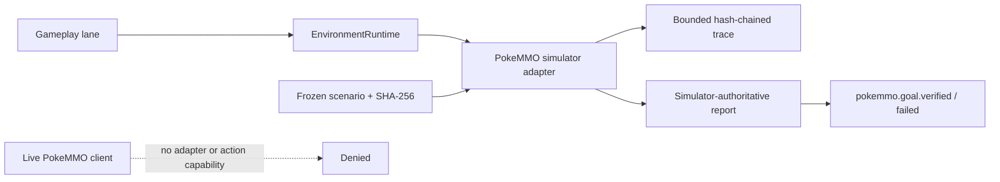

# ADR 0038: Provider-profiled environment contracts and the PokeMMO simulator boundary

Status: accepted.

## Context

The frozen interactive-environment v1 session and lease contracts use generic
names but contain Minecraft-only concepts: server identity, allowed dimensions,
distance from origin, and block-change quotas. Reusing those fields for PokeMMO
would make the provider boundary misleading and leave future adapters free to
reinterpret a limit silently.

PokeMMO also has a materially different policy boundary. Its published
[macroing policy](https://support.pokemmo.com/knowledgebase/article/macroing-faq)
forbids automatic client input and input multiplication. Its
[penalty policy](https://support.pokemmo.com/knowledgebase/article/penalty-policy)
classifies automated control, tampering, restriction bypass, virtualization used
to hide automation, and reverse engineering as cheating. The
[Terms of Service](https://pokemmo.com/en/tos/) govern the account and client
license. A simulator proof cannot create an accidental path to the live client.

## Decision

Session specifications, resource bounds, leases, and durable runtime records use
a strict v2 provider profile. The profile discriminator owns the resource
vocabulary:

- `minecraft_java` retains server, dimension, distance, block, and combat bounds;
- `pokemmo_simulator` owns simulator, allowed-map, navigation, menu, battle-turn,
  duration, and typed simulator-capability bounds; and
- `legacy_v1` preserves non-Minecraft test or private adapters while they migrate.

The boundary dual-reads v1 and v2. It translates a recognized v1 Minecraft
session to `minecraft_java`, translates any other v1 adapter to `legacy_v1`, and
single-writes v2 runtime state. New adapters receive only the normalized v2
shape. Shared action/result/event contracts remain frozen at v1 because their
semantics do not change.

Character state keeps the frozen `minecraft` projection readable and adds a
bounded generic environment-presence projection. New PokeMMO state uses that
projection. Goal replacement selects provider-specific semantic event names and
cancels the active action without relabeling PokeMMO state as Minecraft.

The PokeMMO production capability boundary contains exactly two live concepts:
read-only observation and coaching. It contains no live action capabilities and
there is no live adapter. Keyboard, mouse, controller, accessibility, packet,
memory, process, login, remote connection, client tampering, anti-cheat,
human-timing imitation, CAPTCHA, social, and economy actions fail closed.

The only executable PokeMMO adapter is deterministic and simulator-local:

Raw frames never enter semantic events. Evidence that needs an image uses a
bounded opaque `artifact://` frame reference. Account credentials are invalid
simulator input and never enter fixtures, runtime records, events, or reports.

## Options weighed

- **Reuse the v1 dimensions and block fields with PokeMMO meanings** — rejected
  because one contract field would serve two incompatible providers and old
  history could be reinterpreted silently.
- **Create a PokeMMO-only runtime beside `EnvironmentRuntime`** — rejected
  because it would not prove the shared lease, stale-goal, idempotency,
  cancellation, and emergency-stop architecture.
- **Add a disabled live input adapter** — rejected because dormant code still
  creates an action path and conflicts with the published automation rules.
- **Store screenshots directly in events** — rejected because raw visual data is
  unbounded and belongs on the artifact plane.

## Consequences

- Minecraft v1 inputs remain compatible while newly persisted runtime records
  make their profile explicit.
- PokeMMO resource bounds and commands cannot carry Minecraft-only fields.
- Simulator evidence is deterministic, replayable, bounded, and independent of
  a model's success claim.
- Live coaching remains a policy shape only. Implementing observation requires a
  separate product decision and adapter; implementing input additionally
  requires explicit written PokeMMO authorization and a new reviewed contract.
