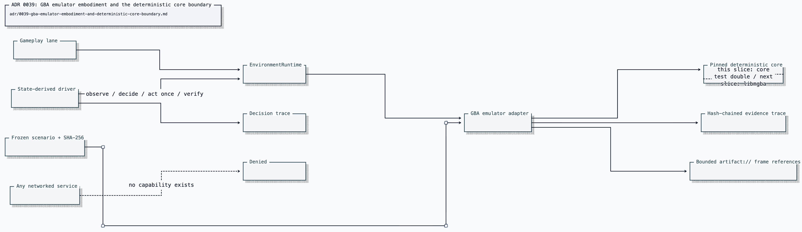

# ADR 0039: GBA emulator embodiment and the deterministic core boundary

Status: accepted. The real-core follow-up described below shipped in
[ADR 0040](0040-real-mgba-core-behind-the-emulator-seam.md).

## Context

At ratification Clankie's embodiment stack had two governed game environments
(Minecraft and a PokeMMO simulator) but no rules-clean target for _real_ input
control. PokeMMO client automation is prohibited by that game's macroing policy, so
the live actuator must land against a game we are permitted to automate: a
locally-emulated Game Boy Advance Pokémon game the operator is legally entitled
to run. The adapter must inherit the environment-runtime governance invariants
rather than growing a private action loop, and the VUH-905 verification
rejection established that a scenario driver must derive decisions from
observed state instead of replaying a script.

## Decision

`gba_emulator` was added as a sibling provider profile in the strict v2
resource-bounds union. Each profile owns its own resource vocabulary.
Its bounds carry the determinism anchors — pinned core identifier, savestate
_identity_ digest, RNG seed — plus per-action input/frame quotas and typed
`emulator.gba.*` capabilities. No Minecraft or PokeMMO field appears in the
emulator contract.

The adapter (`integrations/gba-emulator`) is an `EnvironmentAdapter` dispatched
by `EnvironmentRuntime`. The runtime's generic dispatch branch carries the
command; the adapter parses the strict emulator contract at its boundary and
fails closed on anything malformed, over-limit, ungranted, paused, stopped, or
uncertain. Actions are bounded button press-for-frames, frame advance, and
cancellable wait; observations are strict unions over overworld, menu, party,
battle, dialog, danger, action state, and a bounded `artifact://`
framebuffer/RAM-state reference. Evidence is a bounded hash-chained trace keyed
by RAM-state digests.

The scenario driver is state-derived: `decideNextGbaAction` is a pure function
of the latest observations (route step from observed position, dialog advance,
battle cursor movement toward the strongest observed legal move), every action
flows through `EnvironmentRuntime.startAction`, and each dispatch is verified
by re-observation before the next decision. Uncertain or stale observations
pause the session and fail closed rather than replaying input.

### What this slice does and does not do

This slice drives `DeterministicGbaCoreDouble`, a clearly-labeled **test
double** for the emulator core: test infrastructure, not a product simulator.
It stands in for the pinned real core behind the exact adapter-facing seam the
real core will occupy — button input consuming frames, a typed RAM-derived
state view, and framebuffer/RAM digests — so the adapter, driver, runtime
governance, and frozen-scenario evidence are proven byte-for-byte replayable in
CI without a ROM. No real emulator process, ROM, BIOS, or savestate is
involved yet.

### Real-core integration path (subsequently delivered)

The pinned core becomes headless **mGBA** driven in-process through its
scripting/embedding surface (libmgba bindings), preferred over RetroArch
because mGBA exposes deterministic frame-stepped control without a frontend:

- input injection: set the GBA keypad state for N frames through the core API —
  the same press-for-frames contract `button_press` already models;
- observation: read the framebuffer after each step and decode fixed RAM
  addresses (position, party, battle state) into the existing strict
  observation union; raw frames/RAM stay on the artifact plane as digests and
  bounded references;
- determinism: pinned core build, fixed BIOS-free boot, load from the pinned
  savestate whose bytes hash to the recorded `savestateSha256`, seeded RNG, and
  frame-stepped execution (no wall clock);
- RetroArch/libretro remains the fallback if libmgba embedding proves
  impractical; the adapter seam does not change either way.

ROMs are produced by the operator's own Universal-Randomizer workflow outside
this repository; the adapter receives only local file paths via runner-private
configuration, and ROM/BIOS/savestate bytes never enter model context, events,
fixtures, or artifacts.

## Options weighed

- **Reuse the PokeMMO simulator profile with emulator meanings** — rejected;
  one field must not serve two providers, and the acceptance boundary
  requires emulator-specific bounds.
- **Drive a real emulator core in this slice** — rejected for CI determinism
  and ROM licensing: CI cannot carry game binaries, and the governance/driver
  architecture is provable against a deterministic double behind the same seam.
- **Script the scenario as a fixed input transcript** — rejected; VUH-905's
  verification rejection established transcripts fake autonomy. Decisions must
  be computed from observed state and change when it changes.
- **A dedicated emulator runtime beside `EnvironmentRuntime`** — rejected; it
  would not prove the shared lease, idempotency,
  cancellation, and emergency-stop architecture.
- **RetroArch network command interface for input injection** — rejected for
  the default path; it introduces a local network socket where an in-process
  core API keeps the no-network-I/O boundary trivially provable.

## Consequences

- Clankie gained a legitimate full-input embodiment target without widening the
  separately constrained PokeMMO boundary.
- The emulator contract, adapter, driver, and evidence pipeline were frozen and
  CI-proven before ADR 0040 swapped in the real core without changing the
  adapter surface.
- The capability boundary cannot represent network or live-service tampering,
  and tests assert the integration sources contain no network I/O path.
- Scenario evidence (report, hash-chained event trace, decision trace) is
  deterministic, bounded, and independently re-hashable.
