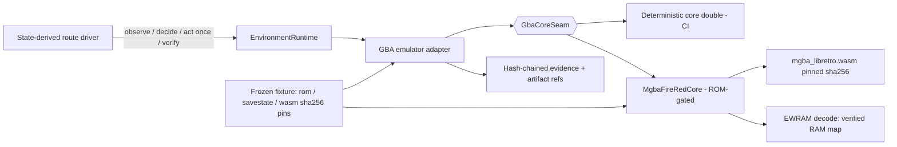

# ADR 0040: Real headless mGBA core behind the emulator seam

Status: accepted.

## Context

ADR 0039 froze the governed GBA emulator surface — adapter, strict contracts,
state-derived driver, hash-chained evidence — proven in CI against a
deterministic core test double behind an explicit adapter-facing seam. This
slice (VUH-913) swaps a **real** emulator core behind that seam so Clankie
drives an actual FireRed ROM end-to-end: real input control against a locally
emulated game the operator is entitled to run, no external service, no game
rules broken. The governed surface must not change; only the core does.

## Decision

### Core: pinned mGBA WASM via the libretro C ABI, in-process

The real core is `romdev-platform-gba@0.11.0` (MPL-2.0), which ships a
prebuilt `mgba_libretro.wasm` + emscripten glue. `MgbaLibretroCore` drives the
libretro ABI directly in-process: `retro_load_game` from ROM bytes,
`retro_run()` per frame, keypad via the input-state callback bitmask, EWRAM
via `retro_get_memory_data(RETRO_MEMORY_SYSTEM_RAM)`, framebuffer (240×160
RGB565) captured in the video-refresh callback, and
`retro_serialize/unserialize` savestates. Single-threaded, frame-stepped, no
timers, no audio device, no sockets — the no-network boundary stays trivially
provable (runtime tripwire + the existing static source scan).

`MgbaFireRedCore` implements the same `GbaCoreSeam` the test double
implements; `GbaEmulatorAdapter` now takes a core factory (defaulting to the
double), so CI runs unchanged without a ROM and the governed dispatch path is
byte-for-byte the same for both cores.

### Determinism anchors and identity pins

The frozen fixture (`integrations/gba-emulator/fixtures/firered-bedroom-route/v1`)
pins SHA-256 digests for the ROM bytes, the pinned savestate bytes, and the
core wasm binary; `MgbaFireRedCore.create` fails closed on any mismatch. ROM
and savestate bytes stay operator-local (env paths `CLANKIE_GBA_ROM_PATH`,
`CLANKIE_GBA_SAVESTATE_PATH`) and never enter the repository, fixtures,
events, or artifacts. The savestate is regenerated deterministically by
`scripts/bootstrap-savestate.ts` — a frozen power-on input schedule that
starts a new game and stops in the player's bedroom; two independent
generations produce byte-identical savestates. Game RNG state comes from the
savestate itself (the fixture's `rngSeed` is a schema anchor, pinned 0);
determinism is proven by running the scenario twice on fresh cores and
requiring byte-identical report, decision trace, and evidence trace.

### RAM map: empirically verified EWRAM fields only

Observed fields are decoded from fixed EWRAM addresses verified by input
differencing against the running ROM (press input → step frames → diff the
256 KB EWRAM snapshot): player tile coords at EWRAM+0x36E48 (two s16, matches
the pokefirered `gObjectEvents[0].currentCoords` layout) and the facing byte
at EWRAM+0x36E58 (1=south, 2=north, 3=west, 4=east). Decoding fails closed on
implausible values. The scenario's tile map itself is empirical: a flood probe
moved the player onto every tile marked walkable; unprobed tiles are blocked.

**EWRAM/IWRAM limitation:** the libretro memory API exposes only EWRAM.
IWRAM (0x03000000) — where FireRed keeps the DMA-protected `gSaveBlock1/2`
pointers — is unreachable, so save-block fields (money, badges, party box
data reached via pointer chase) cannot be decoded through this seam. This
slice therefore observes only fixed-address EWRAM fields, which the bounded
route scenario needs. The path to full address space, in preference order:
patch/rebuild the core to widen `retro_get_memory_data` (mGBA is MPL-2.0 and
the vendor path below already implies rebuildability), or map additional
fixed-address EWRAM mirrors of the needed fields as later scenarios require
them. Party/battle decoding is a later slice on the same seam.

### State-derived routing that adapts to observed collision

The route driver derives every step by BFS from the currently observed
position over the fixture's verified tile map — no input transcript. The
verify-after-act step distinguishes three outcomes: landed on the intended
tile (continue); emulator refused the transition — position unchanged and
facing turned to the pressed direction (record the directed edge as observed
collision and re-plan around it); anything else — frame freeze or unexpected
tile (desync: pause and fail closed). The FireRed bedroom exhibits a real
directed collision (the bed-side approach to the target tile), so the frozen
scenario exercises the re-plan path on every run, and a CI stub reproduces
the same behavior without a ROM.

### ROM gating and evidence

CI never sees a ROM: the real scenario, ROM-gated tests, and run script all
skip cleanly unless the operator env paths are set, and the CI-safe suite
(double + runner-over-stub-seam) is unchanged. A recorded local run captures
report, decision trace, hash-chained event trace, semantic events, a
framebuffer screenshot PNG, a two-run byte-identical determinism proof, and a
runtime no-network tripwire result (fetch/socket/dns traps armed for the
whole run) into the operator's receipt directory.

### Supply chain

The core dependency is version-pinned exactly (`romdev-platform-gba@0.11.0`)
and its wasm binary is content-pinned by SHA-256 in the fixture and verified
at core creation. Provenance: monteslu/romdev builds the core from mGBA
sources (MPL-2.0; license text ships in the package). If the upstream package
disappears or a custom build is needed (e.g. widened memory access), the
vendor path is to build `mgba_libretro.wasm` from mGBA source with emscripten
and carry it as a repository- or operator-pinned artifact behind the same
`MgbaLibretroCore` driver; the seam and contracts do not change.

## Options weighed

- **Native libmgba bindings (N-API)** — rejected for this slice: a native
  build chain per platform against a WASM core that is already deterministic,
  in-process, and dependency-free; WASM also sandboxes the core.
- **RetroArch frontend / network command interface** — rejected (ADR 0039):
  introduces a local socket and a frontend where the in-process ABI keeps the
  no-network boundary provable.
- **Copying ROM/savestate bytes into fixtures for reproducibility** —
  rejected: game binaries stay operator-supplied; identity digests plus a
  deterministic bootstrap script give reproducibility without carrying bytes.
- **Trusting community RAM maps without verification** — rejected: every
  decoded offset is verified by input differencing against the running pinned
  ROM; the community decompilation corroborates but does not substitute.
- **Fail closed on any unexpected post-input position** — softened: an
  emulator-refused transition is observable collision reality (position
  unchanged, facing turned), and treating it as fatal desync would make honest
  navigation impossible; true desync signatures still fail closed.

## Consequences

- Clankie drives a real Pokémon FireRed binary end-to-end through the
  unchanged governed surface: VUH-907's plumbing is no longer proven only
  against a stand-in.
- The adapter constructor accepts an injected core factory; the double stays
  the default and CI stays ROM-free and green.
- Real-run evidence is deterministic, independently re-hashable, and gated on
  operator-supplied paths; the live-capability boundary remains empty.
- Observed fields are limited to fixed-address EWRAM until the core's memory
  access is widened; the limitation and the rebuild path are recorded here.
