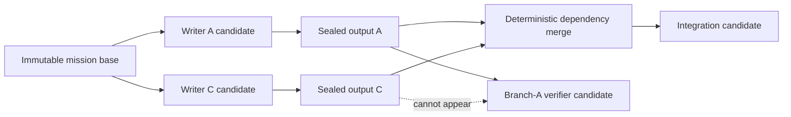

# ADR 0041: Task-scoped candidate snapshots and concurrent pull lanes

Status: accepted by the capability-completion mission (2026-07-25).

## Context

ADR 0019 retains one mutable candidate worktree for an entire mission. That
model proves the frozen implementation-and-verification chain, but it does not
implement the scheduler contract for general task graphs:

- the control plane admits only the two-task proof slice or the five-task
  frozen recovery graph;
- production starts one pull loop even when doctrine permits several workers;
- unordered writers would mutate the same worktree, so one worker's Git
  evidence can include another worker's changes;
- a verifier for one branch can observe a sibling branch it does not depend on.

Removing only the structural admission gate makes those failures
nondeterministic rather than fixing them.

## Decision

Every worker attempt receives its own Git worktree. The input commit is
materialized from the exact direct dependency outputs:

1. a root task starts at the runner's immutable configured base;
2. a one-dependency task starts at that dependency's runner-sealed output
   commit;
3. a multi-dependency task merges dependency outputs in stable task-id order
   before provider execution and treats the resulting commit as its immutable
   input.

The runner validates the provider's observed changes against the task write
scope, refuses to propagate ignored-file changes, and seals accepted writer
state in a runner-authored Git commit. A read-only task seals its unchanged
input commit. A failed verification also publishes that unchanged input for its
dependent debugger; an unsafe or mutated verifier publishes nothing.

Task-output manifests bind mission ID, task ID, worker run, attempt, input
commit, output commit, dependency task IDs, and branch. Manifests are written
atomically under runner-private state. Recovery validates every commit and
branch against the repository before using it. Branch refs keep published
output commits reachable after their worktrees close.

The production runner starts a bounded number of independent pull lanes.
Control-plane doctrine remains the global concurrency ceiling; runner
configuration can tighten but not widen it. Worktree lifecycle operations stay
serialized inside `WorktreeManager`, while provider execution proceeds
concurrently in separate worktrees.

The control plane admits every protocol-valid plan that passes
`assertValidMissionPlan`. Candidate materialization failures remain typed
runner failures with retained evidence. The mission-engine validator continues
to reject dependency cycles, unknown dependencies, overlapping unordered write
scopes, self-verification, and debugger role mismatch.

## Security and recovery invariants

- A task never receives a sibling output that is absent from its dependency
  closure.
- No two worker attempts write the same physical worktree.
- Only normalized, scope-valid, non-ignored repository paths enter a sealed
  output commit. Ignored content remains hash-only evidence and cannot be
  copied into Git objects.
- Verification and review worktrees remain structurally read-only. A changed
  HEAD, index, tracked path, untracked path, or ignored path fails the result.
- A merge conflict fails candidate acquisition and preserves the worktree for
  inspection. The runner does not guess conflict resolution.
- A downstream claim cannot race output publication: the output manifest is
  durable before the successful settlement makes the dependency ready.
- Branch/task output manifests replace the mission-wide candidate manifest;
  the reader retains explicit compatibility for already-created legacy
  mission candidates until they settle.

## Options weighed

- **Keep one mission worktree and serialize every task** — rejected because it
  makes doctrine concurrency misleading and lets branch-specific verification
  observe unrelated state.
- **Use one worktree but trust disjoint write scopes concurrently** — rejected
  because Git index/HEAD are shared and evidence is collected over the whole
  worktree.
- **Copy dependency files between worktrees** — rejected because deletions,
  renames, symlinks, file modes, and ignored secrets are easy to mishandle.
- **Store only patch artifacts** — rejected as the execution input because
  patch replay weakens exact Git identity and multi-parent recovery.
- **Let providers commit their own final snapshots** — rejected because
  successful provider prose is not authority and dirty/untracked changes would
  otherwise have no durable dependency identity.

## Consequences

- Arbitrary-length valid task graphs use the ordinary pull path rather than a
  frozen shape exception.
- Parallel branches have real isolation and deterministic integration inputs.
- Runner state gains task-output manifests and reachable internal branches that
  require a later bounded retention/pruning policy.
- Existing frozen graphs keep their semantics while their implementation and
  verification tasks use distinct worktrees containing the same candidate
  tree.
