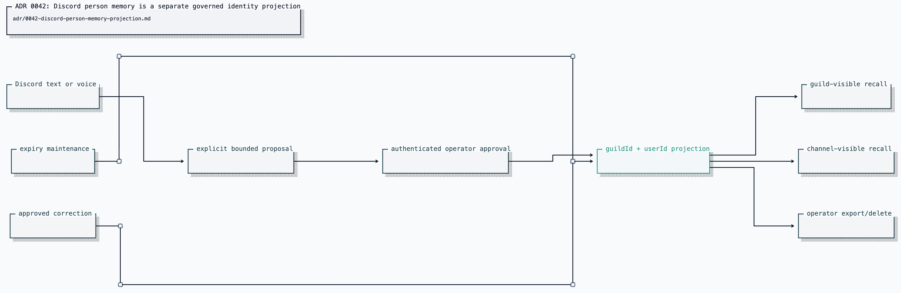

# ADR 0042: Discord person memory is a separate governed identity projection

Status: accepted.

## Context

Mission memory stores approved repository and mission facts. A long-lived
Discord relationship has different identity, privacy, and lifecycle rules: the
same Discord user id may appear in several guilds; channel-visible notes must
not leak to another channel; private operator notes must not enter ambient
recall; facts expire, are corrected, exported, and deleted per person.

Adding these fields to the mission-fact namespace would make one category and
deduplication key serve two authorities. A normalized preference shared by two
people could merge accidentally, and mission retention could become person-data
retention.

## Decision

The Clankie service owns a separate file-backed person-memory projection keyed
by `(guildId, userId)`. Display names are presentation only. Facts carry a
bounded kind, confidence, guild/channel/operator-private visibility, optional
expiry, correction lineage, and content-free provenance. The provenance schema
requires `rawTranscript: false`; text and voice can propose an explicit fact
but cannot store audio or a transcript through this boundary.

An authenticated Discord captain may propose and recall visible facts; a
proposal applies directly and upserts by `factId`. The authenticated operator
may browse every person and fact, export or delete a person's projection, and
edit or forget one fact from the TUI. An edit can change bounded content, kind,
visibility, confidence, or expiry, but never identity or source provenance.
Mutation events record ids and the operator identity without copying
memory content into the event log.

Every guild text and captain-handoff voice turn receives up to eight of that
speaker's newest visible facts as host-authored context. Direct messages have no
guild identity and receive no person-memory projection. Guild and channel
visibility filtering happens before prompt construction; operator-private facts
never reach Discord.

## Options weighed

- **Add a person category to mission memory** — rejected because global
  normalized deduplication, mission provenance, and category caps do not encode
  guild identity or visibility.
- **Key only by Discord user id** — rejected because it silently shares
  relationship context across unrelated guilds.
- **Persist raw text or voice transcripts and extract later** — rejected
  because it expands retention and disclosure risk. Only explicit bounded
  proposals enter the durable approval flow.
- **Allow Discord to delete or curate facts** — rejected because Discord is an
  ambient authority surface. Its authenticated captain may only upsert a fact
  it explicitly proposes and recall facts visible to that room.

## Consequences

- Renames do not break memory because names are never part of the durable key.
- Cross-guild and channel isolation are query invariants with regression tests.
- Correction, expiry, export, and deletion have explicit APIs and receipts.
- The person projection has its own per-identity cap and migration, independent
  of mission-memory category caps.
