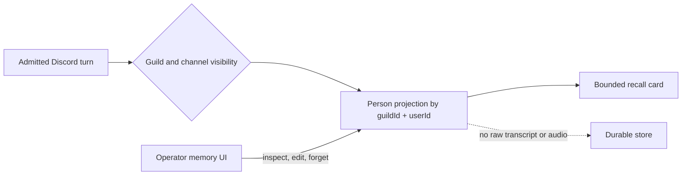

# ADR 0042: Discord person memory is a separate governed identity projection

Status: accepted. The mission/world-fact store used as the comparison in this
record was later retired. The separate Discord person projection remains part
of the current memory surface.

## Context

At ratification Clankie also had a mission/world-fact namespace. A long-lived
Discord relationship had different identity, privacy, and lifecycle rules: the
same user could appear in several guilds, channel-visible notes must not leak to
another room, and operator-private notes must not enter ambient recall.

Putting person data in the world-fact namespace would have made one key and
retention policy serve two authorities. That rejected namespace is historical;
the privacy argument for a separate person projection still holds.

## Decision

The Clankie service owns a separate file-backed person-memory projection keyed
by `(guildId, userId)`. Display names are presentation only. Facts carry bounded
kind, confidence, visibility, optional expiry, correction lineage, and
content-free provenance. Raw transcripts and audio are not stored through this
boundary.

An authenticated Discord turn may propose and recall facts visible to that
room. The operator may inspect, edit, export, and delete the projection. Identity
and source provenance do not change when content is corrected. Mutation events
record identifiers without copying memory content.

Each Discord turn receives only the newest facts visible to its authenticated
guild, channel, and user. Direct messages have no guild projection, and
operator-private facts never reach Discord.

## Alternatives considered

- **Store person data with world facts** was rejected because global
  deduplication and retention did not encode guild identity or visibility.
- **Key only by Discord user id** was rejected because it silently shares
  context across unrelated guilds.
- **Persist transcripts and extract later** was rejected because it expands
  retention and disclosure risk.

## Consequences

- Renames do not break memory because names are not durable keys.
- Cross-guild and channel isolation are query invariants.
- Correction, expiry, export, and deletion have explicit paths.
- Current memory behavior is summarized in the
  [architecture guide](../architecture.md); this ADR preserves why person data
  received its own projection.
