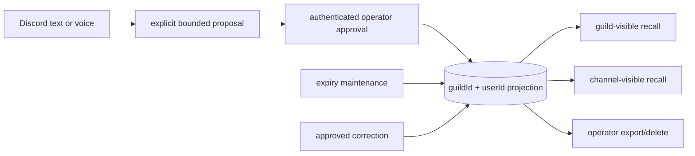

# ADR 0042: Discord person memory is a separate governed identity projection

Status: accepted.

## Context

Mission memory stores approved repository and mission facts. A long-lived
Discord relationship has different identity, privacy, and lifecycle rules: the
same Discord user id may appear in several guilds; channel-visible notes must
not leak to another channel; private operator notes must not enter ambient
recall; facts expire, are corrected, exported, and deleted per person.

Adding these fields to the mission-fact namespace would make one category and
deduplication key serve two authorities. A normalized preference shared by two
people could merge accidentally, and mission retention could become person-data
retention.

## Decision

`@clankie/memory-store` owns a separate
`discord_person_memory_facts` projection keyed by `(guildId, userId)`. Display
names are presentation only. Facts carry a bounded kind, confidence,
guild/channel/operator-private visibility, optional expiry, correction
lineage, and content-free provenance. The provenance schema requires
`rawTranscript: false`; text and voice can propose an explicit fact but cannot
store audio or a transcript through this boundary.

The existing `memory.profile.write` doctrine action remains the write gate.
The control plane persists the proposal and ordinary approval request, rebuilds
the exact approved envelope, and only then calls
`applyApprovedDiscordPersonProposal`. Replay is idempotent. Discord may propose
and recall visible facts, but export and deletion require the authenticated
operator surface. Deletion returns fact ids and emits a semantic receipt.

## Options weighed

- **Add a person category to mission memory** — rejected because global
  normalized deduplication, mission provenance, and category caps do not encode
  guild identity or visibility.
- **Key only by Discord user id** — rejected because it silently shares
  relationship context across unrelated guilds.
- **Persist raw text or voice transcripts and extract later** — rejected
  because it expands retention and disclosure risk. Only explicit bounded
  proposals enter the durable approval flow.
- **Allow Discord to commit/delete directly** — rejected because Discord is an
  ambient authority surface.

## Consequences

- Renames do not break memory because names are never part of the durable key.
- Cross-guild and channel isolation are query invariants with regression tests.
- Correction, expiry, export, and deletion have explicit APIs and receipts.
- The person projection has its own per-identity cap and migration, independent
  of mission-memory category caps.
