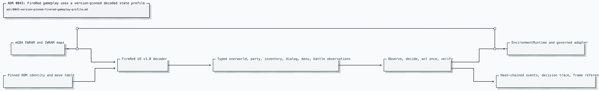

# ADR 0043: FireRed gameplay uses a version-pinned decoded state profile

Status: accepted.

## Context

ADR 0040 places a real headless mGBA core behind the governed emulator seam,
but overworld coordinates alone do not support general bounded gameplay.
Party and bag records use pointer-bearing and encrypted save structures;
battle input changes among action selection, move selection, and resolution;
dialog and menus reuse buffers that can retain stale values. Treating raw
bytes as game state without an exact ROM profile can fabricate an action prompt
or victory.

The implementation remains ROM-free in CI while proving the same state-derived
control loop that runs against the operator-supplied real core. A passing live
capability requires a two-fresh-core real receipt.

## Decision

### One exact ROM profile

`decodeFireRedState` accepts only Pokémon FireRed US v1.0 with SHA-256
`3d0c79f1627022e18765766f6cb5ea067f6b5bf7dca115552189ad65a5c3a8ac`.
Its symbol addresses and structure layouts are pinned to the corresponding
`pret/pokefirered` source profile. The decoder reads:

- EWRAM overworld coordinates, facing, text buffers, menu state, battle
  buffers, battlers, and outcome;
- IWRAM pointers to the active save blocks plus main-loop and task state;
- encrypted, checksummed party substructures, including personality-dependent
  permutations;
- encrypted bag quantities across all five pockets;
- move metadata and power from the pinned ROM's battle-move table.

Every pointer, bound, checksum, enum, count, cursor, HP value, and battle
outcome is validated. Unsupported state throws and pauses the governed session.
Only outcome `1` is a win; loss outcomes `2` and `9` are losses, and every
other nonzero outcome is unsupported rather than treated as victory.

### State-derived gameplay goal

The versioned real-scenario contract supports `reach_target` and
`trainer_battle_won`. The latter can require party and inventory proof before
navigation. On each iteration the controller observes the latest authoritative
state, chooses one bounded action, executes it through `EnvironmentRuntime`,
and verifies that frames and expected state advance. It carries no input
transcript.

The controller opens the start menu, observes party and bag data, closes
menus, waits through callback-locked field transitions using bounded frame
advance, routes by BFS over verified tiles, engages the trainer, advances
dialog, selects the highest-power decoded legal move, and halts only on a
decoded win. It also recognizes FireRed's all-zero battle initialization
sentinel after `gMain.inBattle` rises and before `BattleMons` is populated.
Partially initialized records, missing or contradictory menus, frozen frames,
unexpected movement, unknown battle outcomes, and decision/evidence exhaustion
fail closed.

### Evidence tiers

CI exercises the full controller against `DeterministicGbaCoreDouble`. The
double is test infrastructure and never counts as proof that a ROM works. The
operator-local `gameplay:live-proof` command selects a schema-valid scenario,
runs two fresh real cores, requires byte-identical reports and traces, arms a
no-network tripwire, and writes content-bounded receipts plus a final
framebuffer PNG. ROM and savestate paths and bytes are absent from receipts.
The `firered-oaks-lab-rival` scenario passes this gate: all authoritative
checks are true, the final battle result is `won`, both runs are byte-identical,
and the no-network attempt count is zero.

## Options weighed

- **Image-only gameplay** — rejected because cursor, battle phase, inventory,
  and outcome are stronger and more deterministic when decoded from validated
  game state.
- **Heuristic offsets across FireRed revisions** — rejected because silent
  layout drift can turn arbitrary bytes into a plausible action or victory.
- **Scripted input transcripts** — rejected because they do not adapt to
  observed state and cannot distinguish progress from desynchronization.
- **Treat every terminal battle outcome as success** — rejected because run,
  capture, draw, and unsupported outcomes are not a trainer victory.
- **Store ROM or savestate fixtures in the repository** — rejected; CI uses the
  labeled double and live proof uses operator-local copyrighted bytes.

## Consequences

- Clankie has a bounded, general FireRed gameplay loop for navigation, menus,
  party, inventory, dialog, and trainer battles.
- Supporting another ROM revision requires a separate identified and tested
  profile; it is never selected by guesswork.
- ROM-free CI proves controller semantics; the ROM-gated rival receipt
  satisfies the live capability gate for the pinned FireRed profile.
- Live proof remains deterministic, independently hashable, local-only, and
  free of ROM or savestate content.
