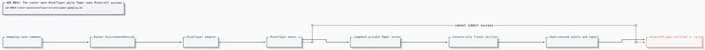

# ADR 0044: The runner owns Mineflayer while Paper owns Minecraft success

Status: accepted, and the body it governs was later removed. The runner, the
Mineflayer client, and the Minecraft environment bindings are gone; the Paper
verifier retains no source. Everything below is the ratified decision, not a
description of the running system — Clankie's only game bodies today are the
local GBA emulator and a hosted PokeAgent MMO seat
([ADR 0103](0103-a-hosted-world-is-another-body.md)).

## Context

Clankie already has strict Minecraft environment contracts and a frozen,
server-authoritative Paper verifier, but no production client drives the
server. A real bot must not expose Mineflayer implementation objects or account
material to model lanes, connect to public servers, turn Paper lifecycle
commands into gameplay tools, or claim success from its own local state.

Pathfinding and digging are long-running. If an adapter call occupies the
runtime's single-writer queue until completion, ordinary pause, cancellation,
lease expiry, and emergency fencing cannot interrupt it promptly.

## Decision

### Runner-owned private client

`createRunnerMinecraftEnvironmentLifecycle` composes
`MineflayerMinecraftAdapter` and `EnvironmentRuntime` inside the trusted runner.
The adapter accepts only the strict `minecraft_java` resource profile and
runner-private connection material. Server hosts are literal `127.0.0.1` or
`::1`; DNS names and public addresses are structurally unrepresentable.

Offline auth is explicitly labeled `offline_lab`. Microsoft auth uses an
absolute runner-private Mineflayer profile cache and suppresses device-code
content; an expired cache fails readiness instead of placing auth prompts in
events. Neither mode persists connection material in the environment record.

The production motor pins Mineflayer `4.37.1`,
`mineflayer-pathfinder` `2.4.5`, and Minecraft `1.21.11`. Movement disables
implicit digging, parkour, sprinting, and one-by-one towers. The adapter
advertises only observe, navigate, collect, craft, place, and wait. Each action
is checked against lease capabilities, allowed dimensions, origin radius,
duration, block-change quota, and no-combat policy.

### Interruptible adapter settlement

An adapter may return `{status: "running", completion}`. The runtime records
the running action and watches its completion outside the serialized mutation
queue. Final settlement re-enters the queue and is ignored if cancellation,
revocation, lease loss, or emergency stop makes the action terminal.
Existing immediate and externally finished adapters remain compatible.

Mineflayer cancellation clears its pathfinder goal, all control states, and
active digging. Stop also closes the network client. A disconnected or
process-lost motor cannot attach; recovery fails that stale session and a
reconnect creates a fresh governed session.

### Frozen gameplay and authority

The controller collects the eight reset oak logs, crafts planks and a crafting
table, and places the table inside the frozen target cuboid. It invokes only
ordinary survival actions through the runtime. The Paper plugin's console-only
`mcscenario` surface starts and ends the run, observes server events and final
state, and alone emits a passing result.

The live proof requires JDK 21, exact Paper 1.21.11 build 132 identity, and
explicit Minecraft EULA acknowledgement. The bootstrap command downloads the
JAR from PaperMC's immutable object URL, checks the published byte count and
SHA-256, and places it in a private operator cache without accepting the EULA.
An operator-supplied override remains possible only with an explicit SHA-256.
The proof covers a planned reconnect, the objective, Paper report/event
sidecars, and emergency stop in a disposable loopback server. Raw server output
is used only for bounded readiness milestones and is not retained.

## Options weighed

- **Let Mineflayer report success** — rejected because client state is not the
  authoritative world or policy record.
- **Expose server console commands to gameplay** — rejected because it lets the
  actor reset criteria, fabricate lifecycle, or invoke unrelated commands.
- **Allow arbitrary private/public hosts** — rejected because the first
  capability is a disposable local laboratory, not a general server bot.
- **Block runtime dispatch until pathfinding ends** — rejected because control
  and cancellation would be serialized behind the work they must interrupt.
- **Automatically reconnect a lost bot** — rejected because a stale lease or
  action could silently regain physical authority.
- **Fetch an unpinned “latest” Paper build** — rejected because reproducibility
  and supply-chain identity take precedence over automatic updates. Build
  changes require a reviewed source-identity update.

## Consequences

- The runner has a real, bounded Minecraft body and an independently
  authoritative success signal.
- Public Minecraft servers, player combat, commands, and chat sending remain
  absent.
- CI proves the complete control and cancellation loop with a motor test
  double; live capability requires the owner-gated Paper laboratory receipt.
- Paper is not checked into Git. The repository pins the official
  [PaperMC downloads-service](https://docs.papermc.io/misc/downloads-service/)
  object identity, while the verified JAR remains in private operator state.
- Supporting remote private servers requires a separate authenticated network
  policy and evidence task rather than widening this profile.
