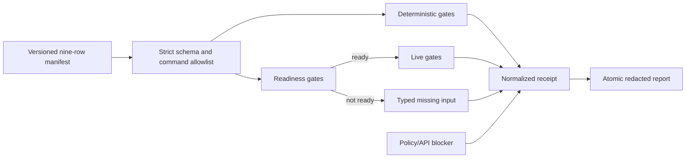

# ADR 0046: One versioned manifest owns the cross-capability live gate

Status: accepted for implementation (2026-07-25).

## Context

Clankie's Discord, worker, TUI, memory, FireRed, and Minecraft components each
have useful package tests and some have dedicated readiness or live-proof
commands. Those checks previously had no single authority that could answer
whether the complete nine-capability product contract passed. A green package
test could therefore be mistaken for live readiness, while missing credentials,
consenting humans, copyrighted operator inputs, or EULA acknowledgement were
reported inconsistently.

The evaluation must not collect raw Discord text, voice media, screen frames,
ROM/savestate bytes, terminal output, or credentials merely to summarize
status.

## Decision

`evals/capabilities/v1/manifest.yaml` is the versioned executable gate for the
nine rows in
[`docs/17-capability-completion-contract.md`](../17-capability-completion-contract.md).
`apps/lead-agent-lab` validates the manifest, invokes each declared command
directly without a shell, caps command output, and publishes
`artifacts/evals/capabilities/capability-report.{json,md}`.

The report retains only capability/gate ids, status, normalized issue codes,
exit status, duration, and SHA-256 hashes of stdout/stderr. It never retains
the command output itself. A command timeout, oversized output, malformed
machine result, or nonzero opaque command is a failure. A valid readiness or
live-proof document whose success predicate is false is `missing_input`.
An explicitly unsupported policy/API route is `blocked`. Live work following a
failed readiness gate is skipped rather than invoked speculatively.

The overall result passes only when all nine capability rows pass. The
evaluator does not average, waive, or rewrite a row.

### Existing evidence

Live FireRed evidence is re-checked without replaying copyrighted inputs:
`CLANKIE_GBA_LIVE_RECEIPT_PATH` points at an operator-local, regular
`run-receipt.json`. The verifier validates its strict content-free schema,
requires the complete rival-battle result, two-core determinism and zero
network attempts, and recomputes the hashes of the report, decision trace,
event trace, semantic events, and screenshot.

Real-provider evidence is also re-checked rather than re-spending provider
turns on every status query. `pnpm eval:real-workers` atomically publishes a
committed artifact tree only after the production control-plane and runner
complete the frozen Codex → Claude → Pi → Claude mission. The capability gate
validates the commit marker and hashes of the report, manifest, and complete
tree, then requires the frozen fixture identity, exact four-task provider
lineage, and distinct worker-run and native-session identities.

A Discord-origin worker proof uses a strict content-free receipt containing the
canonical Discord, mission, worker-run, native-session, TUI, and event-cursor
identities. The evaluator requires equal mission/worker ids across projections;
raw Discord or terminal content is rejected.

### Screen-media blocker

The manifest records `discord_screen_official_transport_unavailable` rather
than treating protocol stubs as success. Discord documents bot voice and DAVE,
but does not expose a supported bot or Social SDK Go Live watch/publish API.
Discord also states that automating a normal user account outside OAuth2/bot
APIs is forbidden and may terminate the account. The evaluator therefore
cannot execute ADR 0024's user-session transport as written. Resolving this
requires an authoritative tracker/product decision: wait for a supported
Discord API or replace the acceptance criteria with a compliant,
human-controlled official-client boundary.

Sources:

- [Discord voice connections](https://docs.discord.com/developers/topics/voice-connections)
- [Discord Social SDK](https://discord.com/developers/docs/social-sdk/index.html)
- [Discord automated user accounts policy](https://support.discord.com/hc/en-us/articles/115002192352-Automated-User-Accounts-Self-Bots)

## Consequences

- `pnpm eval:capabilities` is intentionally nonzero until every row is live.
- External gates remain visible as typed missing inputs instead of being
  confused with implementation failures.
- Existing package tests remain necessary but cannot satisfy a live row alone.
- A new capability or changed acceptance contract requires a new manifest
  version and corresponding documentation decision.
