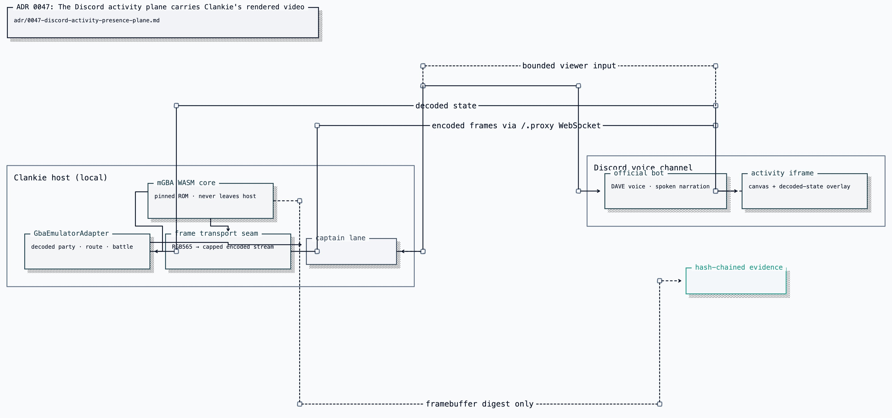

# ADR 0047: The Discord activity plane carries Clankie's rendered media

Status: accepted (James, 2026-07-25). The activity plane shipped. The separate
user-session watch/publish path that was future work at ratification later
shipped through
[ADR 0098 (user-session shares)](0098-user-session-watches-discord-shares.md)
and [ADR 0100](0100-vox-is-an-owned-native-media-package.md). Live game sound
is added by [ADR 0114](0114-a-rendered-game-surface-carries-live-sound.md).
Current-status addendum (2026-08-19):
[ADR 0128](0128-vox-is-the-sole-discord-media-owner.md) governs Discord media
ownership. The Activity remains the bot-supported rendered-media surface;
screen watch and Go Live remain user-body capabilities because Discord does not
offer them to bots.

## Context

Clankie plays and talks in the same Discord room through separate surfaces. The
emulator owns the ROM, core, savestate, and rendered frame; official-bot voice
owns conversation ([ADR 0045](0045-official-bot-dave-group-voice.md)). Humans
need to see the rendered game without moving copyrighted or stateful emulator
bytes to a browser.

Discord blocks bot accounts from publishing Go Live video. Normal-user Go Live
is a separately opted-in personal-lab capability under
[ADR 0024](0024-discord-dual-plane-presence.md), not the default path for a
Clankie-rendered surface. Discord Activities are the supported bot-transport
alternative.

## Decision

Clankie gains an **activity plane**: a Discord Embedded App launched by the bot
into a voice channel. It receives bounded rendered media from the host and holds
no ROM, core, savestate, Discord credential, or machine authority.

| Plane             | Process                     | Role                                    |
| ----------------- | --------------------------- | --------------------------------------- |
| Official bot      | `apps/discord-bridge`       | text, voice, and activity launch        |
| Personal-lab body | `apps/discord-user-session` | screen-share watch and Go Live publish  |
| Activity          | `apps/discord-activity`     | rendered media; no viewer input channel |

The activity is the default way to show Clankie's own rendered surface. The lab
body covers screen-share receive and Go Live media that Activities cannot.

### Activity state is a facet

Connection phase and activity presence are orthogonal. A voice session may have
an activity, a Go Live stream, both, or neither. Activity state therefore stays
a separate observational facet rather than another rung in the connection
phase ladder.

### Rendered media and bounded display state cross the media boundary

The host emits capped encoded frames and live PCM through lossy transports.
Raw media never enters semantic event streams; evidence carries frame digests.
Disconnected producers and slow viewers drop stale media rather than building
queues. Audio is never replayed to late viewers.

The display sidecar carries only bounded turn fields and a closed work-phase
enum. The phase is emitted at the free-play loop's real thinking/action
boundary and retained latest-only for late viewers. It grants no input or
authority and prevents clients from guessing model state from frame timing.

The retained implementation evidence justified the simple transport: a FireRed
frame compressed to about 3.2 KB and encoded in about 1.68 ms, making per-frame
PNG sufficient at hardware rate. Async pacing was load-bearing: blocking waits
froze frame delivery and service I/O, while awaited timers preserved both.

The public viewer and private producer are separate listeners. Only the viewer
is tunnelled; producer ingress stays loopback-only behind a brokered bearer. The
play host dials outward, so the internet-facing renderer cannot connect into the
credential-holding service.

The current viewer has no keyboard, pointer, or outbound control channel. Adding
one later would create a new untrusted-input boundary rather than inheriting
authority from the Activity.

## Alternatives considered

- **Normal-user Go Live as the default** was rejected because it violates
  Discord's terms and inherits reverse-engineered transport risk.
- **Wait for bot video support** was rejected because Discord provided no
  committed path.
- **Post periodic PNG attachments** was retained only as a non-live fallback.
- **Stream through a third-party video service** was rejected because it adds
  another account, terms, and latency for a worse in-room result.

## Consequences

- `apps/discord-activity` is rendering-only and holds no Discord credential or
  emulator authority.
- The emulator advances at hardware rate while watched, so live play is not
  frame-for-frame replayable; deterministic scenario tests remain separately
  driven.
- Unverified Discord Activities retain Discord's developer/tester and small-
  server limits.
- Current tunnel setup, ports, bounds, and diagnostics belong in the
  [activity operating guide](../../apps/discord-activity/README.md); launch and
  voice configuration belong in the
  [bridge operating guide](../../apps/discord-bridge/README.md).
