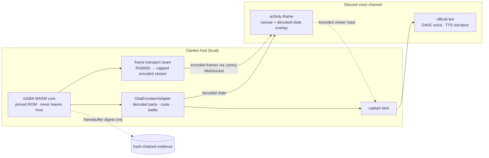

# ADR 0047: The Discord activity plane carries Clankie's rendered video

Status: accepted (James, 2026-07-25). The ADR and presence contracts land first;
the activity app, the frame transport, and live Discord evidence remain
implementation gates.

## Context

Clankie can already do both halves of "play a game in front of people" — but not
at the same time, and not in the same place.

He plays: the pinned headless mGBA core drives an operator-supplied FireRed ROM
and decodes overworld position, party records, legal moves, bag, dialog, menus,
and battle outcome from RAM ([ADR 0040](0040-real-mgba-core-behind-the-emulator-seam.md),
[ADR 0043](0043-version-pinned-firered-gameplay-profile.md)). He talks: the
official bot holds a DAVE group-voice session with brokered speech
([ADR 0045](0045-official-bot-dave-group-voice.md)).

What is missing is a way for the pixels to reach the humans in the voice
channel. `MgbaFireRedCore.framebufferSnapshot()` returns real RGB565 frames and
they are discarded after one evidence screenshot.

**Discord blocks video publication from bot accounts.** This is a gateway-level
restriction, not a missing library. Every Go Live implementation — the
Discord-RE fork, `@dank074/discord-video-stream`, and the republished
derivatives — takes a selfbot library as a peer dependency and requires a raw
user-account token. The published request to lift this for bots
(`discord/discord-api-docs#1603`) has never been granted, and the March 2026
move to end-to-end encrypted calls everywhere raises the maintenance cost of
reverse-engineered transports further.

[ADR 0024](0024-discord-dual-plane-presence.md) therefore scoped Go Live as an
explicitly opted-in, isolated **personal-lab** capability, denied by the
high-assurance and team doctrine profiles, and left it unimplemented behind
VUH-836/840/841. That boundary was correct and this ADR does not relax it.

It was, however, incomplete: it treated Go Live as _the_ way to put a rendered
surface in front of a voice channel. There is an officially supported one.

## Decision

Clankie gains a third presence plane: the **activity plane**, built on Discord's
Embedded App SDK. Activities are web apps hosted in an iframe inside a voice
channel. They are open to all developers, they run on bot transport, and they
require no user-account token.

The bot launches the activity through the documented invite endpoint —
`POST /channels/{channel.id}/invites` with `target_type: 2`
(`EMBEDDED_APPLICATION`) and `target_application_id`. No unofficial transport
is involved at any point.

### The plane table

| Plane         | Process                                        | Auth                    | Role                                                    |
| ------------- | ---------------------------------------------- | ----------------------- | ------------------------------------------------------- |
| Ambient bot   | `apps/discord-bridge`                          | Official bot token      | Slash, mission threads, ambient steer                   |
| Presence body | bot runtime plus isolated user-session runtime | `bot` \| `user_session` | Catalog actions via policy; user session is lab-only    |
| Activity      | `apps/discord-activity` plus the bot launcher  | Official bot token      | Rendered surfaces and bounded viewer input in a channel |

The activity plane is the **default** path for showing a rendered surface. The
user-session Go Live plane remains available for what activities genuinely
cannot do — watching _someone else's_ stream — and stays personal-lab gated.
Neither plane is a prerequisite for the other.

### Activity state is a facet, not a rung

`DiscordPresenceSessionPhaseSchema` is an ordered ladder of connection liveness
(`off → connecting → present → voice_active → go_live_active`) and
`isDiscordPresenceActionAvailable` compares rank to a per-action `minPhase`.

Running activities do **not** join that ladder. A running activity and a running
Go Live stream are orthogonal — either, both, or neither may be true while the
session sits at `voice_active` — so ordering them against each other would force
one slot to carry two unrelated meanings and would make "is an activity running"
unanswerable whenever Go Live is also active.

Activity instances are therefore a separate facet on the session record, gated
by `minPhase: voice_active`. `activity_stop` additionally requires a running
instance rather than a higher phase.

This leaves `go_live_active`-as-a-phase as pre-existing modelling debt inherited
from ADR 0024. This decision does not resolve it; VUH-841 should, when the
publish path lands and the same orthogonality argument applies to it.

### The frame transport boundary

The core stays on the host. The ROM, the WASM core, and the savestate never
cross the transport — only encoded frames do. This preserves the pinned-digest
fail-closed model, keeps copyrighted bytes off every client, and keeps the
existing two-fresh-core byte-identical live receipt meaningful.

The seam is versioned and bounded: a capped frame rate, a capped encoded frame
size, and a capped in-flight queue. GBA output is 240×160 flat-palette pixel art
that compresses hard, so per-frame PNG through the existing RGB565 unpack in
`integrations/gba-emulator/scripts/png-writer.ts` is sufficient; WebCodecs is
the upgrade path if 60fps is ever wanted.

Clankie does not play at 60fps — he advances the core in `advanceFrames` bursts —
so frames are pushed on observation plus a paced tick, which matches how the
agent actually behaves and costs far less than a constant encode.

Raw frames never enter semantic event streams. Evidence keeps carrying the
`framebufferSha256` digest it already carries, consistent with the media
boundary ADR 0024 sets for VUH-840.

The runner and the activity server are separate processes, so the seam is a
concrete wire with a deliberate direction and exposure:

- The activity server runs **two listeners**. The viewer listener is tunnelled
  and public through the Discord proxy; the producer listener binds loopback
  only and is never tunnelled. A producer path mounted on the tunnelled server
  would be reachable by anyone who can reach the activity, so the split — not
  the bearer token — is the primary control. The token is the second lock.
- The **runner dials out** to the producer endpoint. The trusted runner holds
  credentials and opens no port for an internet-facing surface to connect into.
- The producer bearer lives in the **credential broker** under
  `clankie_activity_producer`, alongside the other internal Clankie bearers, and
  `CLANKIE_ACTIVITY_PRODUCER_TOKEN` is a hard startup error. The activity server
  owns the first-run mint because it owns the listener; the runner only
  resolves, so the two processes cannot mint divergent tokens.
- Ingress is deny-by-default: a runner with no resolvable credential publishes
  nothing rather than connecting unauthenticated.
- The wire is lossy in both directions by design. The runner drops frames while
  disconnected instead of buffering them, so a reconnect resumes at the present
  moment rather than replaying a stale playthrough; the hub drops frames for a
  backed-up viewer rather than growing a queue. Both count their drops.

### Eligibility and constraints, stated plainly

- **Unverified activities run only in servers with fewer than 25 members, and
  only for the app team's developers and testers.** That covers the personal lab
  exactly. Verification is the documented path if this is ever made public, and
  is not in scope here.
- All activity network traffic is proxied through `discordsays.com`. URL
  Mappings must be registered in the developer portal, requests need a `/.proxy`
  prefix or `patchUrlMappings`, and unmapped external requests fail with
  `blocked:csp`. Local development needs an HTTPS tunnel.
- The activity is a distinct surface with its own risk: it renders Clankie's
  decoded internal state to every viewer. `activity_start` and `activity_stop`
  are therefore `publish-external`, matching `send_attachment` and `go_live_*`.
- Viewer input arriving from an activity is **ambient authority**. It cannot
  approve privileged actions, exactly as voice and text ingress cannot.

## Options weighed

- **Go Live via a selfbot user token as the primary path** — rejected as the
  default. It automates a normal user account against Discord's terms, risks the
  account, breaks whenever the custom UDP protocol changes, and would require
  weakening the `DISCORD_USER_TOKEN` hard-fail that is currently a startup
  error. It survives only as ADR 0024's separately gated lab capability.
- **Wait for Discord to allow bot video** — rejected. The request has been open
  for years with no commitment.
- **Post periodic PNG attachments into the mission thread** — rejected as the
  primary path. It works today and needs no new infrastructure, but it is not
  live, not in the voice channel, and cannot take viewer input. It remains a
  useful fallback when no activity is running.
- **Stream to Twitch/YouTube and link it in the channel** — rejected. It leaves
  Discord, adds a third-party account and its terms, and adds encode latency for
  a worse result than a canvas.

## Consequences

- A new `apps/discord-activity` workspace owns the iframe client and the frame
  server. It holds no Discord credentials and no mission authority; it is a
  rendering surface fed by the host.
- `apps/discord-bridge` gains activity launch and stop as policy-gated catalog
  actions on bot transport, under the existing deny-by-default guild/channel
  allowlists and content-free receipts. It gains no new credential class.
- `@clankie/protocol` and `@clankie/interactive-environment` gain the activity
  actions, their `publish-external` risk class, and the session facet. Action
  schemas stay transport-agnostic as ADR 0024 requires.
- The trusted runner owns the emulator body. `createRunnerGbaEnvironmentLifecycle`
  composes the `GbaEmulatorAdapter` behind the durable environment runtime, so
  playing is an agent decision dispatched through a lease rather than a script
  invocation, and the frame sink is an explicit option on that composition. The
  runner falls back to the clearly-labeled deterministic core double when no ROM
  is configured, so CI exercises the path without copyrighted bytes.
- Game audio remains absent: the core installs no-op `retro_set_audio_sample`
  callbacks and discards every sample. Narration covers the gap for now; mixing
  emulator audio into the existing 48 kHz stereo voice path is separate work.
- The `DISCORD_USER_TOKEN` startup error, ADR 0045's official-bot voice
  boundary, and the doctrine profile denials all stay exactly as they are.
