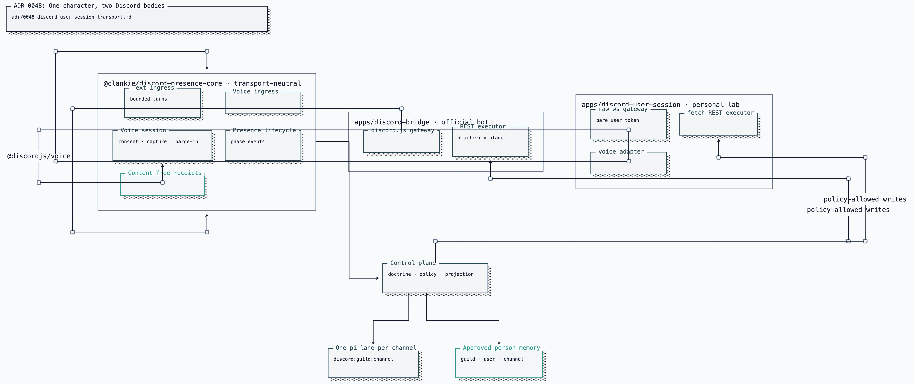

# ADR 0048: One character, two Discord bodies

Status: accepted (James, 2026-07-25). The transport, gating, and shared
participation core are implemented; live Discord evidence remains a deployment
gate, and Go Live media stays sequenced behind [ADR 0024](0024-discord-dual-plane-presence.md).

## Context

[ADR 0024](0024-discord-dual-plane-presence.md) defines two Discord planes that
share one character and reserves `user_session` as a transport binding. This
ADR makes that binding operational across the presence schema, credential
broker, Clankie service, and bridge processes.

A real capability gap remains. A bot cannot Go Live, cannot appear as a member
of a friend's server the owner has not administered, and is visibly a bot in
social contexts where the point is presence rather than service. Meanwhile the
things that make Clankie _himself_ — the pi lane, person memory, consent rules,
receipts — are not properties of a Discord connection at all.

Discord forbids automating normal user accounts. ADR 0024 already weighed that
and placed the capability in an explicitly enabled personal lab, denied by
high-assurance and team profiles. This ADR does not reopen that decision; it
implements that enforcement.

## Decision

### Transport is a runtime binding, not a fork of the character

`DiscordTransportKind` is the single place bot-versus-user is named. Action
schemas stay transport-agnostic, and each catalogue entry declares a
`transports` list rather than a pair of booleans, so "which bodies can do this?"
has exactly one answer per action.

**Exactly one body is live.** `discord.activeBody` (`bot` | `user_session`,
default `bot`) is the mouth. Both credentials stay in the broker; the
launcher starts only the active process and stops the other on
`clankie restart`. Voice, music, and speech attach to that one connection,
so they are implemented once. The lab user body may also Go Live the same
YouTube URL (video + audio on the stream) instead of mixing audio into
voice — one sink per track, so the room does not hear it twice. Switching
bodies is an operator action in `/discord`, not a runtime radio the model
can flip.

`DiscordTransportKind` still names which credential opened the gateway:

| Action family                                                                             | Transports            |
| ----------------------------------------------------------------------------------------- | --------------------- |
| reply, react, send_message, typing, threads, voice join/leave, attachments                | `bot`, `user_session` |
| `go_live_*`                                                                               | `user_session` only   |
| `activity_*` (embedded applications, [ADR 0047](0047-discord-activity-presence-plane.md)) | `bot` only            |

### Continuity is a property of the lane address

`discordPresenceLaneAddress` derives the bounded-turn scope from _where the
conversation happens_ — `discord:<guildId|dm>:<channelId>` — never from which
transport observed it. Both bridges must derive it there. A channel Clankie is
speaking in as the bot is the same lane he continues in as the user session, so
switching bodies mid-thread keeps one continuing pi lane, one character, and
one person-memory projection. A transport-local identifier would silently fork
the conversation into two streams of consciousness, which is the failure this
decision exists to prevent.

Person memory needed no change: it is already keyed by guild, user, and
channel, and the Clankie service — not the bridge — retrieves it.

### Isolation is structural, not conventional

ADR 0024's invariant that bot and user credentials never share a gateway is
enforced by shipping a second process, `apps/discord-user-session`, rather than
a mode flag on the bridge. The user plane never imports `discord.js`; it carries
a bounded gateway client (identify, heartbeat, resume, the four dispatches
ingress and voice consume, outbound voice state) and a `fetch` REST executor.

Voice reuses `@discordjs/voice` through a custom gateway adapter. [ADR 0045](0045-official-bot-dave-group-voice.md)
fixed one media owner for Discord voice; that decision is about the media stack,
not about which credential opened the gateway, since the voice websocket
authenticates with the `VOICE_SERVER_UPDATE` token. DAVE, consent, per-speaker
capture, barge-in, and memory-only audio therefore apply unchanged to both
bodies.

### Four gates, all fail-closed

Configuration alone cannot reach a user token.

1. **Enablement** — `DISCORD_USER_SESSION_ENABLED=true`, off by default, plus
   non-empty guild and channel allowlists.
2. **Doctrine** — `discord.transport.user_session_connect` is classified
   `publish-external` and evaluated when the opt-in is recorded. Unclassified
   `discord.transport.*` actions fail closed like `discord.presence.*`. The
   high-assurance overlay denies it exactly, so a high-assurance deployment
   cannot record an opt-in and therefore can never start the plane.
3. **Durable owner opt-in** — an operator-authenticated, event-sourced record
   bound to the doctrine profile hash in force. Recompiling doctrine invalidates
   it: an acceptance must not survive a policy change it is never weighed
   against. Configuration may narrow the recorded guild/channel scope, never
   widen it. Revocation stops the next action rather than waiting for grant
   expiry.
4. **Brokered credential** — `discord_user_session` lives in the credential
   broker; an environment token is a startup error. Admission resolves the token
   last, so a run that will be refused never materialises a user credential in
   process memory.

### Transport is proven by authentication

The Clankie service binds `transportKind` to the authenticated bearer, never to
the request body. Four broker-owned local bearers exist —
`clankie_discord_bridge`, `clankie_discord_voice_bridge`,
`clankie_discord_user_bridge`, `clankie_discord_user_voice_bridge` — with
mutually exclusive patterns, because `clankie_discord_` prefixes all of them and
an unanchored match would let a user-plane bearer authenticate as the bot
bridge. A bot bearer claiming `user_session` (or the reverse) is refused with
`discord_presence_transport_not_authenticated`.

Each plane loads its own privileged executor module
(`CLANKIE_DISCORD_PRESENCE_RUNTIME_MODULE`,
`CLANKIE_DISCORD_USER_PRESENCE_RUNTIME_MODULE`). A deployment that never
configures the user module cannot execute a user-session write even if one is
somehow authenticated.

## Options weighed

- **A transport mode flag on `apps/discord-bridge`** — rejected. It satisfies
  "no shared gateway" only by convention, and it would put a normal-user token
  in the same process image as the official bot token, so one compromise leaks
  both.
- **Duplicate the ingress/voice stack in the second app** — rejected. Two copies
  of consent, capture, and lane addressing is exactly how the two bodies would
  drift into two characters.
- **Keep `requiresUserSession: boolean` and add `requiresBotApplication`** —
  rejected. Two booleans encoding one question can contradict each other, and
  the contradiction grows worse as planes are added.
- **Ship the transport behind a load-on-demand driver module** — rejected for
  this repository after an explicit owner decision: the gates above, not the
  absence of code, are what keep the capability from being reached.
- **Self-declared `transportKind` on the request body** — rejected. Go Live is
  reachable only from the user session, so an unauthenticated transport claim
  would be a privilege-escalation path.

## Consequences

- `packages/discord-presence-core` owns the transport-neutral participation
  stack. `apps/discord-bridge` keeps only bot-shaped concerns: slash commands,
  mission threads, the projector, and the activity plane.
- `DiscordPresenceWriteSchema` and `DiscordPresenceWriteResultSchema` accept
  both transports. Existing bot payloads are unchanged on the wire.
- The user plane has no slash commands, because a user account cannot register
  them. Voice join is driven from the operator surface, which also keeps voice
  capture from being startable by anyone who can type in a channel.
- Ambient context messages are disabled on the user plane: a user session cannot
  request bounded history without reading channels wholesale.
- Go Live remains unimplemented media. The executor fails loudly with
  `discord_presence_go_live_media_unavailable` rather than reporting a stream
  nobody can watch; VUH-841 owns the media path.
- Account and ToS risk is the owner's, is recorded in the opt-in
  acknowledgement, and is denied outright by high-assurance and team profiles.
- Live evidence — a real account, a real guild, and a spoken round trip through
  the same pi lane the bot uses — remains a deployment gate that deterministic
  tests cannot substitute for.
