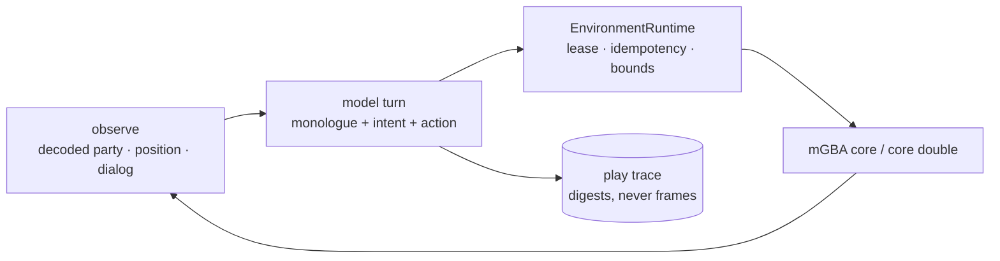

# ADR 0049: Free play is model-decided, and asserts something other than determinism

Status: accepted (James, 2026-07-25). M1 is implemented and has produced a live
playthrough; the interjection, volition, and Discord milestones are follow-ups.

## Context

Clankie's FireRed runs were never Clankie's. `nextRealRouteStep` is breadth-first
search over a scenario's declared map, and move selection is an `argmax` over
decoded legal moves. Both are deterministic by construction, which is what makes
the frozen scenarios reproducible and their two-fresh-core receipts
byte-identical ([ADR 0040](0040-real-mgba-core-behind-the-emulator-seam.md),
[ADR 0043](0043-version-pinned-firered-gameplay-profile.md)).

That is an algorithm playing a game. The product intent is different: Clankie
plays by his own choices, his thinking is readable, people can ask him what he
wants to do, and he volunteers commentary when he chooses to.

`GbaEmulatorToolNameSchema` already specified the model-facing surface —
`gba_emulator_observe`, `_start_action`, `_pause`, `_steer` — and had **zero
consumers**. The contract existed; nothing handed it to a model.

## Decision

A free-play loop where the **model** chooses each action, sitting beside the
deterministic drivers rather than replacing them.

Actions are dispatched through `EnvironmentRuntime` exactly as the scripted
drivers dispatch them. Free play changes _who decides_, not how an action is
authorised — so a model asking for an illegal button, an exceeded frame bound, or
a missing capability is refused by the same machinery that refuses a script.

### What a free-play run asserts

A model-decided run cannot be replayed, so determinism is unavailable as
evidence. It is replaced, not abandoned:

| Property           | How it is evidenced                                                                                             |
| ------------------ | --------------------------------------------------------------------------------------------------------------- |
| **Legality**       | Every action passed the adapter's catalogue and bounds, or was recorded as `rejected_by_adapter`                |
| **Causal linkage** | Each turn records the observation digest the decision was made from, the monologue, the action, and the outcome |
| **Bounds**         | Model text is length-capped; frames and inputs are capped by the session's resource bounds                      |
| **Coherence**      | Fraction of turns where the previous turn's stated intent referenced the action actually taken                  |

**The deterministic scenarios are untouched and still pass.** Determinism was not
weakened to accommodate free play; a second, differently-evidenced mode was added
next to it.

### He looks at the screen, not only at RAM

The decoded observation is a **privileged and partial** view. It carries
position and facing but nothing about what is _in_ the room, so a model reading
only RAM discovers furniture by walking into it. That is exactly what the first
real-ROM run showed: six turns of "I may be bumping into something", inferring
obstacles by collision.

Each turn therefore carries the rendered frame as a PNG image part alongside the
decoded state. The same run with vision produced "I can see the stairs in the
upper-right", "I'm a bit too close to the desk furniture", "move east around the
desk" — naming stairs, desk, chair, PC, TV, and rug, **none of which the RAM
decoder exposes**.

Both inputs are kept because they answer different questions. The frame shows
what is on screen: walls, doors, NPCs, text. The decoded state carries the exact
values a screenshot reads badly: HP, PP, legal moves, map coordinates. It also
means Clankie sees what a viewer sees, so his commentary can be about the same
picture — which matters once the activity plane is showing that frame to people
([ADR 0047](0047-discord-activity-presence-plane.md)).

The frame is reused from the existing pipeline: `MgbaFireRedCore.framebuffer()`
through `encodeFramebufferPng`, the same bytes the activity plane streams. The
trace records only its digest.

### Coherence is reported, never gated

Coherence separates reasoning from post-hoc narration: a model that decides and
then describes will follow through; one that narrates plausibly after the fact
will drift. It is a **keyword heuristic over free text and a deliberate lower
bound** — a coherent turn phrased unusually scores as a miss.

It is therefore reported and never gated. Gating would optimise the metric before
anyone knows what a healthy value looks like, and would reward a model that
restates the button name over one that thinks.

### Failure is a turn outcome, not an exception

A playthrough must survive its own participants. Four outcomes are recorded and
none ends the run: `accepted`, `rejected_by_adapter`, `invalid_decision` (the
model returned something unparseable or out of catalogue), and `mind_failed` (the
model call itself failed). A long session should not die because one call
timed out.

### Model text is untrusted

`monologue` and `intent` are model output destined for operator and, later,
public surfaces. They are length-bounded at the schema, and reach a viewer only
through the bounded overlay contract in
[ADR 0047](0047-discord-activity-presence-plane.md). Raw frames never enter the
trace; it carries digests.

## Options weighed

- **Let the model emit a structured next-action prediction** so coherence is an
  exact match — rejected for M1. It constrains him to commit to a plan before he
  has looked, which is the scripted behaviour being removed. The heuristic's
  imprecision is the acceptable cost of leaving intent as natural language.
- **Gate a run on coherence** — rejected, see above.
- **Drive the model through the existing scenario drivers** — rejected. Those
  drivers halt on uncertainty and route by BFS; wrapping them would produce a
  model that rubber-stamps an algorithm's choice.

## Consequences

- Two provider constraints shaped the implementation and are load-bearing:
  the Codex OAuth endpoint rejects non-streaming calls outright
  (`{"detail":"Stream must be set to true"}`), and OpenAI structured output
  rejects `oneOf`, so the action union cannot go on the wire. The model answers
  a **flat** schema which is reassembled and then validated against the strict
  union. The strict contract still guards the boundary.
- The environment runtime caps a lease at five minutes. A playthrough outliving
  that needs lease renewal — a real constraint for the longer-running milestones,
  not something to be worked around by widening the cap.
- `pnpm gba:free-play` runs against the core double with no ROM, so the loop is
  exercisable in CI and by anyone without copyrighted bytes. The decision still
  comes from a real model; the double changes what he is looking at, not who is
  choosing.
- A run writes its trace under `artifacts/`, which stays untracked: the
  gitignore's redaction doctrine keeps transcript-bearing evidence local, and a
  trace carries model monologue. A short **format sample** is committed at
  `integrations/gba-emulator/fixtures/free-play/sample-trace.jsonl` — six turns
  from the first live playthrough, 6/6 accepted, coherence 1.0 — so the shape is
  reviewable without committing run output.
- Cost is now per decision. A long playthrough is a long series of model calls,
  and the trace grows with it; summarising a playthrough into memory rather than
  an ever-growing prompt is required before sessions get long.
