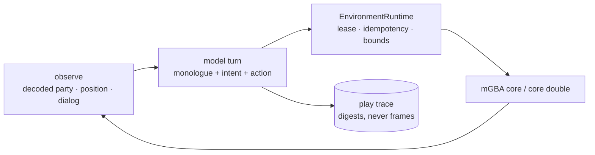

# ADR 0049: Free play is model-decided, and asserts something other than determinism

Status: accepted (James, 2026-07-25). M1 is implemented and has produced a live
playthrough; the interjection, volition, and Discord milestones are follow-ups.

## Context

Clankie's FireRed runs were never Clankie's. `nextRealRouteStep` is breadth-first
search over a scenario's declared map, and move selection is an `argmax` over
decoded legal moves. Both are deterministic by construction, which is what makes
the frozen scenarios reproducible and their two-fresh-core receipts
byte-identical ([ADR 0040](0040-real-mgba-core-behind-the-emulator-seam.md),
[ADR 0043](0043-version-pinned-firered-gameplay-profile.md)).

That is an algorithm playing a game. The product intent is different: Clankie
plays by his own choices, his thinking is readable, people can ask him what he
wants to do, and he volunteers commentary when he chooses to.

`GbaEmulatorToolNameSchema` already specified the model-facing surface —
`gba_emulator_observe`, `_start_action`, `_pause`, `_steer` — and had **zero
consumers**. The contract existed; nothing handed it to a model.

## Decision

A free-play loop where the **model** chooses each action, sitting beside the
deterministic drivers rather than replacing them.

Actions are dispatched through `EnvironmentRuntime` exactly as the scripted
drivers dispatch them. Free play changes _who decides_, not how an action is
authorised — so a model asking for an illegal button, an exceeded frame bound, or
a missing capability is refused by the same machinery that refuses a script.

### What a free-play run asserts

A model-decided run cannot be replayed, so determinism is unavailable as
evidence. It is replaced, not abandoned:

| Property           | How it is evidenced                                                                                             |
| ------------------ | --------------------------------------------------------------------------------------------------------------- |
| **Legality**       | Every action passed the adapter's catalogue and bounds, or was recorded as `rejected_by_adapter`                |
| **Causal linkage** | Each turn records the observation digest the decision was made from, the monologue, the action, and the outcome |
| **Bounds**         | Model text is length-capped; frames and inputs are capped by the session's resource bounds                      |
| **Progress**       | Distinct tiles, maps entered, turns since a new tile, and accepted actions per new tile                         |

**The deterministic scenarios are untouched and still pass.** Determinism was not
weakened to accommodate free play; a second, differently-evidenced mode was added
next to it.

### He looks at the screen, not only at RAM

The decoded observation is a **privileged and partial** view. It carries
position and facing but nothing about what is _in_ the room, so a model reading
only RAM discovers furniture by walking into it. That is exactly what the first
real-ROM run showed: six turns of "I may be bumping into something", inferring
obstacles by collision.

Each turn therefore carries the rendered frame as a PNG image part alongside the
decoded state. The same run with vision produced "I can see the stairs in the
upper-right", "I'm a bit too close to the desk furniture", "move east around the
desk" — naming stairs, desk, chair, PC, TV, and rug, **none of which the RAM
decoder exposes**.

Both inputs are kept because they answer different questions. The frame shows
what is on screen: walls, doors, NPCs, text. The decoded state carries the exact
values a screenshot reads badly: HP, PP, legal moves, map coordinates. It also
means Clankie sees what a viewer sees, so his commentary can be about the same
picture — which matters once the activity plane is showing that frame to people
([ADR 0047](0047-discord-activity-presence-plane.md)).

The frame is reused from the existing pipeline: `MgbaFireRedCore.framebuffer()`
through `encodeFramebufferPng`, the same bytes the activity plane streams. The
trace records only its digest.

### Progress is the metric that means something; coherence is not yet

Coherence was intended to separate reasoning from post-hoc narration. Measured
against real play it does not yet do that, and the reason is worth recording
rather than tuning away.

Two separate problems were found, in order:

1. **It punished correct adaptation.** Every turn was scored, including turns
   where the emulator refused the move. Revising a plan after walking into a
   desk is the right response, so transitions whose previous action was blocked,
   turned-only, or inert are now excluded.
2. **Intent is objective-shaped.** Even after that fix it reads ~9%, and an
   audit of the scored transitions shows why: the model states goals — "move
   north toward the stairs" — and then takes a step _right_ to route around
   furniture while still heading for the stairs. The metric compares an
   objective to one button press. It is measuring a category mismatch, not
   dishonesty.

Follow-through therefore cannot be measured until the objective and the
next-action are separate fields, each scored against the thing it actually
claims. Until then coherence is reported as a floor and read as noise.

**Progress is the metric that answers "is he playing well"**: distinct tiles,
maps entered, turns since a new tile, and accepted actions per new tile. Those
moved measurably when the feedback improved — 6.0 actions per new tile before,
2.8 after — which is what a real optimisation looks like.

Neither is ever gated. Gating would optimise a number before anyone knows what a
healthy value is, and would reward a model that restates the button name over
one that thinks.

### `accepted` never meant anything happened

The loop reported `accepted` for every dispatched action, which means the
adapter took the button — not that the character moved. A model walking into a
desk was told `accepted` and had to re-derive from coordinates that it was
stuck, so it walked into the desk again.

Each action is now diffed against the state before it: moved, entered a map,
blocked, dialog or menu changed, or nothing visible. Directions the emulator
refused accumulate per tile and are shown back. **That is memory of what he
tried, not a route** — the model still chooses, and no ranking or suggestion
reaches it.

One subtlety proved load-bearing. A short directional tap _turns_ the character
without stepping, so "position unchanged" is not evidence of a wall. Reporting
it as blocked invented obstacles and poisoned the refusal memory, and the model
correctly protested that it could see open floor. A turn is now reported as a
turn, and only a refusal while already facing that way records a block.

### Bursts are coarser granularity, not a wider budget

One model call per button press is the wrong unit: a corridor cost a decision
per tile, and because a short tap only turns the character, even a single step
often cost two calls.

`button_press` therefore takes an optional bounded `repeat`. Every repeat counts
against the session's `maxInputs` and the total hold against `maxFrames`, so a
burst draws from exactly the budget a single press draws from — it buys fewer
decisions, not more input. `repeat` is optional rather than defaulted so
`GbaEmulatorAction` stays backward compatible and the deterministic drivers
needed no edit at all.

Measured on the real ROM at equal turn count, actions per new tile moved 3.3 →
2.9, and the model used bursts unprompted in 4 of 20 turns — one `repeat: 4`
crossed four tiles in a single decision. It also raised its own `holdFrames` to
12-16 after learning that short taps only turn.

The aggregate gain is modest **and the measurement location is the reason**: a
7x7 bedroom full of furniture is the worst case for crossing distance, and a
burst of five immediately meets a wall. The capability is kept because it is
already used correctly and its payoff is outdoors; the honest reading is that
this scenario cannot demonstrate the win, not that the win is absent.

### He keeps his own notes

A bounded scratchpad is carried across turns and rewritten only by him. Omitting
the field leaves the previous notes standing, so silence is not amnesia, and
nothing else ever writes it — it is memory he chose to keep, not a summary the
harness imposed.

It is capped for two reasons: model text is untrusted, and an unbounded
scratchpad becomes the ever-growing prompt this loop is already paying for.

The content is the evidence it works. After twenty turns he had written: "North
from around (13,13) was blocked by furniture/TV, so I moved left around it. The
staircase is visually toward the upper-right; plan is go up along the left side
of the room, then right across the upper path to the stairs." That is a map, a
refusal history, and a plan, none of which the harness supplied.

**It did not measurably improve efficiency in a twenty-turn run**, and the honest
reason is that run-to-run variance (2.8, 2.9, 3.3 actions per new tile across
comparable runs) exceeds the effect being looked for. A single short run cannot
separate these changes; the notes are kept on the strength of what they contain
and their value over longer horizons, and that is stated rather than dressed up
as a measured win.

Adding the field also surfaced a failure mode worth recording: with more fields
to fill, the model began omitting `holdFrames`, and a strict read discarded 15 of
20 turns as invalid. A hold duration is a mechanical detail rather than a game
decision, so an omitted one now defaults to a value that commits a step. The
button and the direction remain entirely his.

### The objective outlives the turn; the intent does not

Asking "what next" every turn made the goal churn, and it was also what broke
follow-through: the model answered with objectives ("move north toward the
stairs") while the metric compared them to one button press.

They are now separate fields. `objective` is a standing goal carried forward
until he changes it; `intent` is the single concrete thing he will do next turn,
and it is what follow-through scores. An omitted objective means unchanged, the
same rule as notes.

This was the largest measured improvement of the set, on the real ROM at equal
turn count:

|                               | before (O2/O3) | after   |
| ----------------------------- | -------------- | ------- |
| distinct tiles in 20 turns    | 7-8            | **12**  |
| accepted actions per new tile | 2.9-3.3        | **1.8** |
| follow-through                | 42-44%         | **50%** |

The intents also changed shape without being asked to — "step right from (13,10)
into the staircase opening" rather than "reach the stairs" — which is the
category error the coherence section predicted, fixed at the source rather than
by a better matcher.

### Two cheap experiments, reported as measured

**Frame upscale — kept, but not on the strength of the numbers.** The frame is
nearest-neighbour upscaled before it reaches him; duplicating pixels adds no
information and invents none. Across three 20-turn runs the metrics did not
separate: native gave 13 tiles / 1.7 actions per new tile, 3x gave 14 / 1.5 and
11 / 2.0. **Run-to-run variance exceeds the effect.** The one consistent
difference is that both 3x runs changed map and the native run did not, which is
suggestive at n=3 and no more than that. It is kept because it is free and
weakly positive, and this is stated rather than presented as a win.

**Model choice dominates everything else here.** Same savestate, same prompt,
same twenty turns:

| model           | left the bedroom | tiles | actions per new tile |
| --------------- | ---------------- | ----- | -------------------- |
| `gpt-5.5`       | 1 run of 3       | 11-14 | 1.5-2.0              |
| `gpt-5.6-terra` | **2 runs of 2**  | 14-16 | **1.5**              |

In one terra run he was downstairs by turn 2 and spent the remainder working out
the front door — "the front-door mat is visibly down-left of me, not directly
below" — which is further than any other configuration reached. Follow-through
read _lower_ for terra (13-24%), which is consistent with that metric being
noise rather than with worse play.

The practical conclusion for anyone tuning this: measure the model before
tuning the harness.

### Volition is built and he does not use it

He can say something unprompted: `speak` is a field he may return null for, gated
only by a rate cooldown. The gate is deliberately **not** a content rule — no
"speak on a new map", no "speak after a battle" — because a rule per trigger
produces a narrator hitting marks. He reads the situation and decides; the gate
only stops him talking over himself.

Measured across four tuned attempts on the real ROM, **he spoke on 0 of 12 turns
every time**. The mechanism is not broken: unit tests confirm the loop records a
remark, counts it, enforces the cooldown, and reports offered-versus-taken. He is
choosing silence.

What was tried, in order, and what it tells us:

| Attempt                                                      | Result                                      |
| ------------------------------------------------------------ | ------------------------------------------- |
| Prompt framing: silence is normal                            | 0/12 — over-corrected, he took it literally |
| Split channels: monologue is reasoning, `speak` is the aside | 0/12                                        |
| Give him an audience to speak to                             | 0/12                                        |
| Schema field descriptions, then a concrete example           | 0/12                                        |

The likely cause is visible in the transcripts rather than the numbers: **all the
character is already going into `monologue`** — "I bonked the help sign.
Thrilling literature, truly", "no need to tour the rug like it owes me money".
The impulse to remark is being satisfied by a required field that nobody hears,
so the optional one stays empty.

Two readings remain open and one run cannot separate them. Either the split is
wrong — the aside and the reasoning are one act for him, and the honest design is
to _route_ monologue outward rather than ask for a second voice — or volition
genuinely needs a real audience, and a terminal is not one. He replies readily
when a person actually speaks to him (V1), which is weak evidence for the second.

**This is recorded as an unresolved result rather than tuned until the number
moves.** Forcing the rate with a stronger instruction would produce exactly the
narrator the feature exists to avoid, and the next honest test is putting him in
front of people rather than adding a fifth prompt revision.

### Failure is a turn outcome, not an exception

A playthrough must survive its own participants. Four outcomes are recorded and
none ends the run: `accepted`, `rejected_by_adapter`, `invalid_decision` (the
model returned something unparseable or out of catalogue), and `mind_failed` (the
model call itself failed). A long session should not die because one call
timed out.

### Model text is untrusted

`monologue` and `intent` are model output destined for operator and, later,
public surfaces. They are length-bounded at the schema, and reach a viewer only
through the bounded overlay contract in
[ADR 0047](0047-discord-activity-presence-plane.md). Raw frames never enter the
trace; it carries digests.

That overlay schema previously documented itself as carrying "no free-form model
output", which directly contradicted this decision. **Bounded model text may
cross** — the monologue is the whole reason the overlay exists — and the comment
has been corrected rather than the rule bent. What holds is the bound, not an
absence: capped length, capped line count, still untrusted, and never posted to
a channel as raw model output.

## Options weighed

- **Let the model emit a structured next-action prediction** so coherence is an
  exact match — rejected for M1. It constrains him to commit to a plan before he
  has looked, which is the scripted behaviour being removed. The heuristic's
  imprecision is the acceptable cost of leaving intent as natural language.
- **Gate a run on coherence** — rejected, see above.
- **Drive the model through the existing scenario drivers** — rejected. Those
  drivers halt on uncertainty and route by BFS; wrapping them would produce a
  model that rubber-stamps an algorithm's choice.

## Consequences

- Two provider constraints shaped the implementation and are load-bearing:
  the Codex OAuth endpoint rejects non-streaming calls outright
  (`{"detail":"Stream must be set to true"}`), and OpenAI structured output
  rejects `oneOf`, so the action union cannot go on the wire. The model answers
  a **flat** schema which is reassembled and then validated against the strict
  union. The strict contract still guards the boundary.
- The environment runtime caps a lease at five minutes. A playthrough outliving
  that needs lease renewal — a real constraint for the longer-running milestones,
  not something to be worked around by widening the cap.
- `pnpm gba:free-play` runs against the core double with no ROM, so the loop is
  exercisable in CI and by anyone without copyrighted bytes. The decision still
  comes from a real model; the double changes what he is looking at, not who is
  choosing.
- A run writes its trace under `artifacts/`, which stays untracked: the
  gitignore's redaction doctrine keeps transcript-bearing evidence local, and a
  trace carries model monologue. A short **format sample** is committed at
  `integrations/gba-emulator/fixtures/free-play/sample-trace.jsonl` — six turns
  from the first live playthrough, 6/6 accepted, coherence 1.0 — so the shape is
  reviewable without committing run output.
- Cost is now per decision. A long playthrough is a long series of model calls,
  and the trace grows with it; summarising a playthrough into memory rather than
  an ever-growing prompt is required before sessions get long.
