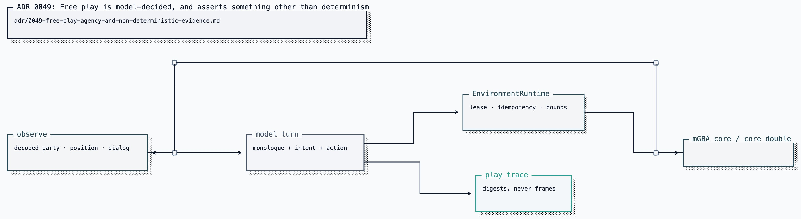

# ADR 0049: Free play is model-decided, and asserts something other than determinism

Status: accepted (James, 2026-07-25).

## Current status (2026-08-19)

Free play and its evidence model remain. [ADR 0129](0129-each-player-owns-a-body.md)
supersedes possession and shared-body references below: Clankie's play owns its
runtime, while GBA MCP applies the same contracts to a separate private runtime.

## Context

The deterministic scenario drivers chose routes and moves algorithmically so
two fresh cores could produce byte-identical receipts. That proved the emulator
boundary, not that Clankie was playing. Free play needed the model to inspect the
state, choose actions, explain intent, react to outcomes, and survive imperfect
decisions without weakening the deterministic test path.

## Decision

A model-decided free-play loop sits beside the deterministic drivers. Every
action still passes through `EnvironmentRuntime`; free play changes who decides,
not how the emulator validates an action.

The retained diagram is the historical evidence model at ratification:

A non-deterministic run asserts different properties:

| Property  | Evidence                                                                        |
| --------- | ------------------------------------------------------------------------------- |
| Legality  | each action is accepted or refused by the adapter                               |
| Causality | decision, immediate pre-action, result, and post-action evidence share one turn |
| Bounds    | model text, frames, inputs, and session resources are capped                    |
| Progress  | distinct tiles/maps and accepted actions per new tile                           |

Each decision sees both the rendered frame and decoded state. The frame carries
scene content such as walls, stairs, NPCs, and text; decoded RAM carries exact
coordinates, HP, PP, and legal moves. Neither substitutes for the other.

Action results distinguish accepted input from visible effect: moved, turned,
blocked, map changed, dialog/menu changed, framebuffer-only change, or no visible
change. Refusal memory records what he tried, never a suggested route. An exact
stable capability refusal may be returned from memory without dispatch while
the body's capability evidence is unchanged; the chosen action is still
journaled and is never replaced. Bounded button bursts reduce model calls
without widening input or frame budgets.

The loop keeps a bounded self-authored scratchpad, a standing objective, and a
one-turn intent. Failure is a turn outcome (`rejected_by_adapter`,
`invalid_decision`, or `mind_failed`), not a reason to kill a long session.

### Evidence summary

- Adding vision let the model identify stairs and furniture absent from decoded
  RAM and reduced repeated collision inference.
- Better effect feedback moved observed play from about 6.0 to 2.8 accepted
  actions per new tile.
- Separating objective from next-turn intent produced the largest measured
  improvement: 1.8 accepted actions per new tile and 50% follow-through in the
  cited twenty-turn run, versus 2.9-3.3 and 42-44% before.
- Run-to-run variance exceeded the measured effect of scratchpad and frame
  upscaling changes, so neither was claimed as a numerical win.
- Optional speech on the action decision remained near-silent across repeated
  runs. That evidence motivated the separate Voice agent in
  [ADR 0056](0056-voice-is-a-separate-agent-from-the-player.md), later narrowed
  per surface by [ADR 0074](0074-the-room-hears-one-voice.md).

Deterministic scenarios remain unchanged. Progress metrics inform tuning but do
not gate runs; optimizing an immature coherence score would reward restating a
button over adapting to the game.

## Alternatives considered

- **Wrap the deterministic driver with model narration** was rejected because
  the algorithm would still choose every action.
- **Gate runs on a coherence heuristic** was rejected because the metric mixed
  standing objectives with one-button intent and punished correct adaptation.
- **Let an uncatalogued model action reach the core** was rejected because free
  play must inherit the same fail-closed boundary as every other caller.

## Consequences

- Free play is not replayable; its durable trail preserves causal stages,
  bounds, progress, and failures instead
  ([ADR 0117](0117-play-evidence-preserves-causal-stages.md)).
- The rendered frame is untrusted model input; durable records keep its digest,
  not raw frame bytes.
- Model text shown on an activity overlay is bounded and remains untrusted.
- Cost scales with decisions, so longer play depends on bounded context and
  self-authored summaries rather than an ever-growing prompt.
- Current local-play controls and checkpoints stay in the
  [emulator guide](../../integrations/gba-emulator/README.md); the isolated MCP
  tools stay in the [GBA MCP guide](../../apps/gba-mcp/README.md), and live
  rendering stays in the [activity guide](../../apps/discord-activity/README.md).
