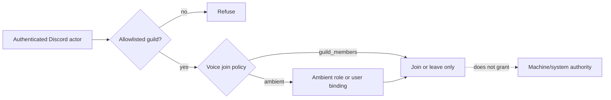

# ADR 0050: Voice presence is a separate authority tier from ambient commands

Status: accepted (2026-07-25). The mission/worker commands that motivated the
original split were later removed. The enduring decision is that permission to
move Clankie into a call does not grant broader machine authority.

## Context

At ratification one Discord role binding covered commands with very different
consequences: mission creation and steering, person-memory administration, and
voice join/leave. Opening voice to a private room would therefore also have
opened unattended machine work. A single-operator deployment also needed a
user-id binding rather than a synthetic Discord role.

## Decision

Voice presence receives its own actor policy. `DISCORD_VOICE_JOIN_POLICY`
selects `ambient` or `guild_members`, while `DISCORD_AMBIENT_USER_IDS` can name
individual ambient operators alongside role ids.

`guild_members` widens voice presence and nothing else. Guild and channel
allowlists still apply first, and leave cannot target a call in another guild.
Unrecognized or absent policy values resolve to `ambient`; the wider policy is
reachable only by selecting it exactly.

## Alternatives considered

- **Grant the ambient tier to everyone** was rejected because it silently
  widened higher-consequence commands at ratification.
- **Use one boolean** was rejected because a named policy expresses the actor
  set and permits future policy values without contradictory flags.
- **Create a binding per command** was rejected as unnecessary; only voice had
  a demonstrated need to diverge.

## Consequences

- Voice remains off by default and guild/channel allowlisted.
- Permission to join never implies permission to capture; the voice consent
  policy remains separate.
- Spoken input remains an ambient social surface and does not grant system-tool
  authority.
- Current configuration belongs in the
  [Discord bridge operating guide](../../apps/discord-bridge/README.md).
