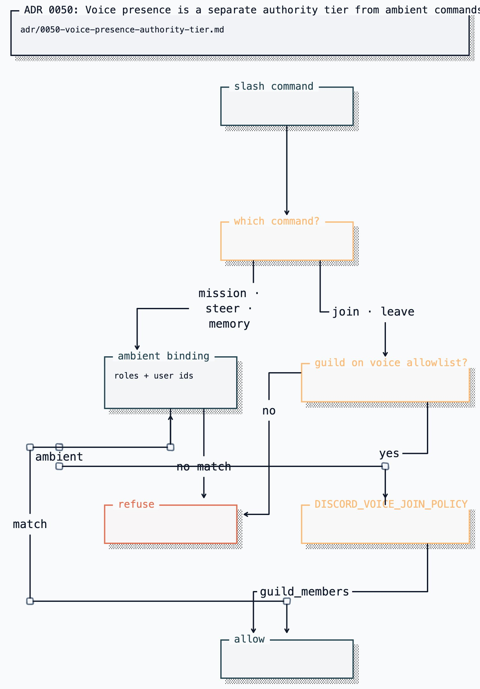

# ADR 0050: Voice presence is a separate authority tier from ambient commands

Status: accepted (2026-07-25).

## Context

`apps/discord-bridge` gated every privileged slash command behind one binding,
`DISCORD_AMBIENT_ROLE_IDS`. That single list covered commands with very
different consequences:

| Command                            | Consequence of an unintended caller           |
| ---------------------------------- | --------------------------------------------- |
| `/clankie mission`                 | spawns workers that execute and write code    |
| `/clankie steer`                   | redirects a running worker                    |
| `/clankie memory forget`           | drops thread↔mission correlation              |
| `/clankie person-memory`           | proposes or recalls stored facts about people |
| `/clankie join` / `/clankie leave` | starts or ends a call; spends speech budget   |

Collapsing these into one tier forces a false choice. An operator who wants
Clankie summonable into a call by anyone in a small private server must grant
that whole room mission creation — unattended code execution against the
operator's machine. An operator who refuses that must instead lock voice down to
role holders, which defeats the social purpose of the voice body in ADR 0045.

A second gap compounded it: the binding is role-shaped only. A
single-operator deployment has no one to hand a role to, so expressing "only me"
required inventing a role whose membership drifts the first time it is edited in
the Discord UI.

## Decision

Voice presence gets its own authority tier, and the ambient tier gains a
user-shaped binding.

- `DISCORD_VOICE_JOIN_POLICY` selects who may invoke `/clankie join` and
  `/clankie leave`:
  - `ambient` (default) — the existing ambient binding, unchanged.
  - `guild_members` — any member of a guild already on the deny-by-default
    voice allowlist.
- `DISCORD_AMBIENT_USER_IDS` grants the ambient tier to named Discord user ids
  without a mapped role, alongside `DISCORD_AMBIENT_ROLE_IDS`.

`guild_members` widens voice presence and nothing else. `/clankie mission`,
`/clankie steer`, `/clankie memory`, and `/clankie person-memory` continue to
consult only the ambient binding, so opening a call to a room never hands that
room execution authority.

The policy decides _who_ inside an allowlisted guild may move Clankie between
calls; it never decides _which_ guild. `DISCORD_VOICE_GUILD_IDS` remains
required and is checked first, so an open policy cannot reach a server the owner
does not choose. `/clankie leave` additionally refuses when the active session is
in a different guild than the caller's, so an open policy in one server cannot
hang up a call in another.

Unrecognized and absent policy values resolve to `ambient`. The open policy is
reachable only by writing it exactly.

## Options weighed

- **Set the ambient binding to `@everyone`** — rejected. It reads as "open
  voice" but actually grants mission creation, steering, and memory commands to
  every member. The failure is silent and the blast radius is code execution.
- **A boolean `DISCORD_VOICE_JOIN_OPEN`** — rejected. A named policy leaves room
  for later tiers without a second boolean, and matches the existing
  `DISCORD_INGRESS_DM_POLICY` enum idiom.
- **Per-command role bindings for every command** — rejected as premature. Only
  voice presence has a demonstrated need to diverge; the rest share one blast
  radius and one binding.
- **Reuse `ownerUserId`** — rejected. That field is scoped to the DM policy;
  overloading it would make two unrelated policies move together.

## Consequences

- `/clankie join` uses this actor-tier policy rather than a Discord-role gate: it is
  gated by the voice presence tier, which defaults to the ambient binding.
- Voice remains off by default, guild-allowlisted, and per-participant
  consented. `guild_members` changes who may _start_ a call, never who is
  captured: `/clankie voice-consent` still governs every microphone, and
  presence never implies consent.
- Spoken input remains ambient authority and still cannot approve privileged
  work, unchanged from ADR 0045.
- An operator running `guild_members` should expect speech-budget spend by any
  member of the allowlisted servers. That is the cost the tier deliberately
  isolates from execution authority.
