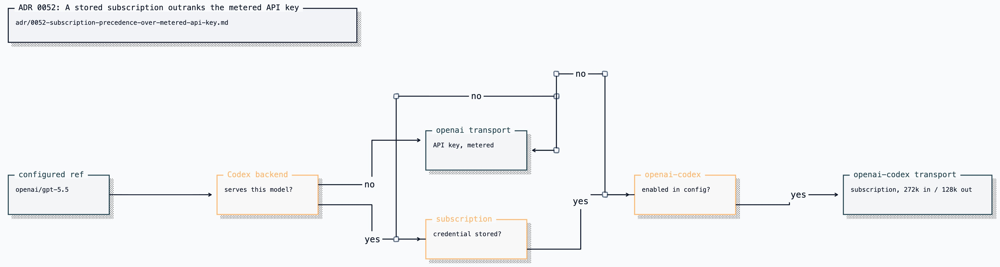

# ADR 0052: A stored subscription outranks the metered API key

Status: accepted (2026-07-25).

## Context

Clankie's captain reaches OpenAI through two provider identities: `openai`
(API key, billed per token) and `openai-codex` (ChatGPT subscription OAuth,
already paid for). [ADR 0012](0012-provider-auth-model-registry.md) makes them
separate identities, so neither transport may borrow the other's credential.

Model selection can carry the whole billing decision in one easily stale
string. A stored `openai/gpt-5.5` ref keeps spending API credit even when a
subscription credential is available, and the surface gives no indication —
the same turn is free on the subscription transport. The drift is visible only
in usage bills or the session ledger.

## Decision

While a subscription credential is stored, it supersedes the API key for every
model the Codex backend serves. The shared subscription policy redirects an
`openai/<model>` ref to `openai-codex/<model>` before any credential lookup;
`gpt-5.6` maps to `gpt-5.6-sol`, the slug the backend answers.

This is a redirect of provider identity, not credential borrowing: the resolved
identity becomes `openai-codex`, the request goes over the Codex transport, and
the context budget narrows to the backend's window. A model the subscription
cannot serve still fails with "No credential is configured for openai" rather
than silently reaching for the other credential, so the identity boundary stands.

The redirect is stated, never silent. `/model status` renders
`openai/gpt-5.5 → openai-codex/gpt-5.5 (ChatGPT subscription)`, `/model` says so
on selection, and the active Pi session reports the effective model and context
budget.

Two ways back to metered access, both deliberate:

1. log out of the subscription (`/auth`), which removes the credential; or
2. remove `openai-codex` from play in config — `disabled_providers`, or an
   `enabled_providers` allowlist that omits it.

The configured effort survives the redirect. Both transports expose the same
per-model ladder, and an effort configured against the subscription ref wins
over one configured against the API-key ref.

Anthropic and SuperGrok need no equivalent rule: subscription OAuth and API
key share one provider id (`anthropic`, `xai`) and one credential slot, so
storing the OAuth already displaces the key, and a stored credential already
outranks `ANTHROPIC_API_KEY` / `XAI_API_KEY`. SuperGrok also covers Grok
image and video: `ConfiguredMediaGenerator` prefers the `xai` OAuth Bearer
over a metered key so pictures and clips ride the plan the operator already
pays for.

## Options weighed

- **Leave the ref authoritative** — rejected because the default
  outcome is spending money on a turn the operator already pays for, with
  no surface stating which transport handles the turn.
- **Warn instead of redirect** — rejected because a warning that appears once at
  selection time does not change the ref an unattended captain resolves later;
  the billing decision would stay in stale config.
- **Redirect with a per-ref force flag** (`openai/gpt-5.5!metered` or a
  `force_metered` config key) — rejected as a third way to say something config
  already says. Provider-level opt-out plus logout keeps one authority for
  "which providers are in play".
- **Hide subscription-served models from the `openai` picker** — rejected
  because the picker would then lie about what the API key can reach, and the
  drift would return the moment the operator logs out.

## Consequences

- An operator holding both credentials pays for OpenAI turns only when they say
  so explicitly, and the surfaces name the transport that handles the turn.
- Stored OpenAI refs honor a subscription login without an edit.
- The captain's usable context can shrink after a login (1.05M → 272k input) for
  the same ref; the status line and ledger budget reflect the narrower window.
- Expanding `CODEX_SUBSCRIPTION_MODEL_IDS` also expands what the redirect
  captures, so the streamed probe
  (`pnpm --filter @clankie/model-provider codex-probe`) gates both.
