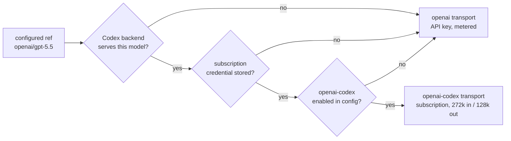

# ADR 0052: A stored subscription outranks the metered API key

Status: accepted (2026-07-25).

## Context

Clankie's captain reaches OpenAI through two provider identities: `openai`
(API key, billed per token) and `openai-codex` (ChatGPT subscription OAuth,
already paid for). [ADR 0012](0012-provider-auth-model-registry.md) made them
separate identities and [ADR 0014](0014-live-eve-captain-session-boundary.md)
forbade either from borrowing the other's credential.

Model selection then carried the whole billing decision in one easily-stale
string. A ref of `openai/gpt-5.5` written before the subscription login kept
spending API credit afterward, and nothing in the surface said so — the same
turn was free on the transport whose credential was already stored. Operators
discovered the drift only in usage bills or by reading the session ledger.

## Decision

While a subscription credential is stored, it supersedes the API key for every
model the Codex backend serves. `resolveConfiguredLanguageModel` redirects an
`openai/<model>` ref to `openai-codex/<model>` before any credential lookup;
`gpt-5.6` maps to `gpt-5.6-sol`, the slug the backend answers.

This is a redirect of provider identity, not credential borrowing: the resolved
identity becomes `openai-codex`, the request goes over the Codex transport, and
the context budget narrows to the backend's window. A model the subscription
cannot serve still fails with "No credential is configured for openai" rather
than silently reaching for the other credential, so ADR 0014's rule stands.

The redirect is stated, never silent. `/model status` renders
`openai/gpt-5.5 → openai-codex/gpt-5.5 (ChatGPT subscription)`, `/model` says so
on selection, and every turn records the effective ref as
`captain.session.model_selected` in the captain session ledger.

Two ways back to metered access, both deliberate:

1. log out of the subscription (`/auth`), which removes the credential; or
2. remove `openai-codex` from play in config — `disabled_providers`, or an
   `enabled_providers` allowlist that omits it.

The configured effort survives the redirect. Both transports expose the same
per-model ladder, and an effort configured against the subscription ref wins
over one configured against the API-key ref.

Anthropic needs no equivalent rule: subscription OAuth and API key share the
`anthropic` provider id and one credential slot, so storing the OAuth already
displaces the key, and a stored credential already outranks `ANTHROPIC_API_KEY`.

## Options weighed

- **Leave the ref authoritative (status quo)** — rejected because the default
  outcome was spending money on a turn the operator had already paid for, with
  no surface stating which transport ran.
- **Warn instead of redirect** — rejected because a warning that appears once at
  selection time does not change the ref an unattended captain resolves later;
  the billing decision would stay in stale config.
- **Redirect with a per-ref force flag** (`openai/gpt-5.5!metered` or a
  `force_metered` config key) — rejected as a third way to say something config
  already says. Provider-level opt-out plus logout keeps one authority for
  "which providers are in play".
- **Hide subscription-served models from the `openai` picker** — rejected
  because the picker would then lie about what the API key can reach, and the
  drift would return the moment the operator logs out.

## Consequences

- An operator holding both credentials pays for OpenAI turns only when they say
  so explicitly, and the surfaces name the transport that ran.
- Refs written before a subscription login start honoring it without an edit.
- The captain's usable context can shrink after a login (1.05M → 272k input) for
  the same ref; the status line and ledger budget reflect the narrower window.
- Expanding `CODEX_SUBSCRIPTION_MODEL_IDS` now also expands what the redirect
  captures, so the streamed probe (`pnpm models:codex-probe`) gates both.
