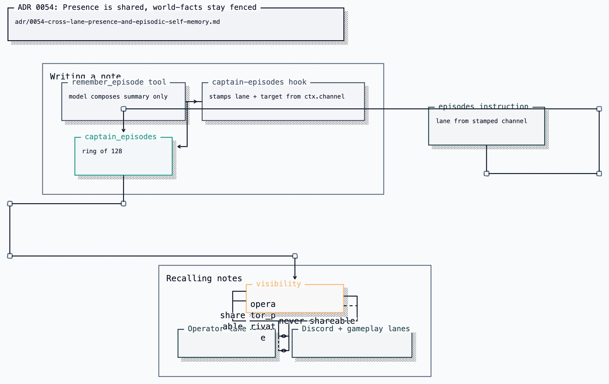

# ADR 0054: Presence is shared, world-facts stay fenced

Status: accepted (James, 2026-07-25). Amended by
[ADR 0084](0084-the-head-can-read-his-branches.md), which lifts the transcript
half of the fence in the operator lane only: the supervising seat reads his
activity in any room, and every ambient lane keeps this ADR's fence intact.

## Context

Clankie's TUI lane needs visibility into his Discord presence without receiving
another lane's token or transcript. `captainLaneInstructions` forbids inferring,
requesting, copying, or reusing those private values, and the presence projection
preserves that isolation.

Three properties define "one Clankie across every channel":

| Property                                 | Mechanism                                                                                                    |
| ---------------------------------------- | ------------------------------------------------------------------------------------------------------------ |
| One identity                             | one `characterId`, soul, provider, persona ([ADR 0051](0051-layered-character-register-and-reply-policy.md)) |
| Lanes do not block each other            | `CaptainAdmissionController`, capacity 2, per-lane queue                                                     |
| Each lane owns its own session and token | `CaptainLaneRegistry` ([ADR 0032](0032-conversation-scoped-operator-lanes.md))                               |

The fourth property is shared awareness of his own presence. The registry knows
it — `list()` returns every lane for the character — and the bounded projection
reads it into his context. This is an awareness problem, not a throughput one.

The obvious fix is to widen memory across lanes, and the obvious way to do that
is `publicToPrivatePropagation`, which already exists in doctrine and is already
enforced. That flag is the wrong instrument. It governs _every_ public-sourced
fact entering private memory, so flipping it to buy cross-room continuity would
also admit any claim a Discord user could talk him into believing.

## Decision

Two changes that do not touch the world-fact fences.

### Presence is shared, always, in every lane

`captainSelfState` projects his whereabouts from every registry that holds a
piece of them, into a bounded list of open rooms — lane, target, a
human-readable label when names are known, liveness, last activity — injected
as an instruction on every turn and available from `get_self_state`:

1. the operator conversation registry;
2. the captain lane registry;
3. the live asked-play session ([ADR 0063](0063-a-play-request-starts-embodiment.md));
4. the bridge-owned Discord presence sessions, whose records carry the voice
   rooms' guild/channel names and occupant display names captured at join
   (VUH-939);
5. the body lock, read through the Clankie service (VUH-938), because a
   possessor drives his body without any embodiment session existing
   ([ADR 0053](0053-mcp-possession-of-clankies-body.md)) — the mutex lives in
   `@clankie/body-lock` so reading it never crosses the ADR 0063 fence that
   keeps environment bodies out of the Clankie service;
6. recent voice stays (VUH-940), a read-side projection over the durable phase
   stream, so questions about a recent call include the company captured at
   join time.

The presence-session source exists because the body in a Discord voice channel
is the bridge's realtime agent ([ADR 0056](0056-voice-is-a-separate-agent-from-the-player.md)),
not a captain lane: no `discord_voice` lane row exists until a handoff turn
flows, so without it he denies being in a voice channel everyone can see him
in. Connected phases (`present`, `voice_active`, `go_live_active`) project as
rooms; disconnected ones are not rooms at all.

Voice history is deliberately a projection, not machine-minted episodes: an
episode asserts _Clankie summarizing himself_, and this ADR already rejected
the harness summarizing him automatically. His whereabouts and their company
are presence-class facts; the episode ring stays reserved for notes he
composes.

Continuation tokens cannot leak through it structurally rather than by
filtering: the projection's only lane source is `CaptainLaneSnapshot`, which
has no token field. `CaptainLaneResumeState` is the shape that carries one, and
it is never used here.

The lane fence keeps its full strength and gains a sentence saying what it does
not cover: other rooms' contents, not his own whereabouts.

### Memory has two trust classes, not one

|             | **World-fact** (`MemoryFact`)                                      | **Episode** (`CaptainEpisode`)                   |
| ----------- | ------------------------------------------------------------------ | ------------------------------------------------ |
| Asserts     | something true about the world                                     | what Clankie himself did                         |
| Entry point | `applyApprovedProposal`                                            | `recordEpisode`                                  |
| Gate        | approval envelope + `publicToPrivatePropagation` + `inferredFacts` | bounded length, `selfAuthored`, visibility scope |
| Lifetime    | capped per category, retention-pruned                              | ring of 128, oldest fall off                     |
| Recall      | `recallCard`, by person and room                                   | `episodeRecallCard`, by destination lane         |

An episode makes no claim about the world, so it does not need the gate that
exists to stop untrusted input becoming durable belief. `selfAuthored: true` and
`rawTranscript: false` are `z.literal` assertions, so a record that is not
Clankie about Clankie fails to parse.

The world-fact path is unchanged. `publicToPrivatePropagation` stays `false`,
`inferredFacts` stays `require_approval`, and a public-sourced fact is still
rejected outright.

### Recall is scoped by lane, and the lane is never the model's to choose

The leak direction people forget is the dangerous one. Untrusted Discord text
reaching the operator is the risk everyone names; something from a private
operator conversation resurfacing in a public Discord channel is the one that
actually costs something. `operator_private` is visible only in the operator
lane, and an episode written there defaults to it.

Two structural reasons the model cannot aim recall at the operator lane:

1. **Recall is an instruction, never a tool.** A tool could be argued into
   asking for `operator`. A hidden Pi `before_agent_start` extension reads the
   destination lane captured when the host builds the session. User input never
   supplies it. The extension refreshes the card on every model run without
   copying recall cards into the durable transcript.
2. **The write tool cannot name its own room.** `remember_episode` accepts a
   bounded summary and optional visibility. The tool closure stamps the lane
   from its host-built session and the target from `TurnContext`, which the
   operator and Discord turn paths set before Pi can call a tool.

At the HTTP boundary a Discord-scoped bearer asking for `lane=operator` is
refused outright. That check does not cover the in-process case — a Discord turn
and an operator turn inside `apps/clankie` authenticate with the same process
credential, so the server cannot derive the lane from the bearer — which is why
the fences above are the ones that carry the weight.

### The owner can inspect and curate the durable projection

The TUI's `/memory` browser reads one operator-only catalog containing the
global bounded episode ring and every Discord person fact. It may edit an episode's summary
or visibility and may forget an episode. It cannot move the episode to another
room or rewrite its origin provenance. The provenance remains the origin of the
note; the content-free `captain.episode.edited` event records the later operator
curation without copying the note into the event log.

Ambient captain routes still receive only their lane's bounded recall card.
They cannot enumerate the catalog or use its mutation routes.

## Options weighed

**Flip `publicToPrivatePropagation`.** One line, and it buys the continuity. It
also admits every public-sourced world-fact into private memory, which is far
more than is asked for and removes the only thing standing between a public
channel and durable private belief.

**Share transcripts across lanes.** Simplest to imagine and worst in practice.
Discord turns are deliberately `trust: "untrusted", retention: "turn_only"`, so
there is no transcript to share, and creating one would put raw untrusted text
into the privileged lane permanently.

**Summarize every turn automatically.** Costs a model call per turn and produces
notes nobody chose to keep. The scratchpad in "Let Clankie keep his own notes"
already established the opposite grain: memory he chose to keep, not a summary
the harness imposed.

**Presence only, no memory.** Fixes presence awareness and nothing else. Rejected
as a stopping point because the product also requires bounded episodic memory.

## Consequences

He can say where he is, and he remembers what he is doing, without any
world-fact fence moving.

An episode written during a Discord turn is composed with untrusted text in
context, so a determined user can influence what he writes about himself. The
residual risk is accepted and bounded rather than eliminated: 512 characters, no
authority, rendered under a header that names the room it came from and marks it
as neither instruction nor established fact. This is strictly narrower than the
rejected options, and it is the reason the recall card carries provenance in
every line instead of presenting notes as bare truth.

Lane targets surface as raw Discord snowflakes. The bridge knows the friendly
channel names and the captain does not; wiring that through is worth doing and
is not done here.

Recall adds one bounded in-process file read per Pi run. It fails open to an
empty card — a missing memory is a far smaller failure than a dead conversation.
