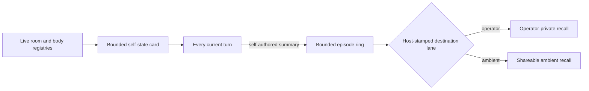

# ADR 0054: Presence is shared, world-facts stay fenced

Status: accepted (James, 2026-07-25). Amended by
[ADR 0084](0084-the-head-can-read-his-branches.md), which lets the operator seat
read activity across rooms. The doctrine-governed world-fact store used as the
comparison in this record was later removed; references to it below are
historical, not current implementation claims.

## Context

One Clankie can have separate operator, Discord, voice, and gameplay sessions
without sharing their continuation tokens or transcripts. He still needs to
know where he is and retain bounded notes about what he did.

At ratification the tempting implementation was to widen a doctrine-governed
world-fact store across lanes. That would also have allowed untrusted public
claims to become private durable belief. The decision instead separated
presence and self-authored episodes from assertions about the world.

## Decision

### Presence is shared; room content is not

`captainSelfState` projects a bounded list of Clankie's open rooms and active
bodies into each turn: lane, target, label when known, liveness, and recent
activity. It may combine operator conversations, captain lanes, live play,
Discord presence, and possession state. Continuation tokens and other rooms'
transcripts are structurally absent from that projection.

### Episodes are self-authored and lane-scoped

Clankie may keep a bounded episode describing what he did. The host stamps its
origin lane and target; model input cannot aim a write or recall at another
room. Operator-private episodes remain operator-only, while ambient recall sees
only entries visible to its destination.

Recall is injected by the host rather than exposed as a destination-selecting
tool. The write tool accepts bounded content and visibility, while the host
stamps lane and target from authenticated turn context.

The operator may inspect, edit, and forget episodes, but cannot rewrite origin
provenance or move an episode to another room. Ambient routes cannot enumerate
the catalog.

### Historical world-fact comparison

The retired implementation distinguished approved world facts from
self-authored episodes. World facts used approval envelopes and propagation
flags; episodes asserted only what Clankie did and used bounded provenance and
visibility. Although that world-fact machinery no longer exists, the durable
decision remains useful: a self-authored episode is not an authority-bearing
claim about the world, and untrusted room text is not silently promoted into
private memory.

## Alternatives considered

- **Share transcripts across lanes** was rejected because it would persist and
  expose untrusted room content in a privileged conversation.
- **Automatically summarize every turn** was rejected because it creates notes
  nobody chose to keep and spends an extra model call.
- **Presence without memory** was rejected because whereabouts alone does not
  provide bounded continuity across sessions.

## Consequences

- Clankie can report where he is without receiving another lane's transcript or
  continuation token.
- A room can influence a self-authored episode because its text was in context,
  but the entry stays bounded, provenance-labelled, and non-authoritative.
- The operator has one curation surface; ambient lanes receive only filtered
  recall cards.
- Current storage paths and memory behavior belong in the
  [architecture guide](../architecture.md); this record preserves the privacy
  and authorship boundaries.
