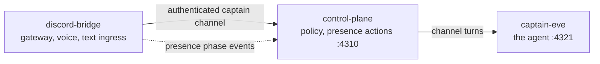

# ADR 0055: The launcher owns every local service, not just the captain

Status: accepted (James, 2026-07-25).

## Context

Being present in Discord takes three long-lived local processes:

Only the captain was supervised. `clankie restart` built it, started it, health
gated it, and refused to signal a pid it did not own ([ADR 0017](0017-self-development-operating-model.md)
made the captain the lead; the launcher grew up around it).

The other two were started by hand. In practice that meant a shell line carrying
a `pgrep -f … | kill` loop, a `sleep 3`, and an env prefix that restated
`DISCORD_PRESENCE_GUILD_IDS` and `DISCORD_PRESENCE_CHANNEL_IDS` — values already
in `~/.config/clankie/settings.json`, which `@clankie/settings` resolves into the
unset environment anyway. The duplication was not just noise: an operator who
edited settings.json and restarted with a stale prefix got the old allowlist and
no indication of it.

Three specific failures followed from having no owner:

- **Nothing knew what was running.** A week-old control plane and runner pair
  survived on this machine, invisible to every command, because no record tied a
  process to the thing that started it.
- **"Restarted" meant "spawned".** The hand-rolled sequence had a fixed sleep
  where a health gate belonged, so a failed boot looked identical to a good one
  until Discord stayed silent.
- **Killing was done by pattern.** `pgrep -f "apps/discord-bridge/node_modules"`
  matches on a path, not on ownership. Pids are recycled; a pattern is not a
  claim.

## Decision

The launcher owns all three services under one supervision model, and
`clankie restart` restarts them in dependency order.

The captain's supervisor already encoded the rules the others needed, so they
were generalized rather than reimplemented. `apps/tui/bin/service-supervisor.ts`
holds the mechanics; `apps/tui/bin/services.ts` holds the three definitions and
the ordering.

Three rules carry over verbatim, because each one was earned:

1. **A pid record per service**, written atomically at mode 0600 under
   `${XDG_STATE_HOME:-~/.local/state}/clankie/<id>-service.json`, so a later
   invocation can find what an earlier one started.
2. **An ownership check before any signal.** The recorded pid's live `ps`
   command must still look like the service we started, or the supervisor
   refuses. A stale record must never let `clankie` kill an unrelated process
   that inherited the pid.
3. **A health gate on start.** `startService` returns only when the service's own
   probe reports healthy — never when the child spawns.

Stop escalates SIGTERM → SIGKILL. The captain deliberately does not: it refuses
to replace a captain that will not stop, because a half-dead agent holding a
build lock is worse than a failed command. The other two carry no such state.

### Restart forwards, stop backwards

`restart` walks `captain-eve → control-plane → discord-bridge` and **stops at the
first failure**. Continuing past a dead captain only produces a bridge that
cannot route a turn plus a wall of downstream errors hiding the one that
mattered. `down` walks the reverse, so a dependent never outlives what it calls.

### The captain keeps its own path

The captain has a build step, a shared build lock, and a source-graph generation
hash. Flattening that into the generic supervisor would have meant teaching the
generic path about builds, so the registry routes captain restarts to
`restartCaptainService` and supplies its own record reader. One special case,
declared, beats three services pretending to be identical.

### Bridge health comes from the control plane

The bridge serves no HTTP surface, so process liveness is the only signal it
owns. Its _semantic_ phase is published to the control plane, and
[ADR 0024](0024-discord-dual-plane-presence.md) is explicit that operator status
must come from that stream rather than from bot log text.

The full session records on `GET /v1/discord/presence-sessions` are captain
scoped — they carry the session id and revision an action must claim, and
widening that route's authentication to include operators would have handed a
read surface the fields that authorize writing. So status reads a separate
`GET /v1/discord/presence-status`, operator-authenticated and read-only, which
projects phase, gateway flag, transport kind, and counts, and omits session id,
credential ref, character id, and revision.

Presence detail is decoration over process health: when no operator credential
is available the bridge still reports its process state, and never degrades to
unhealthy because a projection could not be read.

## Consequences

Operators get `clankie restart` (all three), `clankie restart discord` (one),
`clankie down`, and a `clankie status` that reports every service rather than the
captain alone. The env prefix is gone: the presence runtime module is a
repository path the launcher supplies, and allowlists keep settings.json as their
single source of truth.

`clankie status` and `clankie restart` now emit an additional `services` array.
Existing top-level captain fields are unchanged, so machine consumers of the old
shape keep working. Bare `clankie restart` changed meaning from "restart the
captain" to "restart everything"; `clankie restart captain` is the old behavior.

A service started outside the launcher is reported, never adopted and never
killed — the supervisor refuses and says so, because the alternative is a command
that silently kills processes it cannot identify.
