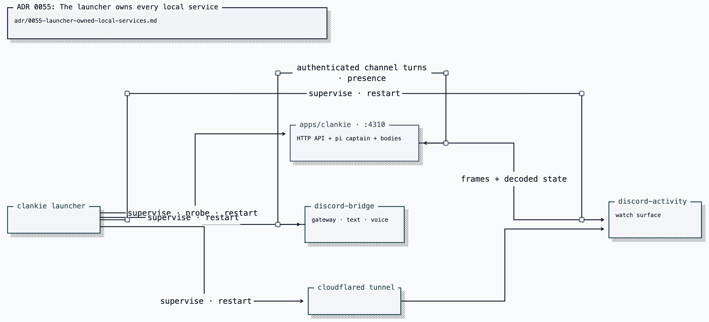

# ADR 0055: The launcher owns every local service

Status: accepted (James, 2026-07-25). Applies to the single-service pi
architecture.

## Context

Clankie is present through several long-lived local processes. Starting them by
hand leaves no durable ownership record, no dependency-aware restart, and no
reliable health gate.

## Decision

`apps/tui/bin/service-supervisor.ts` owns the process mechanics and
`apps/tui/bin/services.ts` declares the services and their dependency order.
The backend is one `clankie` process: the HTTP API, pi captain, presence state,
media, and game bodies all live there. The Discord bridge depends on it. The
optional lab user-session body depends on it too and stays off until enabled
([ADR 0098 (user-session shares)](0098-user-session-watches-discord-shares.md)). The activity
surface and tunnel publish what he plays.

Every managed process gets:

1. an atomically written mode-0600 pid record under the Clankie state root;
2. a live command check before any signal, so a recycled pid cannot kill an
   unrelated process; and
3. a service-specific health gate before start succeeds.

Restart follows dependencies. Restarting `clankie` also restarts the bridge
and the lab user-session body, because both hold live claims against the
service instance. Stopping one named service remains scoped to that service.

A restart requested from Clankie's own operator-turn bash tool is handed to a
detached launcher helper. Pi already exposes the durable `PI_SESSION_FILE`; the
launcher uses its conversation's append-only event log to wait for that turn's
terminal event before stopping the service. The operator face retries only a
dropped durable tail read, then resumes from its persisted cursor. It never
replays the prompt or any tools that already ran.

[Editable Turbopuffer tldraw source](../diagrams/clankie-docs-diagrams.tldraw)

The compatibility aliases `captain`, `captain-eve`, `eve`, `control-plane`, and
`cp` all resolve to `clankie`; they do not name separate processes.

## Consequences

- `clankie restart` and `clankie status` cover the full local stack.
- A self-restart finishes the conversation turn before replacing its backend;
  a dropped tail reconnects without repeating the turn.
- A process started outside the launcher is reported but never adopted or
  killed.
- Settings remain the source of Discord allowlists; the launcher supplies only
  repository paths and brokered service credentials.
