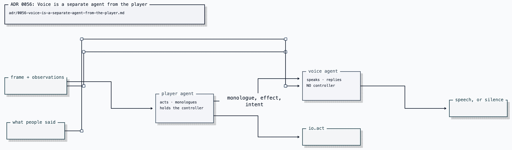

# ADR 0056: Voice is a separate agent from the player

Status: accepted (2026-07-26). Defines a separate gameplay voice decision
alongside [ADR 0049](0049-free-play-agency-and-non-deterministic-evidence.md). Its scope follows
[ADR 0074](0074-the-room-hears-one-voice.md): this agent authors for the
activity overlay and the journal, and is not consulted while a voice room is
listening — there the realtime session is the sole author.

## Context

The single-call player returns an action, a monologue, and an optional `speak`.
Current benchmark evidence shows that speech remains structurally subordinate
when the same decision handles navigation:

| Attempt                                        | Spoke                        |
| ---------------------------------------------- | ---------------------------- |
| Single-call baseline                           | 0 of 12                      |
| Prompt-only variants                           | 0 of 12                      |
| Cold-start fix + named audience                | 0 of 16                      |
| Prompt discouragement absent (gate is the cap) | 1 of 16                      |
| **Voice as its own agent**                     | **7 of 16 wanted, 2 spoken** |

The last row is the decision's evidence: with speech as its own decision he
_wants_ to speak seven times and the rate gate holds five. The gate governs
real demand instead of an empty stream.

Follow-through is 18% for the baseline and 57% for the split-agent run. One run
each makes this an observation rather than a claim, but the mechanism is plausible: the player's
call does not split between two jobs.

Two independent constraints also suppress speech:

- **Cold start.** `turnsSinceSpoke` is rendered only when non-null, and it is
  null until he first speaks. The signal that prompts a first remark appears
  only after the first remark.
- **Double suppression.** A mechanical rate gate caps how often he can speak
  _and_ the prompt tells him not to speak often. The prompt is rationing
  against a ceiling that is already enforced.

Together they move the single-call result from 0 to 1 in sixteen turns. The
remaining cause is not wording.

In a single call the model is solving a navigation problem. `speak` is an
optional field it can decline at no cost, and the expressive impulse the field
wants has already been spent on `monologue`, which is mandatory and which the
model treats as where thinking goes. Speech is structurally subordinate to the
task it shares a call with.

## Decision

Split the loop into two agents with different jobs and different authority.

- **Player** decides actions and writes monologue. It has `io.act`.
- **Voice** receives the frame, the player's monologue, recent effects, and
  anything people say. It decides to speak or stay silent. It has no `io.act`.

Voice's speech and reply win whenever a voice is wired. The player's own
`speak`/`reply` remain on its wire schema as the single-agent fallback, so a
caller with no voice still behaves as before rather than going mute. The player
still sees an interjection, because a question about what he is doing is context
for the turn; it cannot arrive only at something that acts.

Voice's job is **selection and delivery, not invention**. It speaks as Clankie
by choosing which of his real thoughts are worth voicing, with the monologue as
its source of truth. That is what keeps it from drifting into commentary
describing a screen it is only half-reading, and from becoming a sportscaster
narrating every move.

### Why this over more prompt work

A dedicated agent's `null` is not free. Deciding whether to speak is its entire
decision rather than a field it can leave empty while doing something else. The
measurements above are four independent attempts at the prompt-level fix, two of
which correct genuine defects; the ceiling stays fixed.

### Why this is also a safety improvement

Without this split, the rule that an interjection must not become a route rests
only on prompt wording — "someone talking to you is a person talking, not an order."
Wording is not a boundary. Routing conversation to an agent that has no
controller makes it structural: a message that reaches only Voice **cannot**
steer the character, because Voice cannot act. The observed good behaviour
(asked to abandon the stairs for the computer, he declined and kept his intent)
stops depending on him choosing to decline.

This is the same shape as possession ([ADR 0053](0053-mcp-possession-of-clankies-body.md)):
who talks and who drives are different authorities, and the driving one is the
one that is fenced.

## Consequences

- One extra model call. Voice runs when something happened or someone spoke, not
  unconditionally, so it is not one call per turn. The has-something-to-consider
  check alone turned out to bind never in practice — the player's monologue is
  a required field, so every valid turn has something to consider — which makes
  this one call per turn after all. The loop therefore also skips the
  consultation when nobody spoke and the rate gate could not let an aside
  through anyway: an aside the gate would drop is not worth a model call. The
  skip is mechanical and content-free (rate and audience, never topic), and it
  is counted in the volition metrics as `skipped` so its binding stays
  measurable.
- Voice is consulted after the action settles, so "what just happened" is the
  turn's real effect line. Consulting it before dispatch supplies a blank
  effect.
- `FreePlayTurn.speak` and `.reply` keep their meaning and their bounds; only
  their source changes. The rate gate stays, because Voice with no ceiling is
  the opposite failure and the more likely one.
- Both agents share the persona layer, so this is one character with two jobs
  rather than two characters.
- `VoiceDecisionSchema` uses `.nullable()`, never `.nullish()`. An optional key
  is dropped from the JSON Schema `required` array and OpenAI structured output
  rejects the request outright. Silence is null, not absence.
- Speech and monologue remain untrusted bounded model text and reach people only
  through the overlay and presence contracts.
- If Voice drifts into narration, the fix is its input (less frame, more
  monologue), not a content rule about what deserves a remark. Nothing here
  decides what is worth saying.
- The volition rate stays reported beside the progress metrics, so this decision
  is falsifiable by the same measurement that produced it.
