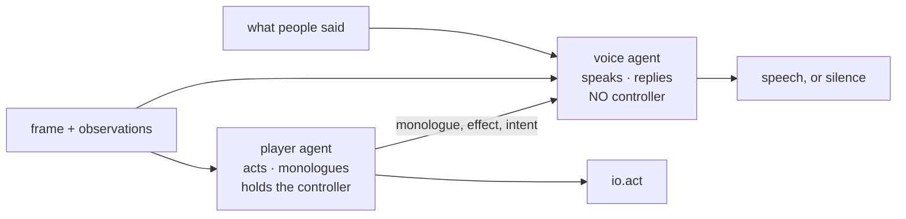

# ADR 0056: Voice is a separate agent from the player

Status: proposed (2026-07-26). Supersedes the single-call volition design in
[ADR 0049](0049-free-play-agency-and-non-deterministic-evidence.md), which kept `speak` as a field on the
player's own decision.

## Context

Free play gave Clankie one model call per turn returning an action, a monologue,
and an optional `speak`. Speech was measured and it did not happen.

| Attempt                                         | Spoke                        |
| ----------------------------------------------- | ---------------------------- |
| Original framing                                | 0 of 12                      |
| Three further prompt revisions                  | 0 of 12                      |
| Cold-start fix + named audience                 | 0 of 16                      |
| Prompt discouragement removed (gate is the cap) | 1 of 16                      |
| **Voice as its own agent**                      | **7 of 16 wanted, 2 spoken** |

The last row is the decision's evidence: with speech as its own decision he
_wanted_ to speak seven times and the rate gate held five. The gate binds now,
which is what it was built for — before, nothing reached it.

Follow-through also rose from 18% to 57% on those runs. One run each, so it is
an observation rather than a claim, but the mechanism is plausible: the player's
call stopped being split between two jobs.

Two real defects were found and fixed along the way, and both were worth fixing:

- **Cold start.** `turnsSinceSpoke` was rendered only when non-null, and it is
  null until he first speaks. The signal that would prompt a first remark only
  appeared after one had happened.
- **Double suppression.** A mechanical rate gate capped how often he could
  speak _and_ the prompt told him not to speak often. The prompt was rationing
  against a ceiling that was already enforced.

Fixing both moved 0 to 1 in sixteen turns. That is the finding: the remaining
cause is not wording.

In a single call the model is solving a navigation problem. `speak` is an
optional field it can decline at no cost, and the expressive impulse the field
wants has already been spent on `monologue`, which is mandatory and which the
model treats as where thinking goes. Speech is structurally subordinate to the
task it shares a call with.

## Decision

Split the loop into two agents with different jobs and different authority.

- **Player** decides actions and writes monologue. It has `io.act`.
- **Voice** receives the frame, the player's monologue, recent effects, and
  anything people said. It decides to speak or stay silent. It has no `io.act`.

Voice's speech and reply win whenever a voice is wired. The player's own
`speak`/`reply` remain on its wire schema as the single-agent fallback, so a
caller with no voice still behaves as before rather than going mute. The player
still sees an interjection, because a question about what he is doing is context
for the turn; what it can no longer do is arrive only at something that acts.

Voice's job is **selection and delivery, not invention**. It speaks as Clankie
by choosing which of his real thoughts are worth voicing, with the monologue as
its source of truth. That is what keeps it from drifting into commentary
describing a screen it is only half-reading, and from becoming a sportscaster
narrating every move.

### Why this over more prompt work

A dedicated agent's `null` is not free. Deciding whether to speak is its entire
decision rather than a field it can leave empty while doing something else. The
measurements above are four independent attempts at the prompt-level fix, two of
which corrected genuine defects; the ceiling did not move.

### Why this is also a safety improvement

The rule that an interjection must not become a route was previously held up by
prompt wording — "someone talking to you is a person talking, not an order."
Wording is not a boundary. Routing conversation to an agent that has no
controller makes it structural: a message that reaches only Voice **cannot**
steer the character, because Voice cannot act. The observed good behaviour
(asked to abandon the stairs for the computer, he declined and kept his intent)
stops depending on him choosing to decline.

This is the same shape as possession ([ADR 0053](0053-mcp-possession-of-clankies-body.md)):
who talks and who drives are different authorities, and the driving one is the
one that is fenced.

## Consequences

- One extra model call. Voice runs when something happened or someone spoke, not
  unconditionally, so it is not one call per turn.
- `FreePlayTurn.speak` and `.reply` keep their meaning and their bounds; only
  their source changes. The rate gate stays, because Voice with no ceiling is
  the opposite failure and the more likely one.
- Both agents share the persona layer, so this is one character with two jobs
  rather than two characters.
- `VoiceDecisionSchema` uses `.nullable()`, never `.nullish()`. An optional key
  is dropped from the JSON Schema `required` array and OpenAI structured output
  rejects the request outright. Silence is null, not absence.
- Speech and monologue remain untrusted bounded model text and reach people only
  through the overlay and presence contracts.
- If Voice drifts into narration, the fix is its input (less frame, more
  monologue), not a content rule about what deserves a remark. Nothing here
  decides what is worth saying.
- The volition rate stays reported beside the progress metrics, so this decision
  is falsifiable by the same measurement that produced it.
