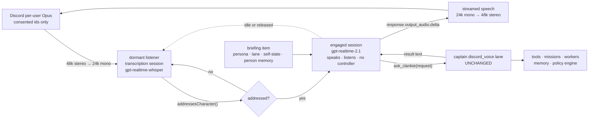
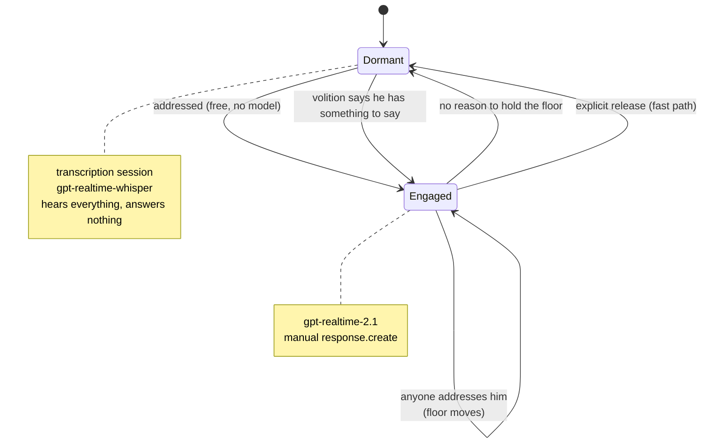

# ADR 0057: Realtime voice speaks; the captain still acts

Status: accepted (2026-07-25). Supersedes the STT → captain → TTS voice pipeline
in [ADR 0045](0045-official-bot-dave-group-voice.md). ADR 0045 remains
authoritative for the media owner, consent model, and allowlists, none of which
change here.

## Context

Discord voice today is a three-stage cascade: brokered
`gpt-4o-mini-transcribe`, one full Eve captain turn, then brokered
`gpt-4o-mini-tts` synthesized in whole before the first frame plays
(`packages/discord-presence-core/src/voice-session.ts`). Every stage is
serialized behind an 800 ms silence hold that exists only to prove the speaker
stopped.

The receipts already say where the time goes: `silenceHoldMs`, `transcribeMs`,
`captainMs`, `synthesizeMs`, `toFirstAudioMs`. The dominant term is `captainMs`,
and it is dominant by construction. A captain turn carries doctrine
instructions, lane instructions, persona, episodic context, and a tool loop.
That is the right cost for leading a mission and the wrong cost for answering
"what are you up to". The cascade is not slow because transcription and
synthesis are slow. It is slow because **the captain is on the critical path of
every utterance**, including the ones that are only conversation.

Swapping faster speech models inside that chain does not fix it. Neither does
moving Clankie's abilities into a speech-to-speech model: the abilities are not
a tool list, they are the captain — the Eve session, lane state, episodes,
compaction, model routing, worker delegation, and the authority boundary. A
second implementation of that is the "two souls" outcome
[ADR 0051](0051-layered-character-register-and-reply-policy.md) rejects.

## Decision

`gpt-realtime-2.1` owns the ears, the mouth, and turn-taking in a Discord voice
channel. The captain owns everything Clankie can *do*. The realtime session
reaches it through exactly one tool.



Two paths, one character:

- **Fast path** — conversation. The realtime session answers directly, with
  streamed audio and native barge-in. This is the latency win.
- **Ability path** — anything that touches the world. The realtime session calls
  `ask_clankie`, which submits to `submitDiscordCaptainChannelTurn` on the
  existing `discord_voice` lane and speaks the result.

No capability moves. The captain turn, its lane session, its continuing cursor,
its person-memory projection, and its authority behavior are byte-for-byte the
ones running today. That is what "same abilities" means here: they are not
reimplemented, they are not relocated, they are called.

### Identity is still one definition

The realtime session's `session.instructions` are composed from the same
sources the captain uses, in the same order:

```text
personaInstructions(persona, "social")   ← who he is, owner-authored
captainLaneInstructions(channel)          ← same Clankie, ambient authority
realtime surface rules                    ← what this surface allows
```

Persona is read from `@clankie/settings`, never from channel metadata, for the
reason ADR 0051 gives: caller-controlled context must not be able to redefine
who Clankie is. The register stays `social`, identical to Discord text, so the
two planes still sound like one person.

[ADR 0056](0056-voice-is-a-separate-agent-from-the-player.md) is the precedent
and the shape is identical: two agents, one persona layer, one job each, and
only one of them holds the controller. There it was Voice and Player. Here it is
Voice and Captain.

### Fencing the controller is a safety improvement

Spoken input has never been able to approve privileged work, but today that is
enforced downstream of a captain that *does* hold every tool. Under this
decision the realtime agent holds **no privileged tool at all** — `ask_clankie`
is its entire surface. A realtime model that is charmed, confused, or
prompt-injected by room audio cannot execute anything, because it has nothing to
execute with. Privileged requests still land in the captain lane and still come
back as `waiting_user` with the authenticated-surface handoff.

This is the ADR 0056 argument applied one layer up: wording is not a boundary,
and routing conversation to an agent with no controller makes it structural.

### The briefing keeps the fast path from being ignorant

A front-end that answers instantly but does not know what Clankie is doing is
not the same Clankie. Questions like "what are you working on", "are you in the
other room", and "what did we decide yesterday" are conversation, not work, and
handing every one of them to the captain gives back the latency this decision
buys.

The session is therefore seeded — and refreshed on captain-visible state change
— with a bounded `conversation.item.create` text item carrying the same
projections the captain already exposes: `get_self_state` (cross-lane presence,
[ADR 0054](0054-cross-lane-presence-and-episodic-self-memory.md)), recent
shareable episodes, and the control-plane-approved person memory for consented
speakers ([ADR 0042](0042-discord-person-memory-projection.md)). The briefing is
a projection, never a second store, and person memory still cannot be committed
from voice.

Anything the briefing does not cover is what `ask_clankie` is for.

### Speaker attribution comes from Discord, never from the audio

Discord delivers one Opus stream per speaker; the Realtime API has one input
audio buffer. Attribution cannot be inferred from mixed audio, and ADR 0045 and
ADR 0042 both require it — consent is per user, person memory is keyed by guild
and user, and receipts carry `actorId`.

Consented streams are downmixed into the single 24 kHz mono input buffer, and
speaker identity is injected out of band: on a Discord `speaking` transition, a
`conversation.item.create` text item names who now has the floor. Identity
therefore comes from the gateway, which is authenticated, rather than from voice
characteristics, which are not.

Consent is *stronger* than a room microphone rather than weaker: an unconsented
participant is never subscribed, so their audio never reaches
`input_audio_buffer.append` at all. Opt-out, leaving the channel, bot leave,
shutdown, and restart revoke as they do today.

### A voice agent is a 1:1 design, and this is a group room

The Realtime API's defaults assume one user talking to one assistant. Four of
them are wrong for a Discord voice channel, and they are wrong in ways that get
worse as the room gets livelier:

| Default | What it does in a group |
| --- | --- |
| `turn_detection.create_response: true` | He answers every utterance, including the ones two other people exchange with each other |
| `turn_detection.interrupt_response: true` | Anyone speaking truncates him — he cannot finish a sentence in a busy room, even when the speaker is answering someone else |
| single input buffer | No notion of who is talking, and simultaneous speakers arrive as one signal |
| conversation accumulates | Every overheard word enters context and is re-billed on every subsequent response |

The text plane already faced the same question and ADR 0051 answered it with a
principle this decision inherits: **deciding to stay quiet must not cost a model
call.** The realtime defaults violate it twice over, because silence costs both
audio input tokens and permanent context growth.

Turn-taking therefore does not move into the model. `create_response` and
`interrupt_response` are both `false`; VAD is kept only for boundaries and
transcripts, and Clankie's floor is a state machine this repository owns.



**Dormant** is a `"type": "transcription"` session on `gpt-realtime-whisper`
over the consented mix. There is no conversational model in the loop, no audio
output, and nothing accumulating in a conversation context. Transcripts are
tested with the existing `addressesCharacter()` from
`packages/discord-presence-core/src/text-ingress.ts` — the same word-boundary
name matching the text plane uses, so "clankiest" still does not summon him and
one function governs both planes.

**Engaged** opens the `gpt-realtime-2.1` session, seeds it with the recent
transcript window as `conversation.item.create` text so he has the context he
just overheard, and drives `response.create` explicitly. While the floor is
held, follow-ups do not need his name.

In both states everyone consented is always *heard* and nobody is ever
auto-answered: no utterance reaches `response.create` without the floor logic
deciding it should. `persona.replyPolicy` governs that decision exactly as it
governs text — `addressed` (the default) runs the machine above, and `all` means
what it says.

### Release is not an event, and engagement is not a permission

Detecting the end of a conversation is genuinely harder than detecting its
start. There is no reliable spoken signal for "we're done with you" — most
exchanges simply stop, and a design that waits for a closing phrase holds the
floor forever in every room that never says one.

The requirement that resolves it is the one that looks like a complication:
**he must also be able to start talking on his own.** Once unprompted speech is
in scope, engagement cannot be a permission state that conversation grants and
revokes, because he needs to speak when nobody granted him anything. Engagement
is therefore downstream of a single question asked continuously over the
transcript stream:

> Do I have a reason to say something right now?

Three situations, one question:

| Situation | Answer | Cost |
| --- | --- | --- |
| Someone addressed him | yes, trivially | free — `addressesCharacter()`, no model |
| Nobody addressed him, but he has something worth saying | volition decides | one cheap gated call |
| He holds the floor and the room has moved on | no reason → decay | the same call, answering no |

Release stops being a signal to detect and becomes the absence of a reason to
hold the floor. The identical mechanism that lets him re-engage unprompted is
what lets him let go, which is why building only the release half was always
going to feel arbitrary.

This is [ADR 0056](0056-voice-is-a-separate-agent-from-the-player.md)'s finding
applied to a room instead of a game, and its measurement is the reason volition
is a dedicated call rather than a flag on something else: speech offered as an
optional field on another decision produced silence in 15 of 16 turns across
four prompt revisions, and only a decision whose *entire* job was whether to
speak moved it. A "should I also say something?" boolean bolted onto the wake
check would reproduce that failure exactly.

The gate is cheap and mechanical; the model only decides content. A volition
tick runs on new transcript rather than on a timer, is rate-capped the way free
play's remarks are, and reads the room from text — never audio — so it costs
text tokens and never realtime audio. `persona.chattiness` sets the bar, which
is the setting ADR 0051 explicitly reserved for proactive speech: this is where
it lands.

An explicit close — "thanks, Clankie" — stays as a fast path, because a clear
signal should not wait for a decay window. It is an optimization over the loop,
never the mechanism, and a room that never uses it still gets a Clankie who
stops talking.

### Hearing his own name is a voice-plane problem

Wake detection depends on transcripts containing his name, and transcription
mangles proper nouns. Steering the transcriber is not available: `prompt` is
**not supported** for `gpt-realtime-whisper` in GA Realtime sessions, so the
name cannot be biased at the source and robustness has to live downstream.

That robustness does not belong in `persona.aliases`. Aliases are
owner-authored nicknames and they feed `characterNames()` for the **text** plane
too; loading them with the ways speech-to-text mishears "Clankie" would make
Discord text ingress fire on transcription artifacts nobody would ever type.

The voice plane instead applies phonetic comparison over the same
`characterNames()` list rather than exact string matching. The owner keeps
authoring nicknames in the TUI, voice gets tolerance for free, and nobody
maintains a hand-written list of every way a transcriber can garble him — which
would be stale the moment the transcription model changes.

### Barge-in inverts in a group, so it becomes deliberate

Today any consented speaker's sustained speech stops playback. In a room that is
the wrong rule — someone answering another person is not interrupting Clankie.
With `interrupt_response: false`, `conversation.item.truncate` is issued
deliberately: when the floor holder speaks over him, or when he is re-addressed.
Crosstalk between other people lets him finish his sentence. This is better
group behavior than what ships today, not merely equivalent.

The turn queue that serializes captain turns and playback stays for the ability
path, because two concurrent `ask_clankie` results talking over each other is
the failure it was written to prevent.

## Options weighed

- **Give the realtime model Clankie's tools directly** — rejected. It makes the
  realtime session a second definition of the agent, with its own context, its
  own memory behavior, and its own authority surface. Two souls, two drift
  paths, and the privileged blast radius moves onto a model that is listening to
  an open room.
- **Keep the cascade, swap in faster STT/TTS** — rejected. It optimizes the two
  stages that are not the bottleneck. `captainMs` is unchanged and still gates
  the first audio frame.
- **Realtime for ears and mouth only, captain authors every word** — rejected.
  It is the current architecture with a better microphone. First audio still
  waits for a full captain turn, so the conversational latency is unchanged.
- **One realtime session per speaker** — rejected. Attribution is perfect and
  the room is destroyed: N private conversations in one channel, none of which
  hear each other.
- **One always-on `gpt-realtime-2.1` session with the floor gate but no dormant
  tier** — rejected on cost, not on behavior. The gate alone fixes the
  interjecting; it does not stop overheard room chatter from entering the
  conversation and being re-billed on every later response. Audio input is one
  token per 100 ms, so an hour of a lively channel is roughly 36k tokens of
  context he mostly did not need, growing the bill superlinearly. The dormant
  tier keeps unaddressed conversation out of the priced context entirely.
- **Ask the model whether it was addressed** — rejected. It spends a response to
  decide not to respond, which is the exact cost ADR 0051's pre-turn reply
  policy exists to avoid.
- **Push-to-talk or a wake word** — rejected. It solves addressing by making the
  room work for Clankie, and a channel where people must announce themselves is
  not the social presence ADR 0045 is for. The floor machine gets the same
  property from speech people were going to produce anyway.
- **`gpt-realtime-2.1-mini`** — rejected for now by the owner. The mini tier is
  roughly a third of the audio cost and is the obvious lever if session spend
  becomes the binding constraint; this decision does not foreclose it.

## Consequences

- **Audio residency changes, and must be disclosed.** Today raw and generated
  PCM are memory-only and zeroed after each turn. A realtime session holds the
  audio conversation server-side for the life of the call, and the whole
  conversation is re-sent on every response. The `/clankie join` disclosure
  (`apps/discord-bridge/src/index.ts:788`) currently promises discarded audio
  per turn and must be rewritten to describe a live session instead. This is the
  most significant user-visible change in this ADR.
- **Cost changes shape, from per-utterance to metered session.** Audio input is
  one token per 100 ms and audio output one per 50 ms, so at `gpt-realtime-2.1`
  rates ($32/1M in, $64/1M out) listening is roughly $1.15 per hour of audio and
  speaking roughly $0.077 per minute — before context re-billing, which is the
  term that actually grows. `session.truncation` with `retention_ratio` and
  `token_limits.post_instructions` is required rather than optional, the dormant
  tier keeps unaddressed chatter out of the priced context, and an idle
  auto-leave becomes necessary. Cached input at $0.40/1M makes long engaged
  stretches cheaper than the raw rate suggests, but a joined channel is no
  longer free.
- **Unprompted speech to humans is a higher bar than unprompted speech over a
  game.** Free play's remarks land on an audience; these land in a conversation
  between people who can be interrupted. The rate cap is therefore load-bearing
  rather than protective tuning, and volition must be reported the way ADR 0056
  reports it — offered, taken, suppressed — so "he talks too much" and "he never
  speaks up" are both falsifiable against a number instead of a vibe. The
  measurement is what makes `persona.chattiness` tunable rather than decorative.
- **The first response after being addressed pays the wake.** Every later turn in
  the exchange is the fast path this decision is for, but the opening one carries
  session setup, and the whole point was latency. The engaged session is
  therefore held connected across a decay window rather than torn down at the
  end of each exchange, so a conversation that resumes within it wakes
  instantly. Measure it: the receipt's first-audio latency should be reported
  separately for waking and continuing turns, or this consequence is invisible.
- **Two session types now have to be operated, not one.** The dormant listener
  and the engaged session have separate lifecycles, and the transition between
  them is a new failure surface — a dropped wake means he ignores someone who
  addressed him, which is a worse social failure than a stray interjection.
  Readiness and the live gate must exercise the transition, not just a
  single-session round trip.
- **Receipts change fields.** `transcribeMs` and `synthesizeMs` stop existing.
  Their replacements are still content-free scalars — first-audio latency,
  handoff latency, and whether the turn took the fast path — and the receipt
  store's rejection of transcript, response, prompt, audio, and PCM fields is
  unchanged.
- **Fast-path speech is model text that no captain reviewed.** It is bounded
  untrusted output reaching people through the presence contract, the same
  status free-play speech has under ADR 0056. What it must never be is a route
  to action, and the absent controller is what guarantees that.
- **The live gate is unchanged in spirit and must be re-run.** ADR 0045's proof
  — one positive DAVE protocol, three unique consents, three attributed speakers
  with round trips, no media failure, clean leave — still gates deployment, with
  attribution now proven through the injected speaker items.
- **Discord text is untouched.** It has no cascade to remove and keeps calling
  the captain directly.
