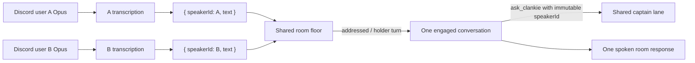
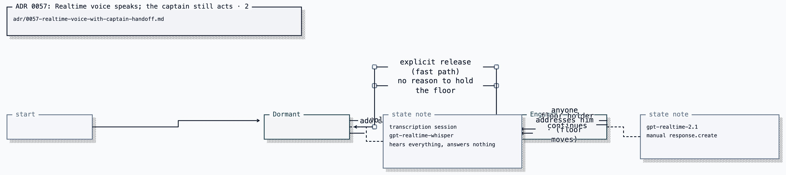

# ADR 0057: Realtime voice speaks; the captain still acts

Status: accepted (2026-07-25). Defines realtime voice and captain handoff.
[ADR 0045](0045-official-bot-dave-group-voice.md) remains authoritative for the
media owner, consent model, and allowlists.

## Context

Discord voice separates conversation latency from ability execution. A realtime
session owns listening, speaking, and turn-taking. The pi captain owns lane
state, memory, tools, model routing, delegation, and authority. Conversation
stays on the fast path; anything that acts crosses one `ask_clankie` handoff.

## Decision

`gpt-realtime-2.1` owns the ears, the mouth, and turn-taking in a Discord voice
channel. The captain owns everything Clankie can _do_. The realtime session
reaches it through `ask_clankie`; local music playback stays on the voice plane
through bounded search and transport tools that carry no machine authority.


Two paths, one character:

- **Fast path** — conversation. The realtime session answers directly, with
  streamed audio and native barge-in. This is the latency win.
- **Ability path** — anything that touches the world. The realtime session calls
  `ask_clankie`, which submits to `submitDiscordCaptainChannelTurn` on the
  existing `discord_voice` lane and speaks the result.

No capability moves. The captain turn, its lane session, its continuing cursor,
its person-memory projection, and its authority behavior use the same
implementation as every other lane. That is what "same abilities" means here: they are not
reimplemented, they are not relocated, they are called.

### Identity is still one definition

The realtime session's `session.instructions` are composed from the same
sources the captain uses, in the same order:

```text
personaInstructions(persona, "social")   ← who he is, owner-authored
captainLaneInstructions(channel)          ← same Clankie, ambient authority
realtime surface rules                    ← what this surface allows
```

Persona is read from `@clankie/settings`, never from channel metadata, for the
reason ADR 0051 gives: caller-controlled context must not be able to redefine
who Clankie is. The register stays `social`, identical to Discord text, so the
two planes still sound like one person.

[ADR 0056](0056-voice-is-a-separate-agent-from-the-player.md) is the precedent
and the shape is identical: two agents, one persona layer, one job each, and
only one of them holds the controller. There it is Voice and Player. Here it is
Voice and Captain.

### Fencing the controller is a safety improvement

Spoken input cannot approve privileged work. The realtime agent holds **no
privileged tool at all** — only `ask_clankie` and bounded local music controls.
A realtime model that is charmed, confused, or
prompt-injected by room audio cannot execute anything, because it has nothing to
execute with. Privileged requests still land in the captain lane and still come
back as `waiting_user` with the authenticated-surface handoff.

This is the ADR 0056 argument applied one layer up: wording is not a boundary,
and routing conversation to an agent with no controller makes it structural.

### The briefing keeps the fast path from being ignorant

A front-end that answers instantly but does not know what Clankie is doing is
not the same Clankie. Questions like "what are you working on", "are you in the
other room", and "what did we decide yesterday" are conversation, not work, and
handing every one of them to the captain gives back the latency this decision
buys.

The session is therefore seeded — and refreshed on captain-visible state change
— with a bounded `conversation.item.create` text item carrying the same
projections the captain already exposes: `get_self_state` (cross-lane presence,
[ADR 0054](0054-cross-lane-presence-and-episodic-self-memory.md)), recent
shareable episodes, and the service-approved person memory for consented
speakers ([ADR 0042](0042-discord-person-memory-projection.md)). The briefing is
a projection, never a second store, and person memory still cannot be committed
from voice.

Anything the briefing does not cover is what `ask_clankie` is for.

### Speaker attribution comes from Discord, never from the audio

Discord delivers one Opus stream per speaker. Each consented speaker keeps a
separate transcription input for as long as they remain permitted in the room.
The transcript callback is permanently bound to the Discord user id whose Opus
stream fed it, so simultaneous speech cannot cause Alice's words to be assigned
to Bob merely because Bob started speaking later.

The room still has one shared engaged conversation, not one private assistant per
person. That conversation receives gateway-attributed transcript items as JSON,
one per utterance, instead of a mixed audio buffer. The bounded wake-time ring is
JSONL for the same reason: transcript text containing newlines or label-shaped
strings cannot impersonate another speaker. Identity therefore comes from the
authenticated gateway stream, never from voice characteristics or transcript
content.



Consent is _stronger_ than a room microphone rather than weaker: an unconsented
participant is never subscribed, so their audio never reaches
`input_audio_buffer.append` at all. Opt-out, leaving the channel, bot leave,
shutdown, and restart all revoke consent.

### A voice agent is a 1:1 design, and this is a group room

The Realtime API's defaults assume one user talking to one assistant. Four of
them are wrong for a Discord voice channel, and they are wrong in ways that get
worse as the room gets livelier:

| Default                                   | What it does in a group                                                                                                     |
| ----------------------------------------- | --------------------------------------------------------------------------------------------------------------------------- |
| `turn_detection.create_response: true`    | He answers every utterance, including the ones two other people exchange with each other                                    |
| `turn_detection.interrupt_response: true` | Anyone speaking truncates him — he cannot finish a sentence in a busy room, even when the speaker is answering someone else |
| single mixed input buffer                 | No notion of who is talking, and simultaneous speakers arrive as one signal                                                 |
| conversation accumulates                  | Every overheard word enters context and is re-billed on every subsequent response                                           |

The text plane already faced the same question and ADR 0051 answered it with a
principle this decision inherits: **deciding to stay quiet must not cost a model
call.** The realtime defaults violate it twice over, because silence costs both
audio input tokens and permanent context growth.

Turn-taking therefore does not move into the model. `create_response` and
`interrupt_response` are both `false`; VAD is kept only for boundaries and
transcripts, and Clankie's floor is a state machine this repository owns.



**Dormant** uses `"type": "transcription"` sessions on
`gpt-realtime-whisper`, one per consented speaker who has spoken. Join probes
the transcription boundary before reporting success; a speaker's first receive
stream waits for their listener to open, so its beginning is not reassigned or
dropped. There is no conversational model in the loop, no audio output, and
nothing accumulating in a conversation context. Transcripts are
tested with the existing `addressesCharacter()` from
`packages/discord-presence-core/src/text-ingress.ts` — the same word-boundary
name matching the text plane uses, so "clankiest" still does not summon him and
one function governs both planes.

**Engaged** opens one `gpt-realtime-2.1` session, seeds it with the recent
attributed JSONL transcript window, and adds one structured text item for every
later floor-approved utterance before driving `response.create` explicitly.
While the floor is held, follow-ups do not need his name. Crosstalk rejected by
the floor never enters the engaged context. A warm session reused after release
receives the new waking utterance before it responds.

In both states everyone consented is always _heard_ and nobody is ever
auto-answered: `response.create` is explicit, and the realtime Clankie may
produce no output. `persona.replyPolicy` governs which dormant transcripts are
offered exactly as it governs text — `all` is the agent-first default;
`addressed` is the explicit cost-saving mode. Engaged follow-ups need neither.

### Release is not an event, and engagement is not a permission

Detecting the end of a conversation is genuinely harder than detecting its
start. There is no reliable spoken signal for "we're done with you" — most
exchanges simply stop, and a design that waits for a closing phrase holds the
floor forever in every room that never says one.

The requirement that resolves it is the one that looks like a complication:
**he must also be able to start talking on his own.** Once unprompted speech is
in scope, engagement cannot be a permission state that conversation grants and
revokes, because he needs to speak when nobody granted him anything. Engagement
is therefore downstream of a single question asked continuously over the
transcript stream:

> Do I have a reason to say something right now?

Three situations, one question:

| Situation                                    | Answer               | Cost                                        |
| -------------------------------------------- | -------------------- | ------------------------------------------- |
| Someone addressed him                        | yes, trivially       | free — `addressesCharacter()`, no model     |
| Nobody addressed him                         | he decides, in voice | one realtime response, most of them empty   |
| He holds the floor and the room has moved on | no reason → decay    | free — a timer, no model, no phrase to hear |

Release stops being a signal to detect and becomes the absence of a reason to
hold the floor. The identical mechanism that lets him re-engage unprompted is
what lets him let go, which is why building only the release half is always
going to feel arbitrary.

#### Whether to speak is a question only Clankie can answer

The repository owns the _mechanical_ half of unprompted speech and nothing more:
a rate cap, derived from `persona.chattiness` (the setting ADR 0051 reserved for
exactly this), that decides how often he may be offered an unprompted turn at
all. It runs on new transcript rather than on a timer, so an empty room costs
nothing.

The half that decides whether to actually say something belongs to the realtime
session itself. It is the only component in the loop that _is_ Clankie: it holds
the composed persona, the seeded room transcript, the current briefing, and
whatever it just heard. A separate bounded yes/no model has none of that — asked
"does Clankie have something worth saying?", it answers as a generic assistant
reasoning about a character it has never met, and its verdict is uncorrelated
with anything he would actually have said. Personality is not a filter applied
after a decision; it is what makes the decision.

So an offered turn is an ordinary `response.create` on the engaged session, with
one system-note item saying nobody addressed him and that producing no output is
a normal answer. A response that comes back with audio is him speaking up; a
response that comes back empty is him passing. Both settle the same accounting.

This keeps [ADR 0056](0056-voice-is-a-separate-agent-from-the-player.md)'s
measured finding intact — speech offered as an optional field on another
decision produced silence in 15 of 16 turns across four prompt revisions, and
only a decision whose _entire_ job is whether to speak moved it. The offered
turn is that dedicated decision; it is simply asked of him rather than about
him. A "should I also say something?" boolean bolted onto the wake check would
reproduce the original failure exactly.

Nothing else releases the floor. In particular no closing phrase does: "thanks,
Clankie" contains his name, so it wakes or holds like any other address and he
gets to answer it. Matching goodbyes against a word list took the floor away
mid-sentence — the one moment a reply is most obviously expected — to save a
decay window that costs nothing to wait out.

### Hearing his own name is a voice-plane problem

Wake detection depends on transcripts containing his name, and transcription
mangles proper nouns. Steering the transcriber is not available: `prompt` is
**not supported** for `gpt-realtime-whisper` in GA Realtime sessions, so the
name cannot be biased at the source and robustness has to live downstream.

That robustness does not belong in `persona.aliases`. Aliases are
owner-authored nicknames and they feed `characterNames()` for the **text** plane
too; loading them with the ways speech-to-text mishears "Clankie" would make
Discord text ingress fire on transcription artifacts nobody would ever type.

The voice plane instead applies phonetic comparison over the same
`characterNames()` list rather than exact string matching. The owner keeps
authoring nicknames in the TUI, voice gets tolerance for free, and nobody
maintains a hand-written list of every way a transcriber can garble him — which
would be stale the moment the transcription model changes.

### Barge-in inverts in a group, so it becomes deliberate

In a group room, any consented speaker's sustained speech must not automatically
stop playback; someone answering another person is not interrupting Clankie.
With `interrupt_response: false`, `conversation.item.truncate` is issued
deliberately: when the floor holder speaks over him, or when he is re-addressed.
Crosstalk between other people lets him finish his sentence.

The turn queue that serializes captain turns and playback stays for the ability
path, because two concurrent `ask_clankie` results talking over each other is
the failure it is written to prevent.

## Options weighed

- **Give the realtime model Clankie's tools directly** — rejected. It makes the
  realtime session a second definition of the agent, with its own context, its
  own memory behavior, and its own authority surface. Two souls, two drift
  paths, and the privileged blast radius moves onto a model that is listening to
  an open room.
- **Keep the cascade, swap in faster STT/TTS** — rejected. It optimizes the two
  stages that are not the bottleneck. `captainMs` is unchanged and still gates
  the first audio frame.
- **Realtime for ears and mouth only, captain authors every word** — rejected.
  It is the current architecture with a better microphone. First audio still
  waits for a full captain turn, so the conversational latency is unchanged.
- **One engaged conversation per speaker** — rejected. Attribution is perfect
  and the room is destroyed: N private conversations in one channel, none of
  which hear each other. Per-speaker transcription does not have this failure;
  attributed text converges into one shared floor and one shared conversation.
- **One always-on `gpt-realtime-2.1` session with the floor gate but no dormant
  tier** — rejected on cost, not on behavior. The gate alone fixes the
  interjecting; it does not stop overheard room chatter from entering the
  conversation and being re-billed on every later response. Audio input is one
  token per 100 ms, so an hour of a lively channel is roughly 36k tokens of
  context he mostly does not need, growing the bill superlinearly. The dormant
  tier keeps unaddressed conversation out of the priced context entirely.
- **Ask a separate model whether he should speak** — rejected. It duplicates
  the actual realtime Clankie without his live session or full character.
  `addressed` remains available as a deterministic cost-saving policy.
- **Push-to-talk or a wake word** — rejected. It solves addressing by making the
  room work for Clankie, and a channel where people must announce themselves is
  not the social presence ADR 0045 is for. The floor machine gets the same
  property from speech people are going to produce anyway.
- **`gpt-realtime-2.1-mini`** — rejected by the owner. The mini tier is
  roughly a third of the audio cost and is the obvious lever if session spend
  becomes the binding constraint; this decision does not foreclose it.

## Consequences

- **Audio residency is disclosed.** Live realtime transcription sessions
  process each permitted speaker's audio server-side, and the engaged session
  retains the attributed transcript conversation that is re-sent on later
  responses. The `/clankie join` disclosure conservatively describes a live
  session rather than promising per-turn discard.
- **Cost is session-metered.** Audio input is
  one token per 100 ms and audio output one per 50 ms, so at `gpt-realtime-2.1`
  rates ($32/1M in, $64/1M out) listening is roughly $1.15 per hour of audio and
  speaking roughly $0.077 per minute — before context re-billing, which is the
  term that actually grows. `session.truncation` with `retention_ratio` and
  `token_limits.post_instructions` is required rather than optional, the dormant
  tier keeps unaddressed chatter out of the priced context, and an idle
  auto-leave becomes necessary. Cached input at $0.40/1M makes long engaged
  stretches cheaper than the raw rate suggests, but a joined channel is no
  longer free.
- **Listener connection count follows recent active speakers and stays
  bounded.** Join opens and closes one transcription probe. A participant who
  speaks owns a transcription socket until two minutes of silence, opt-out,
  departure, or leave. At 25 retained speaker listeners, a new speaker evicts
  the least recently active listener that has no capture or pending transcript;
  if all 25 are active, the new capture fails closed rather than opening an
  unbounded socket. The next utterance transparently reopens an idle-evicted
  listener. This spends the same transcribed audio volume as a mix while trading
  bounded additional sockets for causal identity under overlap.
- **Unprompted speech to humans is a higher bar than unprompted speech over a
  game.** Free play's remarks land on an audience; these land in a conversation
  between people who can be interrupted. The rate cap is therefore load-bearing
  rather than protective tuning, and offered turns must be reported the way ADR
  0056 reports them — offered, taken, suppressed — so "he talks too much" and "he
  never speaks up" are both falsifiable against a number instead of a vibe. The
  measurement is what makes `persona.chattiness` tunable rather than decorative.
- **An offered turn he declines is not free.** Asking him costs a realtime
  response, and asking him from a cold room additionally pays briefing, session
  open, and seeding — where a bounded text verdict cost a fraction of a cent.
  The rate cap is what bounds that spend, which is a second reason it is
  load-bearing. A declined offer parks the warm session on the same hold window
  a decayed exchange uses, so passing costs one response and not an idle
  session; `discord.voice.volition`'s suppressed counter is what makes the
  wasted half of the spend visible.
- **The first response after being addressed pays the wake.** Every later turn in
  the exchange is the fast path this decision is for, but the opening one carries
  session setup, and the whole point is latency. The engaged session is
  therefore held connected across a decay window rather than torn down at the
  end of each exchange, so a conversation that resumes within it wakes
  instantly. Measure it: the receipt's first-audio latency should be reported
  separately for waking and continuing turns, or this consequence is invisible.
- **Two session types are operated.** Speaker-bound dormant listeners and the
  one engaged session have separate lifecycles, and the transition between them
  is a failure surface — a dropped wake means he ignores someone who addressed
  him, which is a worse social failure than a stray interjection. Readiness and
  the live gate must exercise the transition, not just a single-session round
  trip.
- **Receipts contain a content-free correlated trace:** one delivery id joins
  utterance, transcription outcome, floor decision, realtime response, and
  tool call/result. Music adds the queue transition, `yt-dlp`/FFmpeg lifecycle,
  first PCM, and Discord player state under the same call id. The fields remain
  ids, phases, counts, durations, and exit codes; transcript, search query, URL,
  model text, prompt, audio, and PCM remain unrepresentable. A `left` receipt
  rolls up spoken count, narration suppressions, and tokens for that stay.
- **Fast-path speech is model text that no captain reviewed.** It is bounded
  untrusted output reaching people through the presence contract, the same
  status free-play speech has under ADR 0056. What it must never be is a route
  to action, and the absent controller is what guarantees that.
- **The live gate is unchanged in spirit and must be re-run.** ADR 0045's proof
  — one positive DAVE protocol, three unique consents, three attributed speakers
  with round trips, no media failure, clean leave — still gates deployment, with
  attribution proven through the injected speaker items.
- **Discord text is untouched.** It has no cascade to remove and keeps calling
  the captain directly.
