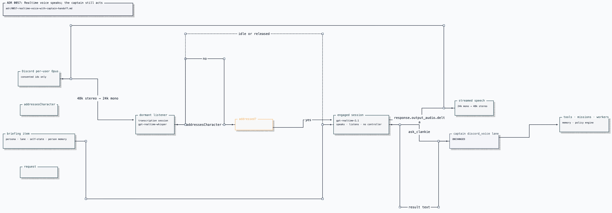

# ADR 0057: Realtime voice speaks; the captain still acts

Status: accepted (2026-07-25). [ADR 0045](0045-official-bot-dave-group-voice.md)
owns the media session, consent, and allowlists.
[ADR 0070](0070-external-voice-via-streaming-tts.md) makes the mouth swappable,
[ADR 0113](0113-one-voice-port-has-multiple-realtime-providers.md) makes the
realtime provider swappable,
and [ADR 0074](0074-the-room-hears-one-voice.md) makes the realtime room session
the sole author of outbound room speech.
[ADR 0119](0119-the-room-is-heard-the-floor-is-who-he-answers.md) splits hearing
from answering in a group room.
[ADR 0121](0121-development-voice-transcripts-are-explicit.md) separately
allows an owner-enabled private development transcript while keeping the
receipt stream content-free. [ADR 0124](0124-one-self-has-many-local-threads.md)
also feeds the active voice room's attached text chat through this floor.

## Context

Discord voice separates conversational latency from machine action. A realtime
session can listen, speak, and handle turn-taking quickly; the pi captain owns
durable lane state, tools, model routing, and authenticated system authority.
Putting every sentence through a complete captain turn would preserve control at
the cost of conversational latency.

## Decision

The realtime session owns the ears, mouth, and room conversation. Anything that
acts outside that conversation crosses one `ask_clankie` handoff to the existing
`discord_voice` captain lane. The realtime model receives no system shell or
other machine-authority tool.

The handoff exists only on a response attributed to a room speaker. A
possessor narration response has no speaker because it is Clankie's own
experience; if it selects `ask_clankie`, the voice session settles that tool
locally and continues the narration. It never guesses the last room speaker or
emits a captain failure for a request no person made.

[Editable Turbopuffer tldraw source](../diagrams/clankie-docs-diagrams.tldraw)

### One character, two jobs

The realtime session receives the same owner-authored persona and social
register as Discord text. Caller-controlled room data cannot redefine either.
The captain remains the only path to machine action, so a charmed or
prompt-injected voice model has no controller to misuse.

A bounded briefing keeps the fast path aware of cross-lane presence, shareable
episodes, current embodiment, and visible person memory. It is a projection,
not a second store; anything outside it goes through `ask_clankie`.

### Attribution comes from Discord

Each consented speaker's Opus stream feeds a separate transcription input bound
to the authenticated Discord user id. Attributed transcript items converge into
one shared room conversation. Identity never comes from voice characteristics,
transcript content, or arrival order.

Unconsented participants are not subscribed, so their audio never reaches the
transcription input. Leaving, opting out, bot leave, shutdown, and restart revoke
the capture path.

### A group room needs an explicit floor

Realtime defaults are 1:1 defaults: auto-response answers every utterance,
auto-interrupt lets crosstalk truncate Clankie, a mixed buffer loses speaker
identity, and one always-growing conversation repeatedly bills overheard room
chatter. The repository therefore owns the floor machine:

- dormant, speaker-bound transcription sessions identify admitted utterances
  without producing responses;
- one engaged conversation hears consented speech; `response.create` is still floor-owned
  ([ADR 0119](0119-the-room-is-heard-the-floor-is-who-he-answers.md));
- `response.create` and interruption are always explicit;
- direct address wakes the room without a model call;
- `persona.chattiness` only rate-limits offers to speak unprompted; the realtime
  Clankie decides whether an offered turn produces speech; and
- floor release is inactivity decay, not a brittle goodbye phrase.

Barge-in is deliberate: the floor holder speaking over Clankie or addressing
him again truncates playback; unrelated crosstalk does not.

"Speaking over" is measured, not assumed. An open mic streams room tone
continuously, so a capture only counts toward barge-in once it carries 350 ms of
audio above a speech-level RMS floor (`BARGE_IN_SPEECH_RMS` in
`voice-session.ts`). Duration alone cut him off mid-sentence on fans and
keystrokes whose transcripts came back empty. The floor is a calibration knob:
mics and noise suppression move both the room tone and the speech level.

### Evidence retained from implementation

- Per-speaker input kept overlapping speakers causally attributed while still
  producing one shared conversation.
- Disabling automatic response and interruption stopped the assistant from
  answering every overheard exchange or being cut off by unrelated speech.
- A dormant transcription tier bounded context growth without requiring a wake
  word or push-to-talk ritual.
- Holding the engaged session briefly across decay avoided paying setup latency
  on every conversational follow-up.
- Content-free receipts joined utterance, floor decision, response, handoff,
  playback, and interruption without storing transcript or audio.

Possessor/play narration follows [ADR 0074](0074-the-room-hears-one-voice.md):
the play loop reports events, while this realtime session authors the words the
room hears.

## Alternatives considered

- **Give the realtime model captain tools directly** was rejected because it
  creates a second agent authority surface inside an open room.
- **Use realtime only for STT/TTS while the captain authors every sentence** was
  rejected because captain latency remains on the first-audio path.
- **Keep one conversation per speaker** was rejected because it creates several
  private assistants talking over one another.
- **Keep one always-engaged room session** was rejected because overheard audio
  accumulates and is repeatedly reprocessed.
- **Use a separate model to decide whether Clankie should speak** was rejected
  because it lacks the room session and character that make the decision.

## Consequences

- Fast-path speech is bounded model output no captain reviewed; its safety
  boundary is the absence of machine-action tools.
- Voice uses separate dormant-listener and engaged-conversation lifecycles, so
  readiness must prove the wake transition as well as a simple round trip.
- Audio residency and AI-generated speech must be disclosed to participants;
  local PCM remains memory-only.
- Cost is session- and context-shaped, so listener caps, truncation, decay, and
  idle leave are load-bearing operational controls.
- Current model names, configuration, rates, readiness, live-proof ceremony,
  and receipt fields belong in the
  [Discord bridge operating guide](../../apps/discord-bridge/README.md).
