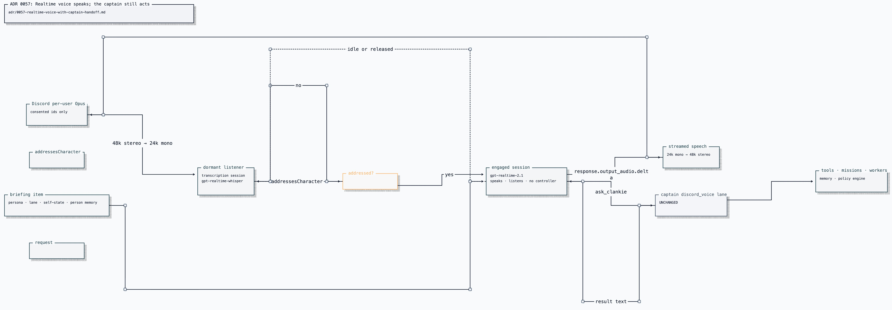
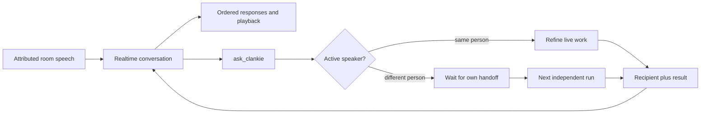
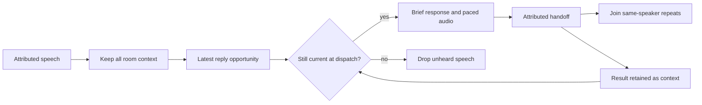

# ADR 0057: Realtime voice speaks; the captain still acts

Status: accepted (2026-07-25). Current-status addendum (2026-08-19):
[ADR 0128](0128-vox-is-the-sole-discord-media-owner.md) owns the media session;
[ADR 0045](0045-official-bot-dave-group-voice.md) retains consent, attribution,
allowlist, and live-ceremony constraints.
[ADR 0070](0070-external-voice-via-streaming-tts.md) makes the mouth swappable,
[ADR 0113](0113-one-voice-port-has-multiple-realtime-providers.md) makes the
realtime provider swappable,
and [ADR 0074](0074-the-room-hears-one-voice.md) makes the realtime room session
the sole author of outbound room speech.
[ADR 0119](0119-the-room-is-heard-the-floor-is-who-he-answers.md) splits hearing
from answering in a group room.
[ADR 0121](0121-development-voice-transcripts-are-explicit.md) separately
allows an owner-enabled private development transcript while keeping the
receipt stream content-free. [ADR 0124](0124-one-self-has-many-local-threads.md)
also feeds the active voice room's attached text chat through this floor.
[ADR 0129](0129-each-player-owns-a-body.md) limits play narration to Clankie's
own local or hosted play; possessor terminology below is historical.

## Context

Discord voice separates conversational latency from machine action. A realtime
session can listen, speak, and handle turn-taking quickly; the pi captain owns
durable lane state, tools, model routing, and authenticated system authority.
Putting every sentence through a complete captain turn would preserve control at
the cost of conversational latency.

## Decision

The realtime session owns the ears, mouth, room conversation, and its own
departure through the local `voice_leave` tool. Machine actions outside that
conversation cross one `ask_clankie` handoff to the existing
`discord_voice` captain lane. The realtime model receives no system shell or
other machine-authority tool.

The handoff is one part of Clankie, not a request to another assistant. The
realtime model treats captain tools reachable through `ask_clankie` as its own
capabilities, including web browsing and research, and uses the handoff instead
of denying a capability merely because the realtime process does not hold it
directly.

The handoff exists only on a response attributed to a room speaker. A
possessor narration response has no speaker because it is Clankie's own
experience; if it selects `ask_clankie`, the voice session settles that tool
locally and continues the narration. It never guesses the last room speaker or
emits a captain failure for a request no person made.

[Editable Turbopuffer tldraw source](../diagrams/clankie-docs-diagrams.tldraw)

### One character, two jobs

The realtime session receives the same owner-authored persona and social
register as Discord text. Caller-controlled room data cannot redefine either.
The captain remains the only path to machine action, so a charmed or
prompt-injected voice model has no controller to misuse.

A bounded briefing keeps the fast path aware of cross-lane presence, shareable
episodes, current embodiment, and visible person memory. It is a projection,
not a second store; anything outside it goes through `ask_clankie`.

### Attribution comes from Discord

Each consented speaker's Opus stream feeds a separate transcription input bound
to the authenticated Discord user id. Attributed transcript items converge into
one shared room conversation. Identity never comes from voice characteristics,
transcript content, or arrival order.

Unconsented participants are not subscribed, so their audio never reaches the
transcription input. Leaving, opting out, bot leave, shutdown, and restart revoke
the capture path.

### A group room needs an explicit floor

Realtime defaults are 1:1 defaults: auto-response answers every utterance,
auto-interrupt lets crosstalk truncate Clankie, a mixed buffer loses speaker
identity, and one always-growing conversation repeatedly bills overheard room
chatter. The repository therefore owns the floor machine:

- dormant, speaker-bound transcription sessions identify admitted utterances
  without producing responses;
- one engaged conversation hears consented speech; `response.create` is still floor-owned
  ([ADR 0119](0119-the-room-is-heard-the-floor-is-who-he-answers.md));
- `response.create` and interruption are always explicit;
- direct address wakes the room without a model call;
- `persona.chattiness` only rate-limits offers to speak unprompted; the realtime
  Clankie decides whether an offered turn produces speech; and
- floor release is inactivity decay, not a brittle goodbye phrase.

Barge-in is deliberate: a recently engaged speaker talking over Clankie or addressing
him again truncates playback; unrelated crosstalk does not.

"Speaking over" requires 350 ms of speech-level audio overlapping the current
playback, plus a substantive final transcript from a recently engaged speaker. Brief
fragments (such as “What I”) and acknowledgements do not truncate. Short
intentional controls (“stop”, “wait”, “hold on”) do; so do longer utterances
with at least three words beyond acknowledgements and fillers. Direct
re-address remains immediate on transcription. A delayed transcript cannot
interrupt a later playback. This waits for transcription rather than guessing
intent from loudness; tuning that latency needs a consented live test.

### Overlapping asks and the one mouth (2026-09-28)

[ADR 0091](0091-a-mid-turn-message-steers-the-turn.md) now admits one speaker's
captain work at a time per room, allowing that person's refinements to steer.
Other speakers get independent handoffs in order. The session no longer puts
`ask_clankie` on the local music/screen tool queue. Work heartbeats are tracked
per call, so one settled refinement cannot stop another pending ask's heartbeat.

Realtime responses are serialized at the provider boundary until `response.done`,
not until captain work completes. Each room response carries a speaker-bound
opportunity, injected when its queued response actually starts, so later
crosstalk cannot replace the actor whose request it may hand off. External TTS additionally waits for the prior
speech to drain before starting another response, preserving audio attribution.
Banter can therefore finish while a handoff remains unresolved. Each tool result
carries its recipient, so Clankie can make the addressee clear in his own wording.
Playback remains one ordered voice; consent, grants, and approval handling do
not change.

```mermaid
flowchart LR
  Room[Attributed room speech] --> Fast[Realtime conversation]
  Fast --> Mouth[Ordered responses and playback]
  Fast --> Ask[ask_clankie]
  Ask --> Admission{Active speaker?}
  Admission -->|same person| Steer[Refine live work]
  Admission -->|different person| Wait[Wait for own handoff]
  Steer --> Result[Recipient plus result]
  Wait --> Work[Next independent run]
  Work --> Result
  Result --> Fast
```

The dated diagram export above predates this amendment. Synthetic multi-speaker
checks do not pass ADR 0045's three-human live gate; audible naming, crosstalk
behavior, and queue delay still need that ceremony.

### A call matches the moment and absorbs bursts (2026-09-29)

Clankie is a friend in the call: match the length to the moment; most turns
are short, sometimes just a few words. Stories, strong opinions, invested bits,
and questions that need real answers can earn more room. James's calibration
replaces the initial sentence-level brevity target: remove assistant padding
and constant performing, not personality. No lists, request restatements, or
menus. Text stays thorough. Spoken handoff results follow the same proportion:
give the gist, expand when warranted, and offer details in text when useful.

OpenAI realtime sessions cap output at 4096 tokens for native audio or 1024
for text feeding an external mouth. Every Discord mouth also caps each response
at 45 seconds of PCM, including xAI. These generous runaway backstops leave
headroom for an earned 20–30 second riff; the register makes ordinary turns
snappy. They replace the initial 160/80-token and six-second limits.

Every admitted utterance stays in room context, but newer room speech replaces
responses that have not become audible. Bursts during session opening collapse
to the latest opportunity; provider and external-TTS queues check freshness at
actual dispatch. Already generated stale PCM is discarded without losing its
response slot until completion. Function outputs remain context even if their
spoken continuation is dropped. In-flight actions keep their original actor.

A repeat ask joins an in-flight handoff for that same speaker. Identical
normalized requests join automatically; the realtime model can use
`join_call_id` for a paraphrase, checked against the authenticated speaker.
Changed requests still refine the work through ADR 0091. After 1.2 seconds a
pending handoff offers one brief acknowledgment in Clankie's own words, unless
he already spoke or the room moved on. That opportunity expires when work
settles; there is no repeated filler loop.

An explicit stop cuts local playback as soon as its final transcript arrives,
without the normal loudness/overlap gate, and discards all queued speech.
Late handoff results remain available silently. Ordinary crosstalk retains the
existing deliberate barge-in rules. Transcription latency, conversational taste,
and paraphrase joining still need James's live activation and call.

```mermaid
flowchart LR
  Speech[Attributed speech] --> Context[Keep all room context]
  Context --> Latest[Latest reply opportunity]
  Latest --> Fresh{Still current at dispatch?}
  Fresh -->|yes| Voice[Brief response and paced audio]
  Fresh -->|no| Drop[Drop unheard speech]
  Voice --> Ask[Attributed handoff]
  Ask --> Join[Join same-speaker repeats]
  Ask --> Result[Result retained as context]
  Result --> Fresh
```

### The voice is Clankie, not a voice for him (2026-10-04)

A 2026-10-05 call (evidence: `voice-character-20261005` in the Clankie backlog
handoffs) sounded like a generic voice assistant: every turn offered a menu
and asked a question back, and "what are we working on right now?" got
"nothing's locked in yet" while he was leading a batch. The voice prompt had
no `# Identity`, framed `ask_clankie` as a separate "captain mind", restated
the 2026-09-29 length paragraph three times (each licensing more room), and
knew nothing about his current work.

- Voice instructions now open with the same `# Identity` section of
  `captain/instructions.md` every lane gets (only that section; the rest names
  tools the realtime session lacks). `ask_clankie` is how he thinks something
  through or acts with his full tools, still him. Trust and routing rules are
  unchanged.
- One register, stated once in `captain/voice-lane.ts`: react like a friend in
  the call, usually one short sentence, go longer only when asked for the
  story or detail; say the thing, no menus, no restating, no closing question
  unless he needs the answer. Handoff results: the gist in a sentence, the
  rest in text. This tightens the 2026-09-29 calibration above after it
  produced assistant-style turns; stories and requested detail still get room.
- OpenAI output backstops drop to 200 tokens for text (about 150 words, past
  the 45-second PCM ceiling) and 800 for native audio.
- A bounded "What you're up to" card (fleet seats with their stated work,
  active goals, the last exchange in this guild's text rooms; never the
  console lane) rides in the session instructions, which are never
  truncated, rather than the seeded briefing that a long call drops first. It
  is a snapshot from when the session opened; `ask_clankie` covers anything
  newer. Console episodes stay `operator_private`.

### Room membership is context, departure is his decision (2026-09-28)

The gateway supplies participant joins and leaves, display names, and the
current human headcount as ordinary room observations. Bots do not count as
humans; consent and audio subscription counts do not establish membership.
The realtime session sees the current roster and recent events. Captain
handoffs carry those observations and the original attributed utterance as
context alongside the model's request, preserving compound requests that its
summary might omit. Names and quoted speech remain untrusted data.

His own arrival also offers a membership turn after transport, DAVE, and the
transcription probe are ready. It carries the current roster, resolved asker,
and up to 1,000 characters of invitation text marked as untrusted data. This
opens a conversation, not an audio capture or consent grant; he may greet or
stay silent. The asker is context only, not an actor for `ask_clankie`.

A membership event offers a realtime turn even with no spoken utterance. Events
arrive while he is speaking or awaiting work; their turn waits for the response
and playback, and uses the latest roster. He may speak, stay silent, remain, or
call the local `voice_leave` tool. That tool takes no target and ends only his
own current stay, receipted as `reason: self_decided`. It grants no machine
powers. A membership turn has no human actor and cannot borrow a departed
participant's authority through `ask_clankie`.

Departure revokes the person's capture but preserves the conversation and its
in-flight captain exchange. Explicit consent revocation still invalidates the
conversation. The existing captain `voice_leave` route remains available for
attributed requests, but the realtime model can end its own stay directly.

There is no empty-room grace timer or hours-alone leave backstop. The briefly
implemented timer was rejected by James: context and tools belong to the body;
the choice to leave belongs to Clankie. Existing idle listener and conversation
expiry already bound unused provider sessions without forcing a departure.
An older 15-minute no-speech leave timer (`CLANKIE_VOICE_IDLE_LEAVE_MS`) still
forced departures and ignored music, so a quiet listening session lost him
mid-song; it was removed on 2026-10-03 and the variable now fails startup.

### Evidence retained from implementation

- Per-speaker input kept overlapping speakers causally attributed while still
  producing one shared conversation.
- Disabling automatic response and interruption stopped the assistant from
  answering every overheard exchange or being cut off by unrelated speech.
- A dormant transcription tier bounded context growth without requiring a wake
  word or push-to-talk ritual.
- Holding the engaged session briefly across decay avoided paying setup latency
  on every conversational follow-up.
- Content-free receipts joined utterance, floor decision, response, handoff,
  playback, and interruption without storing transcript or audio.

Possessor/play narration follows [ADR 0074](0074-the-room-hears-one-voice.md):
the play loop reports events, while this realtime session authors the words the
room hears.

## Alternatives considered

- **Give the realtime model captain tools directly** was rejected because it
  creates a second agent authority surface inside an open room.
- **Use realtime only for STT/TTS while the captain authors every sentence** was
  rejected because captain latency remains on the first-audio path.
- **Keep one conversation per speaker** was rejected because it creates several
  private assistants talking over one another.
- **Keep one always-engaged room session** was rejected because overheard audio
  accumulates and is repeatedly reprocessed.
- **Use a separate model to decide whether Clankie should speak** was rejected
  because it lacks the room session and character that make the decision.

## Consequences

- Fast-path speech is bounded model output no captain reviewed; its safety
  boundary is the absence of machine-action tools.
- Voice uses separate dormant-listener and engaged-conversation lifecycles, so
  readiness proves both the wake transition and that a web lookup routes through
  `ask_clankie` under the live room instructions.
- Audio residency and AI-generated speech must be disclosed to participants;
  local PCM remains memory-only.
- Cost is session- and context-shaped, so listener caps and idle expiry,
  truncation, decay, and the engaged-hold window are load-bearing operational
  controls. None of them forces a departure.
- Current model names, configuration, rates, readiness, live-proof ceremony,
  and receipt fields belong in the
  [Discord bridge operating guide](../../apps/discord-bridge/README.md).
