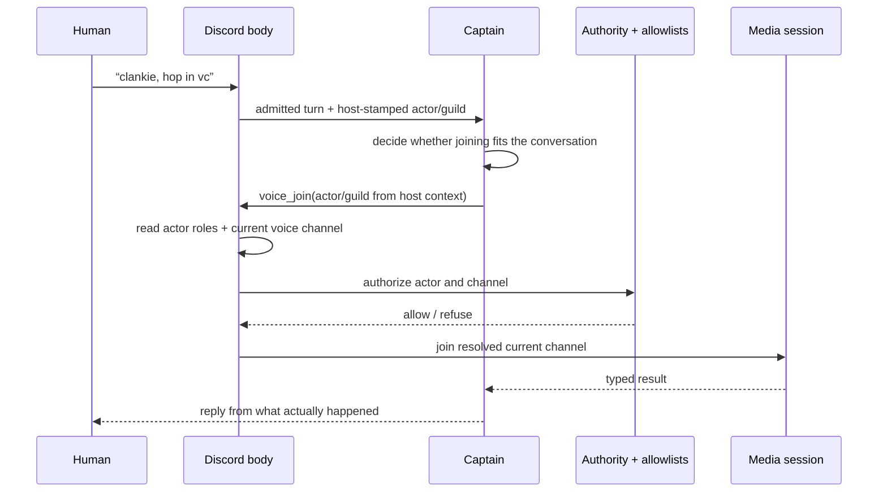

# ADR 0062: Voice presence is a captain tool

Status: accepted (2026-08-15). Builds on
[ADR 0050](0050-voice-presence-authority-tier.md) (voice presence authority)
and [ADR 0057](0057-realtime-voice-with-captain-handoff.md) (the realtime voice
body).

## Context

Clankie is the agent. Natural language interpretation and the decision to act
belong to his captain unless a separate decider is required by a different
trust boundary. Joining voice does not require one: the captain already reads
the admitted Discord turn and already decides when to use every other ability.

The live Discord body still owns the facts and effects the captain must not
invent: the authenticated speaker, their current voice channel, roles, gateway
adapter, allowlists, consent session, and media connection.

## Decision

The captain owns the join/leave decision through `voice_join` and
`voice_leave`. The active Discord body owns authorization, target resolution,
and execution.

This is the general social-action split, not a voice special case. The captain
also chooses reactions, thread participation, and whether to show or stop his
live play surface. The host grounds reactions/threads in the trigger message;
the body resolves live-watch actions from the authenticated speaker's fresh
voice state. Raw user, guild, channel, and message ids are never tool arguments.

- **Agent-owned intent.** No phrase matcher, voice-token gate, classifier model,
  or pending-retry state runs ahead of the captain. An admitted message reaches
  the same agent that handles the rest of the conversation; that agent decides
  whether to call a tool. Follow-ups such as “try now” use normal channel
  context and engagement.
- **Argument-free tools.** The model supplies no user, guild, or channel id.
  The service stamps the authenticated turn actor and guild into mutable tool
  context. The live body reads the actor's current gateway voice state when the
  tool executes, so text and prompt injection cannot pick a destination.
- **Body-owned execution.** The captain calls the active body's loopback
  control surface. The official bot applies ADR 0050's voice tier plus the
  voice guild/channel allowlists. The lab user-session body admits only the
  configured owner and its explicit guild/channel allowlists. Both prevent one
  guild from ending a call in another and treat joining the current channel as
  idempotent so consent state is not reset.
- **Typed truth.** The tool returns `joined`, `join_refused`, `left`, or
  `leave_refused` with a bounded reason. A successful join also says whether
  this operation auto-opted the speaker into capture, so the captain can give
  the required consent guidance in his own reply.
- **Consent remains separate.** An official-bot asked join opts in nobody;
  participants use `/clankie voice-consent opt-in`. The owner-only lab body
  auto-opts its authenticated owner when it creates the media session, and the
  captain discloses live speaker-attributed transcription in the reply.
- **Grounded catalog coverage.** Replies, generated media, and typing already
  happen as consequences of a captain turn. Reactions and threads target that
  turn's trigger; live-watch targets fresh voice state. Arbitrary
  edit/delete/send-by-id actions stay out of the social tool bank until the
  host can prove an owned target instead of asking the model to invent one.

## Options weighed

- **A second model at text ingress** — rejected. It duplicates the captain's
  language understanding, adds a second personality-free decision path, and
  needs its own matcher, context shaping, retry state, prompt, timeout, and
  traces. None of those enforce authority; the body must still do that after
  the model returns.
- **Let the captain choose guild/channel ids** — rejected. Agency decides
  _whether_ to act, not which authenticated facts are true. The host and
  gateway provide identity and destination.
- **Keep slash commands only** — rejected. Slash commands remain a deterministic
  operator fallback, but ordinary conversation is the primary product surface.

## Consequences

- One admitted Discord turn makes one captain decision instead of a captain
  call plus a separate intent call.
- Voice presence behaves like play, music, browser, and media abilities: the
  captain chooses a typed tool, while the owning subsystem validates and acts.
- Reactions, threads, and live-watch actions use the same seam: agent-owned
  intent, host-owned identity and destination, body-owned authority and effect.
- Tool-call history is the durable explanation of why Clankie moved. The body
  logs only content-free actor/guild/result metadata.
