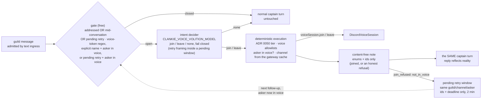

# ADR 0062: Voice join by asking

Status: accepted (2026-07-26, amended 2026-08-02 with the pending join
retry). Builds on
[ADR 0050](0050-voice-presence-authority-tier.md) (the voice presence authority
tier) and [ADR 0057](0057-realtime-voice-with-captain-handoff.md) (the realtime
voice architecture and its consent disclosures), neither of which changes here.

## Context

`/clankie join` and `/clankie leave` exist and work, but a slash command is how
you operate a bot, not how you talk to a member. In a room where Clankie is
already a social presence, "clankie hop in vc" typed into the text channel is
the natural ask — and the owner explicitly rejected slash-only presence as
bot-like. The official bot should move in and out of voice the way a person
does: because someone asked them to, in words.

Two facts shape where that decision can live:

- Join authority already sits in the bridge (ADR 0050's presence tier, the
  deny-by-default guild allowlist, the optional channel allowlist), beside the
  gateway voice-state cache and the media-owning `DiscordVoiceSession`.
- The captain has no presence-action tool, and no control-plane→bridge command
  transport exists. The protocol's catalogued `discord.presence.voice_join`
  action is still refused by the control-plane-hosted runtime.

## Decision

The decision lives at the bridge's text ingress boundary, in the pattern this
repository already uses twice (the text reply policy of ADR 0051, the voice
volition call of ADR 0057): a cheap mechanical gate, a bounded model call that
only interprets, deterministic authority and execution, and a captain who is
informed rather than asked.

- **Gate (free).** Runs only on inbound guild messages that already pass the
  ingress admission text ingress applies and that speak to him the way text
  ingress itself reads "spoken to" — an explicit mention/name
  (`mentionsBot`/`addressesCharacter`) **or** a message inside a conversation
  he is actively answering (`DiscordTextIngress.engagedInChannel`, the same
  live-message window that keeps him replying to follow-ups). Never a second
  matcher: the first live run proved that a narrower per-message name test
  makes him answer "hop in vc and play" in text while the voice seam pretends
  nobody spoke to him. The body must also match a deliberately loose
  voice-token regex — **or** name him explicitly while the asker is already in
  a voice channel: the second live run showed the word list missing natural
  asks ("clankie i wanna talk to you" from inside vc), and the asker's gateway
  voice-state is a stronger mechanical ask signal than any word. The wordless
  door requires the explicit mention/name, not merely an engaged conversation,
  so an engaged channel whose members sit in voice does not pay a decider read
  per message. Whether the asker is in voice never _closes_ the gate — that is
  voice state, and execution owns it, so an early worded ask earns an honest
  refusal instead of silence. Closed means zero added cost and an untouched
  turn.
- **Intent decider (one bounded call).** The brokered OpenAI key and
  `CLANKIE_VOICE_VOLITION_MODEL` — the same cost tier as the volition call, not
  a new knob — at temperature 0 with a hard timeout, asked one question: does
  this message ask Clankie to join the speaker's voice channel, to leave voice,
  or neither? Anything but a clear answer is "none" (fail closed). It reads the
  message body plus a few bounded recent channel lines, attributed only as
  Clankie / the sender / another member — natural addressing means the ask
  often names nobody, and without the surrounding lines the decider cannot
  tell an ask to Clankie from an ask to another member. Never room audio,
  never transcripts, and none of the text is ever logged. A failed context
  read degrades to a body-only decision rather than dropping the ask.
- **Deterministic execution.** The model authorizes nothing. A read ask runs
  exactly the slash checks — `authorizeVoicePresenceCommand` under
  `DISCORD_VOICE_JOIN_POLICY`, the `DISCORD_VOICE_GUILD_IDS` /
  `DISCORD_VOICE_CHANNEL_IDS` allowlists, and slash leave's cross-guild bound —
  then joins the asker's _current_ voice channel, read from the gateway cache
  at execution time. An asker who is not in a voice channel gets
  `join_refused: not_in_voice` — the note that lets his reply say "hop in a
  channel and ask again" instead of enthusiasm followed by nothing. A leave
  ask requires no voice presence from the asker. The model returns an intent
  enum and nothing else, so a prompt-injected body can never steer _where_ he
  joins. If he is already in exactly the asked channel, nothing is rejoined: a
  rejoin resets the consent registry, and silently un-consenting a room is
  worse than doing nothing.
- **The honest refusal keeps listening.** `join_refused: not_in_voice` opens a
  pending retry window — ids and a deadline only (two minutes), bound to
  exactly that guild, text channel, and asker, capped in count, consumed by
  the next executed decision for its key. His reply says "hop in a channel and
  ask again", and the window is him actually listening for that: while it is
  open, the same asker's follow-up in the same channel counts as spoken-to,
  and once the gateway reports them in a voice channel it earns one bounded
  read with no voice-ish word — the second live run showed "try now" and
  "im in general" exiting unread while his reply improvised that he still
  could not see voice. That read uses a retry framing (the standing prompt
  judges the message alone, and "try now" alone asks nothing): does this
  message renew the already-asked join, ask a leave, or neither — unrelated
  chatter stays "none", so the window never joins on the strength of the
  sender merely talking. A renewed join then runs the unchanged deterministic
  execution — same tier, same allowlists, target channel from a fresh gateway
  read — and a retry that finds the asker gone again reopens the window
  instead of eating the follow-up. Another member, another channel, or a late
  message can never ride an old refusal into a join.
- **Consent is never granted by asking.** An asked join opts in nobody — the
  asker included. Everyone consents through `/clankie voice-consent opt-in`,
  which already carries the residency disclosure ephemerally. The slash join
  keeps auto-opting-in its invoker, who sees that disclosure in the ephemeral
  reply; an asked join has no such reply, so it has no basis to opt anyone in.
- **The captain is informed, not authorizing.** The executed outcome travels
  into the same message's captain turn as `voicePresenceNote` — a strict
  enums-and-ids object (`joined` / `join_refused` / `left` / `leave_refused`
  plus a bounded reason), rendered by the control plane as one neutral factual
  line of ephemeral thread context. His conversational reply reflects what
  actually happened: he is the voice, the bridge is the actor.

## Options weighed

- **A captain presence-action tool plus a control-plane→bridge command
  transport** — rejected. It requires building two new infrastructures to move
  a decision away from the place that already holds its authority (ADR 0050),
  its data (the gateway voice-state cache), and its executor (the media-owning
  session) — and the execution plumbing would still end up in the bridge. The
  catalogued `discord.presence.voice_join` action stays as-is for a possible
  future captain-initiated surface.
- **A pure phrase matcher, no model** — rejected. Brittle rule-per-trigger:
  every new way of asking ("come hang", "you can dip") becomes a code change,
  and the repository's settled pattern is one cheap mechanism where the model
  interprets and never authorizes.
- **Do nothing (slash only)** — rejected by the owner. A member you must
  slash-command into a call is a bot, and the social presence ADR 0045 built is
  the point.

## Consequences

- Gated messages cost one cheap model call; everything else costs nothing. The
  gate is deliberately loose because a false positive is one bounded call and a
  false negative is a missed convenience — and the first live run showed the
  false negatives are the expensive side: they cost a debugging session, not a
  model call. Mid-conversation admission means a busy engaged channel spends a
  few more decider reads on stray "come"/"out" tokens; each is one bounded
  call that fails closed. An explicitly named wordless message from an asker
  inside voice also costs one read — rare, and the strongest ask signal there
  is.
- The intent decider is untrusted-input-facing, but it returns only an enum:
  a hostile body (or hostile context lines) can at most ask him to join the
  channel its author is sitting in, under the asker's own authority.
- The join surface widens from slash to natural speech within the same
  authority tier — who may move him is unchanged; only the phrasing is.
- An asked join starts with zero consented participants, so he sits in the
  channel hearing nobody until people opt in. That is the consent model working
  as designed, and the injected note tells him so, so he can say it.
- A pending retry window spends at most one bounded read per follow-up message
  from its one asker for its two minutes, and each read fails closed. The
  content-free ask trace carries a `pendingRetry` flag, so whether a refused
  join was still listening when a follow-up arrived is a recorded fact rather
  than an inference from his reply.
