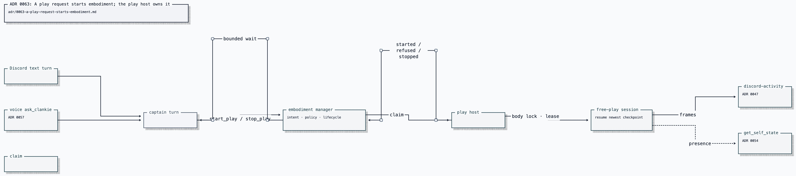

# ADR 0063: A play request starts embodiment; the play host owns it

Status: accepted (2026-07-26). Builds on
[ADR 0047](0047-discord-activity-presence-plane.md) (the activity watch
surface), [ADR 0053](0053-mcp-possession-of-clankies-body.md) (possession and
the single-holder body), [ADR 0057](0057-realtime-voice-with-captain-handoff.md)
(`ask_clankie` as voice's only route to abilities),
[ADR 0059](0059-lease-expiry-pauses-the-body.md) (lease-lapse pause),
[ADR 0060](0060-progress-as-minted-checkpoints.md) (checkpoints), and
[ADR 0062](0062-voice-join-by-asking.md) (asked voice presence). None of them
change here.

## Context

"Hey clankie, hop in vc and play pokemon" is the product sentence. The presence
path (ADR 0062) moves him into the voice channel, and the realtime voice stack
(ADR 0057) routes a spoken ability request into a captain turn through
`ask_clankie`. The captain submits bounded play intent; the play host owns the
environment body, possession lease, checkpoints, and activity frame pipeline.

Three facts shape where the seam can live:

- Captain tools are thin typed calls into service capabilities, not child
  processes.
- The play host holds the emulator body and activity producer credential.
- The body is one mutex with several suitors. The cross-process body lock
  (`integrations/gba-emulator/src/body-lock.ts`) is the only authority that
  sees _all_ of them, including an MCP possessor the Clankie service knows
  nothing about.

## Decision

The captain asks for play; the embodiment manager holds the intent; the play
host owns the session. Embodiment is a first-class requested capability.

- **Tool surface.** Two captain tools, `start_play` and `stop_play`, taking an
  environment id (`pokemon-firered`). No keyword matches "pokemon" upstream of the tool call: the
  captain reads the message and decides, the same emergent shape as every
  other ability. The tool description carries the teaching — what he can play,
  that refusals name a reason he can say out loud. The host stamps
  `requestedBy` from the authenticated turn (`owner` on the operator lane); it
  is not a model argument.
- **Transport.** Embodiment intents stay inside the service: the embodiment
  manager records intent, the play host claims it, and lifecycle events flow
  back. The captain tool waits bounded for
  `started` / `refused`; past the bound it reports the request as pending
  rather than guessing.
- **Ownership.** Only the play host boots the emulator. The captain never
  imports it (enforced by the architecture check). The Clankie service holds
  intent, authority admission, and the durable lifecycle record — it can
  refuse a second requested session before the play host claims it, but it is not
  the body mutex.
- **The body lock stays the mutex.** The play host acquires the same
  cross-process lock possession uses, under its own holder id. A start while
  any holder — MCP possession, another play host, a stray CLI — holds the body
  refuses with a typed `body_held` reason that travels back into the captain's
  reply. "Someone's already driving me" is product behavior, not an error
  path. Lease-lapse pause (ADR 0059) and checkpoint minting (ADR 0060) are
  unchanged: an asked session resumes from the newest checkpoint and mints one
  on graceful stop.
- **Authority tier.** Starting and stopping bounded play is allowed ambient
  work under docs/17's rule — Discord can create, steer, and stop allowed
  work. The policy engine is consulted per intent with
  `environment.play.start` / `environment.play.stop` classified as
  **reversible writes** — a budgeted, stoppable, checkpointed session is one —
  so each profile's existing risk-class posture decides: the lab profile
  allows, and a profile whose reversible writes require approval refuses,
  because an ambient surface cannot carry an approval ceremony. Listing the
  actions explicitly remains the owner's restriction path, taken with a
  baseline regeneration when it is actually wanted. Nothing privileged
  becomes reachable from voice or text; approval-shaped asks keep returning
  the authenticated-surface handoff.
- **The budget is the asker's, and the owner's default is no cap.** An intent
  may carry `maxTurns` / `maxDurationMs`; absent means he plays until asked to
  stop — the owner's explicit choice (2026-07-26), because a Clankie who
  quits mid-session on a timer is worse product than one who keeps going. The
  standing controls on an open-ended session are the stop ask (one message,
  lands at the next turn boundary), the single-holder body lock, lease-lapse
  pause, and the operator's launcher. `CLANKIE_PLAY_MAX_TURNS` /
  `CLANKIE_PLAY_MAX_DURATION_MS` restore a cap when one is wanted.

## Options weighed

- **A captain tool that owns the free-play process directly** — rejected. The
  captain does not hold the body or producer credential; giving it either moves
  the play host's trust boundary into the conversational agent.
- **Promote free play to a launcher-owned always-on service** — rejected.
  Launcher services (ADR 0055) are presence infrastructure that should always
  be up; a play session is on-demand model spend with a budget and a stop. An
  always-on player is the wrong default for both cost and consent.
- **Have the discord bridge start play the way it joins voice (ADR 0062)** —
  rejected. Asked presence works there because the bridge already holds join
  authority, the voice-state cache, and the media session. It holds nothing an
  emulator needs, and gameplay is an ability, not presence: abilities belong
  to the captain (ADR 0057), or voice and text drift apart.
- **Reuse mission plans as the vehicle (a play "mission")** — rejected.
  Missions carry task graphs, verification, and evidence contracts sized for
  work products. A play session is a lease on a body with a budget; forcing it
  through mission ceremony either bloats every ask or tempts weakening the
  mission contract to fit.
- **A separate play RPC** — rejected. In-process capability dispatch already
  carries the request without another transport.

## Consequences

- The captain's bounded environment capability is deliberately
  indirect: ask, wait bounded, report truthfully. The reply reflects what
  actually happened, in the same turn — the ADR 0062 property, applied to
  abilities.
- The bounded startup wait keeps the reply honest; the self-state projection
  (ADR 0054) makes the
  session visible to later turns and to the voice briefing either way.
- The play host is I/O-bound and must not block other Clankie service work.
- A second requested start refuses at the embodiment manager; an external possessor
  refuses at the body lock. Both come back as the same typed `body_held`, so
  he says the same true thing regardless of which layer saw the collision.
- The development CLI remains a thin alias of the same host composition, so one
  place assembles the pipeline.
- The live proof of the product sentence (join, play, watch, hear, stop) depends
  on ADR 0057's open human items for its voice half; the text half stands alone.
  Speech and hearing during a playthrough are carried by
  [ADR 0067](0067-a-play-request-speaks-through-the-possessor-seam.md) over ADR
  0064's seam, under the same operator flag.
