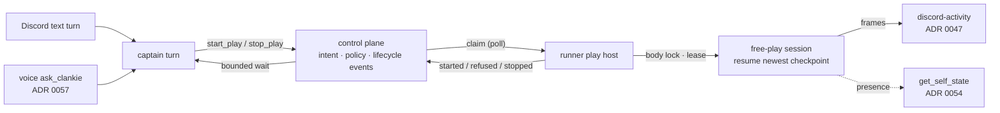

# ADR 0063: Asked embodiment — the captain starts play, the runner owns it

Status: proposed (2026-07-26). Builds on
[ADR 0047](0047-discord-activity-presence-plane.md) (the activity watch
surface), [ADR 0053](0053-mcp-possession-of-clankies-body.md) (possession and
the single-holder body), [ADR 0057](0057-realtime-voice-with-captain-handoff.md)
(`ask_clankie` as voice's only route to abilities),
[ADR 0059](0059-lease-expiry-pauses-the-body.md) (lease-lapse pause),
[ADR 0060](0060-progress-as-minted-checkpoints.md) (checkpoints), and
[ADR 0062](0062-voice-join-by-asking.md) (asked voice presence). None of them
change here.

## Context

"Hey clankie, hop in vc and play pokemon" is the product sentence, and today it
dead-ends in the one agent whose job is to act. The asked-presence path
(ADR 0062) moves him into the voice channel. The realtime voice stack
(ADR 0057) routes any spoken ability ask into a captain turn through
`ask_clankie`. But the captain's tool surface has mission tools, read tools,
web, and memory — nothing that touches an environment — and its `bash` tool is
deliberately disabled. The free-play loop, the possession lease, checkpoints,
and the activity frame pipeline all exist and work; their only entry points are
a manually launched runner script (`apps/runner/scripts/free-play-live.ts`) and
an external MCP possessor (ADR 0053).

[docs/17](../17-capability-completion-contract.md) already draws the missing
arrow — CAPTAIN → environment runtime — and constrains it: the runner is the
trust boundary that owns bodies, credentials, and worker processes; Discord is
an ambient surface that may start allowed work; privileged approval stays on
authenticated surfaces.

Three facts shape where the seam can live:

- The captain already reaches every service through one client
  (`controlPlaneClient()`); its tools are thin typed calls, not processes.
- The runner already polls the control plane to claim work
  (`claimTask` in `apps/runner/src/mission-worker.ts`) and is the process that
  holds the emulator body and the activity producer credential — the exact
  reasoning `free-play-live.ts` records for being composed there.
- The body is one mutex with several suitors. The cross-process body lock
  (`integrations/gba-emulator/src/body-lock.ts`) is the only authority that
  sees _all_ of them, including an MCP possessor the control plane knows
  nothing about.

## Decision

The captain asks for play; the control plane holds the intent; the runner owns
the session. Embodiment becomes a first-class asked capability with the same
shape missions already have.

- **Tool surface.** Two captain tools, `start_play` and `stop_play`, taking an
  environment id (`pokemon-firered` first; Minecraft rides the same seam
  later). No keyword ever matches "pokemon" upstream of the tool call: the
  captain reads the message and decides, the same emergent shape as every
  other ability. The tool description carries the teaching — what he can play,
  that refusals name a reason he can say out loud.
- **Transport.** Embodiment intents ride the runner's existing claim shape: the
  control plane records the intent, the runner polls and claims it, lifecycle
  events flow back. No new socket, no control-plane→runner push path, no
  second transport to operate. The captain tool waits bounded for
  `started` / `refused`; past the bound it reports the request as pending
  rather than guessing.
- **Ownership.** Only the runner boots the emulator. The captain process never
  imports it (enforced by the architecture check). The control plane holds
  intent, authority admission, and the durable lifecycle record — it can
  refuse a second _asked_ session before any runner claims it, but it is not
  the body mutex.
- **The body lock stays the mutex.** The play host acquires the same
  cross-process lock possession uses, under its own holder id. A start while
  any holder — MCP possession, another play host, a stray CLI — holds the body
  refuses with a typed `body_held` reason that travels back into the captain's
  reply. "Someone's already driving me" is product behavior, not an error
  path. Lease-lapse pause (ADR 0059) and checkpoint minting (ADR 0060) are
  unchanged: an asked session resumes from the newest checkpoint and mints one
  on graceful stop.
- **Authority tier.** Starting and stopping bounded play is allowed ambient
  work under docs/17's rule — Discord can create, steer, and stop allowed
  work. The policy engine is consulted per intent with
  `environment.play.start` / `environment.play.stop` classified as
  **reversible writes** — a budgeted, stoppable, checkpointed session is one —
  so each profile's existing risk-class posture decides: the lab profile
  allows, and a profile whose reversible writes require approval refuses,
  because an ambient surface cannot carry an approval ceremony. No profile
  gains a new action entry, deliberately: profile content feeds the doctrine
  hash that frozen evaluation baselines pin, and a hash shift for a capability
  the risk classes already govern would churn every one of them. Listing the
  actions explicitly remains the owner's restriction path, taken with a
  baseline regeneration when it is actually wanted. Nothing privileged
  becomes reachable from voice or text; approval-shaped asks keep returning
  the authenticated-surface handoff.
- **The budget is the asker's, and the owner's default is no cap.** An intent
  may carry `maxTurns` / `maxDurationMs`; absent means he plays until asked to
  stop — the owner's explicit choice (2026-07-26), because a Clankie who
  quits mid-session on a timer is worse product than one who keeps going. The
  standing controls on an open-ended session are the stop ask (one message,
  lands at the next turn boundary), the single-holder body lock, lease-lapse
  pause, and the operator's runner. `CLANKIE_PLAY_MAX_TURNS` /
  `CLANKIE_PLAY_MAX_DURATION_MS` restore a cap when one is wanted.

## Options weighed

- **A captain tool that spawns the free-play process directly** — rejected.
  The captain service does not hold the body, the producer credential, or the
  process-supervision discipline, and giving it any of the three moves the
  runner's trust boundary into the conversational process ADR 0057 just
  finished fencing.
- **Promote free play to a launcher-owned always-on service** — rejected.
  Launcher services (ADR 0055) are presence infrastructure that should always
  be up; a play session is on-demand model spend with a budget and a stop. An
  always-on player is the wrong default for both cost and consent.
- **Have the discord bridge start play the way it joins voice (ADR 0062)** —
  rejected. Asked presence works there because the bridge already holds join
  authority, the voice-state cache, and the media session. It holds nothing an
  emulator needs, and gameplay is an ability, not presence: abilities belong
  to the captain (ADR 0057), or voice and text drift apart.
- **Reuse mission plans as the vehicle (a play "mission")** — rejected.
  Missions carry task graphs, verification, and evidence contracts sized for
  work products. A play session is a lease on a body with a budget; forcing it
  through mission ceremony either bloats every ask or tempts weakening the
  mission contract to fit.
- **A new push transport (control plane → runner RPC)** — rejected for now.
  The claim poll already exists, is restart-tolerant, and adds at most a poll
  interval of latency, which the bounded tool wait absorbs. A push path is a
  new failure surface with one beneficiary; if latency ever matters, that is
  its own decision.

## Consequences

- The captain gains its first environment capability, and it is deliberately
  indirect: ask, wait bounded, report truthfully. The reply reflects what
  actually happened, in the same turn — the ADR 0062 property, applied to
  abilities.
- The claim poll puts seconds between "sure!" and visible frames. The bounded
  wait keeps the reply honest; the self-state projection (ADR 0054) makes the
  session visible to later turns and to the voice briefing either way.
- Two long-lived loops now share the runner process (mission worker, play
  host). The host is I/O-bound and must never block the claim loop; they share
  a process because they share the trust boundary, not because they share
  work.
- A second asked start refuses at the control plane; an external possessor
  refuses at the body lock. Both come back as the same typed `body_held`, so
  he says the same true thing regardless of which layer saw the collision.
- The manual `free-play-live.ts` path stops being the product story and
  becomes a thin development alias of the same host composition, so there is
  exactly one place the pipeline is assembled.
- The live proof of the product sentence (join, play, watch, hear, stop) depends
  on ADR 0057's open human items for its voice half; the text half stands alone.
  Speech and hearing during a playthrough are carried by
  [ADR 0067](0067-asked-play-speaks-through-the-possessor-seam.md) over ADR
  0064's seam, under the same operator flag.
