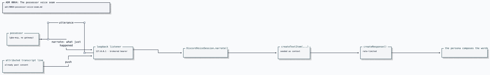

# ADR 0064: The possessor voice seam

Status: accepted (2026-07-26). Builds on
[ADR 0047](0047-discord-activity-presence-plane.md) (possession changes who
decides, never who is present), [ADR 0053](0053-mcp-possession-of-clankies-body.md)
(possession over MCP), and [ADR 0057](0057-realtime-voice-with-captain-handoff.md)
(the realtime voice architecture, its floor, and its consent disclosures). None
of them changes here. Amended by
[ADR 0098 (room text)](0098-the-room-can-type-to-a-playthrough.md), which widens the hearing
half from voice transcripts to any text the ingress allowlist already admits.

## Context

A harness can possess Clankie's GBA body and play FireRed, and the activity
plane lets people watch the frames. What nobody could do is hear him talk about
it. `clankie_say` and `clankie_listen` default to `deniedSpeechPort` and
`deniedHearingPort` as their only implementations — correct refusals with no
counterpart, so every call failed with a reason and commentary is impossible.

The refusal exists for a real reason rather than an unfinished wire. Speaking
through the Clankie service's `POST /v1/discord/presence-actions` requires a live
presence claim: the session id, phase, and monotonic revision the bridge
publishes while it holds the gateway. Only the process holding the gateway can
mint one, which is precisely what fences an action against a session that is
live _right now_. A possessor holds no gateway, so it holds no claim, and no
amount of wiring inside the possessor can produce one.

Two further constraints shape the answer:

- A possessor is a local process by construction, and it is the less trusted
  side of this boundary. It should not hold Discord credentials, and the
  credential-holding process should not dial out to it.
- The bridge deliberately retains no transcripts. Raw and generated PCM are
  zeroed after use. Any hearing mechanism that let a possessor ask for "the last
  N lines" would silently force the bridge to start retaining them.

## Decision

A possessor never speaks directly. It reports to the process that owns the body
in Discord, over a loopback seam, and that process speaks.

Four properties make this the same fence rather than a hole in it:

**The possessor supplies the event; the persona supplies the words.** Narration
is seeded with `createTextItem` and never spoken verbatim. What Clankie says
about walking into a wall is his, composed in the voice the briefing supplies
and folded in with whatever the room is saying. A possessor that could script
his dialogue would be choosing how he sounds, which is exactly what
[ADR 0051](0051-layered-character-register-and-reply-policy.md) reserves to the
character.

**The transport is loopback-only with a brokered bearer.** The listener binds
`127.0.0.1` and never a routable interface; the token is minted into the
credential broker under `clankie_possessor_voice` on the bridge's first start
and is a hard startup error in the environment. The bearer is the second lock,
not the only one — the same shape as the activity producer listener.

**The wire carries two messages and nothing else.** `narrate` in, `utterance`
out. A possessor cannot choose an audience, join or leave a channel, or reach
any other presence action from here. It drives the character; it does not pick
new rooms.

**Hearing is push, not pull.** The bridge hands each attributed line to live
subscribers as it happens, so its retention stays at zero. What a possessor then
holds is bounded, its own, and discarded when the lease ends. Nothing captured
outside the existing consent registry crosses the seam, and raw audio never
does. Which lines qualify is widened by
[ADR 0098 (room text)](0098-the-room-can-type-to-a-playthrough.md) to include admitted text;
the retention floor and the audio fence are unchanged.

### Rate-limiting narration, not narration's content

A play loop reports constantly: every step, every bump, every menu. Answering
each report would turn a voice channel into a monologue nobody can talk over.
Seeding is therefore unbounded and responding is rate-limited
(`narrationMinIntervalMs`, default 12 s). He always knows what his body just
did — the alternative is narrating a past he never saw — but he speaks about it
at the pace of a person watching a game, not a process emitting events. A
drop is receipt-visible as `possessor_narration_suppressed` with reason
`playing` or `rate_limited`. Asked play mints one `speechDeliveryId` on the
journal turn and carries it across the seam so the submission, the spoken
response, and the drop share a join key. The receipts stay content-free.

## Consequences

- `clankie_say` and `clankie_listen` work when the bridge is up, the seam is
  enabled, and he is in a voice channel; they refuse with a specific reason
  otherwise. Deny-by-default is unchanged: absent credential, absent bridge, or
  absent voice session all mean silence with an explanation.
- The bridge gains one loopback listener and one public method on the voice
  session. It gains no new credential class, no inbound public surface, and no
  retention.
- Narration cannot be used to make Clankie say a specific sentence. That is the
  point, and it means the seam is unsuitable as a general text-to-speech path —
  anything needing verbatim output belongs on the presence-action path with a
  live claim.
- A possessor that dies mid-session simply stops reporting. The room does not
  wait for it, and nothing is queued on its behalf.
