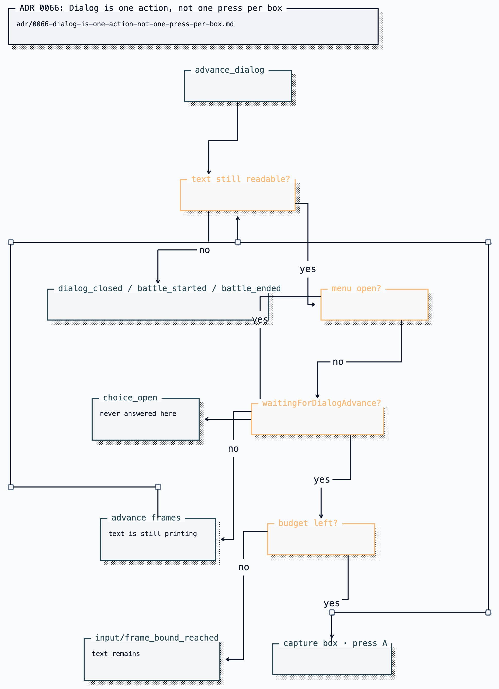

# ADR 0066: Dialog is one action, not one press per box

Status: accepted (2026-07-26). Extends the catalogued-composite-action pattern
[ADR 0058](0058-read-collision-from-the-live-map-buffer.md) established for
`walk_to`, inside the bounds
[ADR 0053](0053-mcp-possession-of-clankies-body.md) and
[ADR 0049](0049-free-play-agency-and-non-deterministic-evidence.md) already set.

## Current status (2026-08-19)

`advance_dialog` remains a shared catalogued emulator action. The possessor and
shared-body examples below are historical under
[ADR 0129](0129-each-player-owns-a-body.md); Clankie's runtime and each private
GBA MCP runtime enforce the same action schema independently.

## Context

Pokémon is a game made largely of talking. FireRed prints text one box at a
time and waits for an A press to continue, so a single NPC conversation is five
to ten presses, and the important part — a choice, a battle, a received item —
only arrives at the end.

Without a composite action, both drivers spend one full decision per box:

- The resident free-play mind (`free-play-mind.ts`, the driver behind asked play
  from Discord) could only choose `button_press`, so every box cost a model turn
  with a screenshot attached — seconds of wall clock and a decision's worth of
  tokens to read one sentence it cannot choose.
- The MCP surface could press with `repeat`, but a blind mash cannot see where
  it is going: past the last box the next A re-engages the NPC and reopens the
  conversation, and through a yes/no prompt it answers for the player. So a
  careful possessor avoids it and presses one box at a time, paying an
  extra `gba_emulator_observe` round trip per box to read what the box says.

The result is a body that looked slow and hesitant during exactly the moments
the game is telling the player something, and it is the first thing an
audience noticed on the watch surface.

The decoder already knew when the game is ready for the next box.
`decodeDialog` computed `waitingForDialogAdvance` — the field script parked on
the wait-for-A/B native — and threw it away after using it as a visibility
heuristic.

## Decision

Add `advance_dialog` to the catalogued action set: one action that reads the
open conversation to its next real decision point.

Three properties make it a catalogued action rather than a caller-side loop,
which is the same argument that supports `walk_to` for collision:

- **Termination is a live-state question.** Only the core knows the box closed,
  and only the state _between_ presses distinguishes "more text" from "you are
  talking to this NPC again". A caller-side loop cannot check it without
  paying the round trip the loop exists to avoid.
- **It stops where judgement is actually required.** A choice, a battle, or a
  closed box ends the action. It never answers a prompt: `menu` open is a full
  stop, and the outcome carries the menu so the next decision is informed.
- **It is bounded by the budget a burst of presses already draws from.** The
  same `maxInputs`/`maxFrames` limits apply, and a run out of budget is reported
  (`input_bound_reached`) rather than silently truncated, so a long conversation
  resumes with a second action instead of appearing to have finished.

Waiting is not pressing — but it is holding. While a box is still printing,
the action advances frames **with A held** rather than spending an input on a
press the game will not accept: FireRed zeroes the printer's per-character
delay while A/B is held, so the wait doubles as the fast-read every human does,
and a whole conversation fits one action's frame budget even at the default MID
text speed. A held button can never register as the _fresh_ press a waiting box
requires, so holding cannot answer a prompt or skip a box, and each held wait
ends on a released frame so the following press always lands as a new edge
(`advanceFramesHolding` on the core seam; a core without it simply waits at its
configured text speed). A box that never reports itself ready (signs and some
scripted text never park on the native) is pressed anyway after a stall
threshold, which in FireRed accelerates the printer rather than being wasted.

### Readable is a question about the screen, not the mode label

What counts as "still reading" is decided from what the screen is doing, because
the mode label and the visible text disagree at the exact moment the game talks
most. A won or lost battle is not a finished conversation: FireRed prints the
whole aftermath — the faint, the EXP, the level-up, the rival's parting line,
the prize money — while the mode still decodes as terminal. Asking `mode ===
"dialog"` refuses that entire run, which is the longest unbroken text in the
early game.

The terminal battle modes are therefore readable while field input is locked.
That qualifier is what keeps the action honest: the core retains `battle_won`
until the next press, so the mode outlives the screen that earned it, and
`inputReady` is the signal that the engine has handed control back. A retained
mode standing in the overworld still fails closed rather than spending a stray A
on whatever the player is facing.

### The text has to come back

The boxes are gone by the time anything looks at the after-state, so the
outcome carries a `transcript` of every distinct box read, and the free-play
loop renders it into the turn's observed effect. Without that, the one action
that reads the story would be the one action whose result he cannot remember —
he would advance through Oak's introduction and know only that "dialog changed".

A `button_press` outcome also carries any resulting `dialogLines`/`menu`,
for the same reason it already carries position and `moved`: reading back what
a press produced should not cost a second round trip.

## Consequences

- A conversation costs one decision instead of one per box, on both drivers. The
  resident mind's action vocabulary gains `advance_dialog`; the MCP tool gains
  the matching `actionKind`.
- Evidence gains one `advance_dialog` event per conversation instead of one
  `button_press` per box — proportional to decisions made, which is what the
  evidence window is sized for.
- The deterministic core double models text printing (as a derived state, not a
  stored one, so no frozen digest changes) and a press still advances whether or
  not printing finished, matching the real core's accelerate behaviour. It also
  models the held fast-read: frames advanced with A/B held count 4× toward the
  box becoming ready, the shape of a zeroed per-character delay against MID's
  four frames per character.
- The stall threshold is a heuristic about a real game's text engine. If a box
  type appears that neither parks on the native nor accelerates, it shows
  up as wasted presses in the transcript rather than as a hang.

## Alternatives considered

- **Teach the model to use `repeat` for dialog.** Rejected: the failure mode is
  silent and destructive (re-engaging an NPC, answering a prompt), and no prompt
  wording makes a blind mash able to see a choice appear.
- **A `read_dialog` observation that returns the whole conversation.** Rejected:
  reading the text requires advancing it, which is an action. An observation
  that mutates the world would break the observe/act split the whole surface
  rests on.
- **Auto-advance dialog inside the driver, below the action layer.** Rejected:
  it would take the decision out of the catalog, so it would not be leased, not
  be evidence, and not be refusable — exactly what ADR 0053's "changes who
  decides, not how an action is authorised" forbids.

## Operational note

The held fast-read makes `advance_dialog` largely independent of the in-game
Text Speed option. Setting it to FAST and minting a checkpoint
([ADR 0060](0060-progress-as-minted-checkpoints.md)) still helps the text this
action does not drive — battle strings scroll on their own clock — and costs
nothing. Worth doing once, but not the difference between watchable and
glacial dialog.
