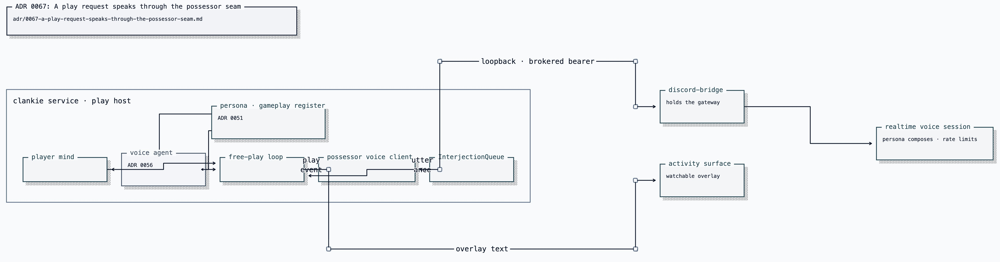

# ADR 0067: A play request speaks through the possessor seam

Status: accepted (2026-07-26). Its inbound decision remains authoritative: room
speech reaches the play loop through the possessor seam. Its original outbound
sentence-carriage decision is superseded by
[ADR 0074](0074-the-room-hears-one-voice.md): the play loop now reports events
and the realtime room session authors the words.

## Current status (2026-08-19)

The bidirectional event/utterance behavior remains for Clankie's own play under
the neutral `@clankie/play-voice` name. [ADR 0129](0129-each-player-owns-a-body.md)
supersedes the possessor scope: external harnesses receive no voice seam or room
input. The diagram and terminology below are historical.

## Context

The play runner owns the game loop and activity overlay. The Discord body owns
the live room, attributed speech, consent, and playback. The possessor seam is
the bounded local transport between them; the play runner never receives a
Discord gateway or chooses a room.

At ratification a separate Voice agent also authored finished `speak` and
`reply` sentences for the playthrough. Sending those through an event-shaped
seam created two outbound authors. ADR 0074 records and fixes that contradiction.

## Decision

### Inbound room speech reaches the play loop

Attributed, admitted room utterances are pushed through the hearing side of the
possessor seam into the play loop's existing `InterjectionQueue`. They are read
at turn boundaries, carry no raw audio or gateway credential, and do not widen
gameplay authority. A person speaking is context for the next decision, not an
emulator command.

### Outbound play uses event narration

The play loop reports a bounded experience update every settled turn. Its
volition separately says whether that update may ask for speech. It does not
send `FreePlayTurn.speak`, `reply`, or any other finished sentence. The
gateway-owning realtime session inherits the experience and is the sole author
of what the room hears.

[Editable Turbopuffer tldraw source](../diagrams/clankie-docs-diagrams.tldraw)

Judgement and carriage remain separate: the play loop decides whether a moment
is worth offering; the seam carries the event; the room session decides the
words. No process without the gateway can mint a live presence claim or inject a
chosen sentence.

### Degradation

Silence is a degraded mode of play, not a reason to stop playing. Missing
credentials, bridge, consent, or live voice state leave the game and activity
surface running. Nothing queues on behalf of a dead room session.

## Alternatives considered

- **Carry the player's finished `speak` field** was originally accepted here
  and then superseded because it caused double authorship through an event seam.
- **Use a direct presence action for verbatim speech** was rejected because the
  play runner has no live gateway claim and must not gain one.
- **Publish only overlay text** was rejected because it leaves a watched
  playthrough mute in the voice room.

## Consequences

- People in the room can affect the next play decision without directly
  controlling the emulator.
- The outbound room has one author, while the activity overlay and journal may
  retain their own surface-specific text.
- Inbound subscriptions close with the playthrough, so a finished session
  cannot continue hearing a room.
- Current enablement, ports, and live proof belong in the
  [Discord bridge](../../apps/discord-bridge/README.md) and
  [play-voice](../../packages/play-voice/README.md) operating guides.
