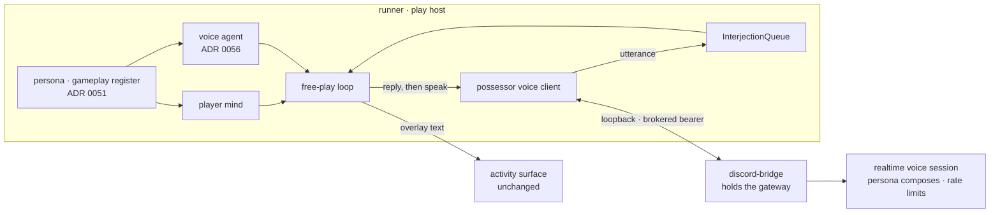

# ADR 0067: Asked play speaks through the possessor seam

Status: accepted (2026-07-26). Joins decisions that had no wire between them:
[ADR 0063](0063-asked-embodiment-and-captain-started-play.md) (the captain
starts a playthrough because someone asked),
[ADR 0064](0064-possessor-voice-seam.md) (a possessor reports what the body did
and the persona voices it), [ADR 0056](0056-voice-is-a-separate-agent-from-the-player.md)
(the half of him that talks is its own agent), and
[ADR 0051](0051-layered-character-register-and-reply-policy.md) (one
owner-authored character, in a register per surface). None of them changes here.
Numbering: 0067 follows 0066, the highest ADR present when this is authored.

## Context

The product sentence is "hop in vc and play pokemon" — join, play, watch, hear
him react, stop. Every part of it existed except the hearing.

Asked play ran the free-play loop under the runner's play host. That loop
produces a `speak` line (his unprompted aside) and a `reply` line (his answer to
someone who spoke to him), and the host published both to the activity overlay —
the text sidebar beside the stream. Nothing carried them into the voice channel
he was playing in. `runFreePlay` was called without a `voice` port, so ADR 0056's
separate Voice agent never ran either. The gap was marked in the code rather
than hidden: _"the dev script wires stdin, voice comes later."_

The inbound half was missing for the same reason. `InterjectionQueue` existed,
the loop consumed it at turn boundaries, and only a developer's stdin ever fed
it. A person in the channel could watch him play and say something, and it
reached nothing.

Meanwhile ADR 0064 had already built the whole seam for the _other_ driver: an
MCP possessor reports narration to a loopback listener, the bridge seeds it into
the live realtime session, and the persona composes the words. Both halves —
`say` and `subscribe` — were sitting in `@clankie/possessor-voice`, consumed
only by `apps/gba-mcp`.

Two further gaps sat behind the missing transport, both visible only by
comparing the production host against `free-play-cli.ts`, the development alias
that was supposed to be the thin one:

- **No voice agent.** ADR 0056 exists because the player model, asked to choose
  an action and optionally a remark in one call, spoke at most once in sixteen
  turns — speech loses to the decision every time when it is a side field. The
  dev CLI passes a `voice`; the production host did not, so even a perfect
  transport would have carried almost nothing.
- **No character.** The dev CLI loads the owner-authored persona in its
  `gameplay` register and hands it to both agents. The production host built its
  mind with no `character` at all, so the Clankie an audience watched play was
  not the Clankie they talk to — a plain ADR 0051 violation, in the one lane
  with an audience.

## Decision

The production host composes what the development alias always did — persona,
voice agent, and now a transport — and asked play speaks and hears through the
ADR 0064 possessor seam rather than a second path.

**Judgement and carriage are different missing pieces, and both were missing.**
The voice agent decides _whether this moment is worth a remark_; the seam
_carries_ the remark to the room. Wiring only the seam would have delivered a
pipe with nothing in it, because ADR 0056 already measured that the player model
alone stays near-silent. Wiring only the agent would have produced good lines
that reached a text sidebar. The cost of the second model call is bounded by the
gate ADR 0056 already ships: voice is consulted only when something happened —
someone spoke, or the turn produced a thought or an observable change.

**One character, both agents.** The persona is loaded once per playthrough and
handed to the player and the voice alike, exactly as the dev alias does. Two
agents sharing one character is the point of ADR 0056; two agents inventing
their own would be the failure.

**Why the runner is a possessor.** The runner holds the body and the activity
producer credential, but no Discord gateway and therefore no live presence claim
— structurally the same position an MCP harness is in. ADR 0064's fence is
exactly right for it: it reports, and the process that holds the gateway decides
how he sounds. This also means asked play cannot be used to make Clankie say a
chosen sentence, which stays true by construction rather than by policy.

**Reply before aside.** Someone who spoke to him is owed the answer before an
unrelated remark about a desk.

**Voice feeds the same queue stdin does.** Hearing the room needed no second
path into the loop, and a supplied queue (the dev script) still works alongside.

### Degradation

Silence is a degraded mode of playing, never a reason not to play. This matches
the frame sink exactly: no credential, no bridge listening, or a rejected line
all leave the playthrough running and watchable. The first rejected line logs
once per session — a bridge that is down stays down, and a line per turn would
bury the playthrough in its own failure.

## Consequences

- The product sentence is true end to end: he joins, plays, is watchable, is
  audible, and stops when asked.
- People in the voice channel can talk to him mid-playthrough and be answered.
  ADR 0063's authority model is untouched: an interjection is something a person
  said, not an instruction, and it reaches the same non-privileged field a
  developer's stdin did.
- Enabling remains the operator's, and stays off by default:
  `possessorVoiceEnabled: true` in the operator settings' `discord` block (env
  `CLANKIE_POSSESSOR_VOICE_ENABLED=true` as the override) plus a live voice
  session, unchanged from ADR 0064 in authority. One switch now governs both
  drivers, which is the point of not building a second path — and storing it
  means a bridge restart cannot silently mute his playthroughs.
- The runner takes dependencies on `@clankie/possessor-voice` and
  `@clankie/settings`. It gains no credential class of its own: the bearer is
  broker-resolved exactly as the activity producer bearer is.
- A playthrough now costs up to two model calls per turn instead of one, gated
  by ADR 0056's has-something-to-consider check. That is the price of him being
  a character rather than a cursor, and it is bounded by the same budget and
  stop ask every playthrough already carries.
- `free-play-cli.ts` and the production host now compose the same three things,
  so the dev alias is finally the thin wrapper ADR 0063 described. A future
  capability added to one and not the other is the drift to watch for.
- Nothing is queued on a dead session's behalf. The subscription is released and
  the client closed when the playthrough ends, so a finished session cannot hear
  a room it is no longer in.

## Alternatives considered

- **Carry the player's own `speak` field and skip the voice agent.** This was
  the first draft of this decision, and it was wrong: ADR 0056 had already
  measured that field as near-silent, so the cheaper design would have shipped a
  working transport that carried nothing and looked like a bug in the seam.
- **A presence-action path with a live claim, so the words are verbatim.**
  Rejected: it would make the runner able to put chosen sentences in Clankie's
  mouth, which ADR 0064 deliberately prevents. The persona composing is a
  feature.
- **Publish overlay text and let a viewer read it.** That is the status quo, and
  it is why the body looked mute in a voice channel.
