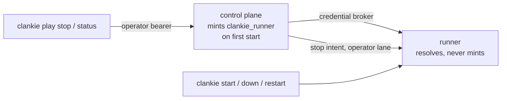

# ADR 0069: The runner is a supervised service

Status: accepted (2026-07-27). Builds on
[ADR 0063](0063-asked-embodiment-and-captain-started-play.md) (asked play) and
[ADR 0068](0068-a-playthrough-leaves-a-durable-trail.md) (the playthrough
trail); completes the operational half both assumed.

## Context

The first live asked-play evening proved the seam end to end — and spent most
of its hours on the process around it. The runner was started by hand with an
env prefix; `CLANKIE_RUNNER_TOKEN` lived only in the shell that exported it, so
each `clankie restart` from any other shell brought up a control plane that
401'd every claim while both processes looked healthy. That outage happened
three separate times in one evening, and the third dressing of the same wound
is a diagnosis: the token's home was wrong, and the runner's place outside the
supervisor was wrong. A stuck playthrough also had no operator-side stop — the
only clean path ran through Discord, which is exactly the surface a stuck
session may have stopped answering.

## Decision

- **The runner bearer is broker-owned.** `clankie_runner` follows the exact
  contract of the bridge bearers: the control plane mints it on first start
  (`ensureRunnerCredential`), the runner only resolves it, and
  `CLANKIE_RUNNER_TOKEN` in the environment remains a deliberate override —
  set for both processes or neither. A restart from a token-less shell can no
  longer silently sever the runner plane.
- **The runner is a `ManagedService`.** `clankie start | down | restart`
  covers it (`runner` target), it logs to the supervisor's standard
  `runner.log`, and its probe is process-liveness — the same honesty rule as
  the bridge: a runner started by hand is reported, not disowned. It sits last
  in `SERVICE_ORDER` so the control plane it authenticates to and the activity
  producer it dials are up first.
- **The game files have a well-known home.** With no env configured, the boot
  looks for `~/.local/share/clankie/gba/firered.gba` and
  `firered-bedroom.state` (existence-gated; the deterministic double remains
  the fallback), mirroring the checkpoint and body-lock directories. A
  supervised runner therefore starts with no env prefix at all.
- **The operator can always stop the game.** `clankie play stop` submits an
  ordinary stop intent under the `operator` lane through an
  operator-authenticated control-plane route; the runner winds down at the
  next turn boundary and mints its checkpoint exactly as an asked stop would —
  a kill-switch that is never a kill. `clankie play status` reads the live
  session the same way.
- **The claim loop cannot fail invisibly.** The claim fetch carries a bounded
  timeout (a hung request across a control-plane restart previously wedged the
  loop forever), and claim failures log once per failure signature with a
  recovery line — deduplicated because the poll runs every second, present
  because the silent catch spent a live evening indistinguishable from "no
  work".

## Options weighed

- **Keep the env-only token and document the restart incantation** — rejected.
  An incantation that must accompany every restart is a defect with
  documentation; the third outage in one evening was the review.
- **Bake the token into the supervisor's `serviceEnv`** — rejected. It fixes
  launcher restarts and leaves every other start path broken, and it spreads
  secret material into a second owner. The broker already exists for exactly
  this shape.
- **An operator kill of the runner process instead of a stop intent** —
  rejected. Killing the process loses unminted progress and leaves the control
  plane believing a corpse is playing (ADR 0068's reconcile then has to clean
  up). The stop intent is cheaper and honest.

## Consequences

- One `clankie start` brings up the whole stack, asked play included, with no
  env prefixes; `clankie down` reaches everything, answering the operator ask
  this evening produced ("we need a good way to cleanly and quickly do this").
- The env override still exists for tests and split deployments, and carries
  the old failure mode with it — deliberately, and now as an opt-in.
- A machine without ROM files keeps the deterministic double everywhere, so CI
  and fresh clones see no behavior change.
