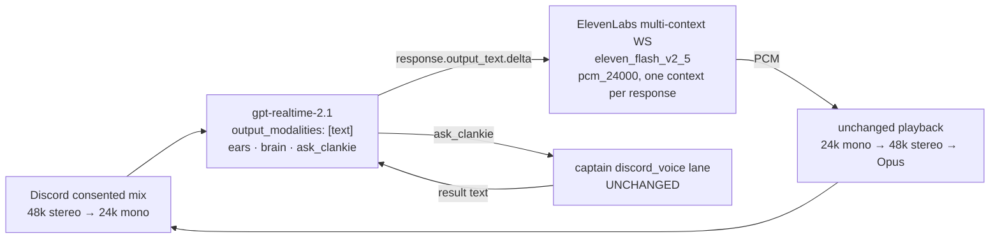

# ADR 0070: An external voice is a swappable mouth, not a second architecture

Status: accepted (James, 2026-07-27). Extends
[ADR 0057](0057-realtime-voice-with-captain-handoff.md): the two-tier realtime
architecture, the captain handoff, the floor machine, and the consent model are
all unchanged. This decision makes exactly one part of it configurable — who
synthesizes Clankie's speech.

## Context

ADR 0057 gave `gpt-realtime-2.1` the ears, the mouth, and turn-taking. The
mouth half of that bargain has a limitation the ears half does not: the
realtime model speaks only from OpenAI's fixed voice list. A Clankie whose
voice is part of his character — cloned, designed, or simply not on that list —
has no way to sound like himself.

The obvious escape hatches are all worse than the problem. Rebuilding the
cascade around a better TTS reintroduces `captainMs` on the critical path.
Voice-changing the realtime audio pays for audio output tokens _and_ a second
synthesis, adds a hop of latency, and still leaves the timbre downstream of a
voice he was trying to leave. Moving to a vendor's conversational-agent
platform re-imports every 1:1 default ADR 0057 fought out of — their turn
detection, their tool plumbing, no floor machine.

What makes a cheaper path possible is a property ADR 0057 already bought:
every response is an explicit `createResponse()` decision, playback is owned by
this repository, and the media owner talks to the engaged tier through one
structural port (`VoiceConversationPort`). The mouth is already a module; it
just was not yet swappable.

## Decision

When the owner selects an external voice, the engaged tier becomes a pair
behind the same port: the realtime session keeps the ears, the brain, and
`ask_clankie`, but runs with `output_modalities: ["text"]`, and its text deltas
stream through an ElevenLabs multi-context TTS WebSocket whose 24 kHz PCM
enters the existing playback path.

- **The media owner cannot tell the difference.** `voice-session.ts` — floor,
  pendings, receipts, barge-in triggers, playback, `ask_clankie` round trips —
  is untouched. The pairing lives in
  `packages/discord-presence-core/src/external-voice.ts` and is composed by the
  bridge (`apps/discord-bridge/src/voice-composition.ts`), which returns it
  from the same `openConversation` port the native session comes from.
- **Configuration is settings-first.** A `voice` section in
  `@clankie/settings` (`ttsProvider`, `openAiVoice`, `elevenLabsVoiceId`,
  `elevenLabsModelId`) is edited from the TUI's `/voice` wizard and projected
  into `CLANKIE_VOICE_TTS_PROVIDER` / `CLANKIE_VOICE_ELEVENLABS_*` at bridge
  startup, with environment-wins precedence like every other setting. The
  retired cascade names stay retired.
- **The key follows the openai credential shape exactly.** Broker-resolved
  under provider id `elevenlabs`, API-type only, connection headers only
  (`xi-api-key`), and `ELEVENLABS_API_KEY` / `XI_API_KEY` in the environment
  are hard startup errors.
- **The boundary has the same discipline as the realtime boundary.**
  `elevenlabs-tts.ts` enforces WSS-or-loopback, per-context audio byte caps,
  per-append text caps, a session lifetime cap, sanitized error codes, PCM
  zeroing on handoff, and sample-alignment carry so playback never sees a torn
  s16le sample. The realtime session gains a per-response text cap
  (`MAX_REALTIME_RESPONSE_TEXT_CHARACTERS`) that fails closed like the audio
  byte cap, because in this mode text _is_ speech.

### Three ordering problems, owned in one place

The pairing glue exists because "the mouth is a different process now" breaks
three assumptions the media owner was allowed to make:

- **`response.done` no longer means the speech exists.** Synthesized audio
  necessarily trails the model's done event, and the media owner drops late
  audio after a response settles. The port therefore holds the done event
  until the TTS context reports final — bounded by a drain timeout so a wedged
  synthesizer cannot wedge the floor.
- **`conversation.item.truncate` stops making sense.** It is an audio-item
  repair, and the server rejects it for text items. Barge-in becomes: close
  the TTS context (stopping paid synthesis of speech nobody will hear), drop
  the item's late output, and inject a bounded marker item telling the model
  the room did not hear the rest.
- **The mouth can die independently of the ears.** A dropped TTS socket fails
  the current utterance loudly, releases any held done event, and is reopened
  lazily on the next utterance. The conversation open itself is eager on both
  sessions: a conversation that can hear but never speak fails the open
  instead of failing the first sentence.

### What the disclosure now says

Room audio never reaches ElevenLabs — only the words Clankie chooses to say.
That is a genuinely different residency story from "everything stays with one
vendor", and the join and opt-in disclosures say it explicitly when the
external voice is configured: replies are synthesized by ElevenLabs from his
words, and participant audio is never sent there. The consent model is
otherwise unchanged, which is exactly why the integration point was chosen
this far downstream of capture.

### What is deliberately lost

Speech-to-speech output carries the model's own prosody — laughter, timing,
emphasis. With text output, delivery is ElevenLabs' interpretation of the
words. The ears are unaffected (audio input is native either way); this trades
expressiveness on the way out for owning how he sounds. The trade is the
owner's to make, per persona, in settings — not a code default.

## Options weighed

- **Voice-change the realtime audio output (speech-to-speech)** — rejected.
  Double synthesis cost, an extra audio hop, and conversational-grade
  streaming voice conversion is not there; the model's vocal performance is
  the only thing it preserves.
- **Rebuild the cascade with better TTS** — rejected. It optimizes the stage
  that was never the bottleneck and puts the captain back on the critical
  path; ADR 0057 exists because of that latency.
- **A vendor conversational-agent platform** — rejected. Turn-taking, tool
  routing, and context land in vendor defaults that are all wrong for a group
  room; the floor machine and `ask_clankie` fence are not portable into it.
- **Give the media owner a second port type for text mode** — rejected.
  Every consumer of `VoiceConversationPort` would need to care which mouth is
  wired; the pairing glue keeps the blast radius of this feature at one file
  plus composition.
- **Probe the ElevenLabs socket in readiness** — rejected for now. Readiness
  checks the brokered credential and configuration; a live synthesis probe
  spends paid characters to prove what the first utterance proves anyway. The
  live gate still exercises the full path end-to-end.

## Consequences

- **`auto_mode` moves the buffering job to this repository.** It disables
  ElevenLabs' chunk schedule and every server-side buffer, so each frame is
  synthesized as one unit with its own prosody. That is what makes a short
  reply fast, and it is only correct for a caller sending complete phrases:
  relaying the model's token deltas straight through made every word its own
  utterance. The pairing therefore accumulates deltas and emits on sentence and
  clause boundaries (`splitSpeakableUnits`), with a character cap so an
  unpunctuated run still starts speaking and an end-of-response drain so a tail
  without punctuation is never lost. Anything sending partial phrases to the
  mouth is a bug, not a latency optimization.
- **Latency adds one hop but stays conversational.** Text deltas arrive
  faster than audio deltas, so the net cost is roughly the TTS time-to-first
  byte (~100–300 ms with `eleven_flash_v2_5` and `auto_mode`). The captain
  remains off the critical path. `toFirstAudioMs` in the response receipt now
  includes the TTS hop; its meaning — decision to first audible frame — is
  unchanged, and no receipt field was added or removed.
- **Cost changes shape favorably.** Audio output tokens ($64/1M, re-billed as
  context on every later response) become cheap text tokens in context, traded
  for ElevenLabs character pricing on what he actually says. Barge-in closes
  the TTS context server-side, so interrupted speech stops billing.
- **A second vendor credential exists.** `elevenlabs` in the broker, checked
  by voice readiness exactly when the provider is configured, forbidden in the
  environment, and reachable from `/voice`, `/discord`, and `/auth`.
- **Two more session lifecycles when configured.** The TTS socket has its own
  inactivity timeout (reopened lazily), lifetime cap, and failure modes; the
  drain timeout turns a wedged synthesizer into a settled turn with an error
  line instead of a stuck floor. The wake probe runs the engaged session in
  text modality so readiness exercises what production runs.
- **The user-session body keeps the native voice.** `apps/discord-user-session`
  composes its own ports inline and is not wired to the external voice; it
  keeps `marin` until deliberately routed through the shared composition. The
  seam (`openExternalVoiceConversation`) is exported for exactly that move.
- **The persona/voice naming collision sharpened.** `/persona`'s "voice" menu
  item means chattiness; `/voice` now means how he sounds. The `/persona`
  wording was left as "How much he talks", which reads unambiguously, but the
  two commands sitting side by side is worth a future rename if it confuses.
