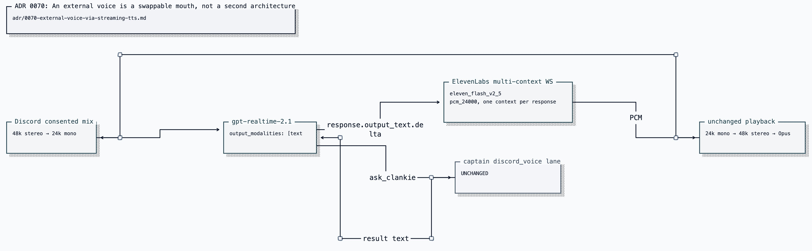

# ADR 0070: An external voice is a swappable mouth, not a second architecture

Status: accepted (James, 2026-07-27). Extends
[ADR 0057](0057-realtime-voice-with-captain-handoff.md): the realtime ears,
captain handoff, floor machine, and consent model stay unchanged. Only speech
synthesis becomes configurable.

## Context

The realtime model's fixed voice list cannot express a designed or cloned
character voice. Rebuilding the old STT/captain/TTS cascade would restore
captain latency to every sentence; voice-changing already synthesized audio
would pay for two synthesis stages; adopting a vendor conversational agent would
replace Clankie's group-room floor and tool fence.

ADR 0057 already gave the repository explicit response and playback control, so
the mouth was a replaceable module rather than a reason for another voice stack.

## Decision

When an external voice is selected, the engaged realtime session keeps the
ears, conversation, and `ask_clankie`, but emits text. Text deltas stream through
an external TTS session whose PCM enters the existing Discord playback path.
The media owner sees the same conversation port in either mode.

Configuration is owner-authored and settings-first. Credentials stay in the
broker; provider API keys in ambient environment variables fail closed. The
external boundary enforces secure-or-loopback transport, bounded text and audio,
session lifetime, sanitized errors, sample alignment, and PCM zeroing.

### The adapter owns three ordering problems

- **Model completion precedes synthesized audio.** The adapter delays the
  response-done signal until TTS drains, bounded by a timeout.
- **Realtime audio truncation no longer applies to text items.** Barge-in closes
  the TTS context, drops late output, and tells the conversation that the room
  did not hear the remainder.
- **The mouth can fail independently.** A failed TTS session settles the current
  utterance and reopens lazily for the next one; opening a conversation proves
  both sides can start.

Room audio never reaches the TTS provider. Only words Clankie chooses to say do,
and join/consent disclosures name that residency when configured.

Text-to-speech trades the realtime model's native prosody for an owner-selected
timbre. That is a character choice, not a code default.

### Evidence retained from implementation

The low-latency provider mode disabled server-side buffering, which made it
incorrect to forward raw token deltas as independent utterances. The adapter
therefore emits complete sentence/clause units, caps unpunctuated runs, and
flushes the tail at response end. First-audio receipts keep measuring the whole
decision-to-audible path, including the TTS hop.

## Alternatives considered

- **Voice-change realtime audio** was rejected because it doubles synthesis and
  adds another audio hop.
- **Rebuild the cascade around external TTS** was rejected because the captain
  returns to the conversational critical path.
- **Use a vendor's full conversational-agent platform** was rejected because
  floor control, authority fencing, and context would move into 1:1 defaults.
- **Expose a second media-owner port** was rejected because every caller would
  need to know which mouth was selected.

## Consequences

- The captain remains off the conversational critical path; external synthesis
  adds one measured hop.
- Barge-in stops synthesis as well as playback, avoiding late paid output nobody
  hears.
- A second provider credential and session lifecycle exist only when selected.
- TTS failure settles a turn rather than wedging the room floor.
- Current providers, settings, credentials, readiness, and diagnostics belong in
  the [Discord bridge operating guide](../../apps/discord-bridge/README.md).
