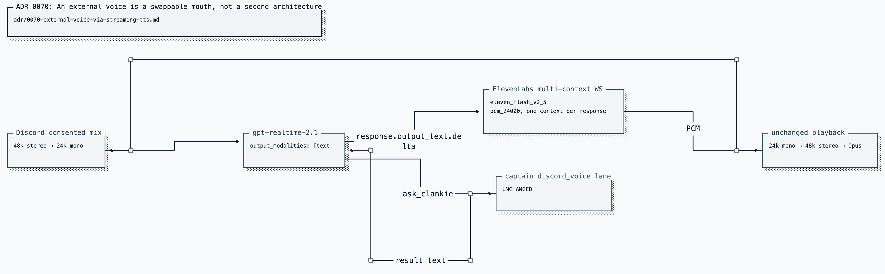

# ADR 0070: An external voice is a swappable mouth, not a second architecture

Status: accepted (James, 2026-07-27). Extends
[ADR 0057](0057-realtime-voice-with-captain-handoff.md): the realtime ears,
captain handoff, floor machine, and consent model stay unchanged. Only speech
synthesis becomes configurable.

## Context

The realtime model's fixed voice list cannot express a designed or cloned
character voice. Rebuilding the old STT/captain/TTS cascade would restore
captain latency to every sentence; voice-changing already synthesized audio
would pay for two synthesis stages; adopting a vendor conversational agent would
replace Clankie's group-room floor and tool fence.

ADR 0057 already gave the repository explicit response and playback control, so
the mouth was a replaceable module rather than a reason for another voice stack.

## Decision

When an external voice is selected, the engaged realtime session keeps the
ears, conversation, and `ask_clankie`, but emits text. Text deltas stream through
an external TTS session whose PCM enters the existing Discord playback path.
The media owner sees the same conversation port in either mode.

Configuration is owner-authored and settings-first. Credentials stay in the
broker; provider API keys in ambient environment variables fail closed. The
external boundary enforces secure-or-loopback transport, bounded text and audio,
session lifetime, sanitized errors, sample alignment, and PCM zeroing. The
five-minute per-utterance PCM bound admits briefings and explicit read-aloud
answers while still fencing runaway output.

### The adapter owns three ordering problems

- **Model completion precedes synthesized audio.** The adapter delays the
  response-done signal until TTS drains, bounded by a timeout.
- **Realtime audio truncation no longer applies to text items.** Barge-in closes
  the TTS context, drops late output, and tells the conversation that the room
  did not hear the remainder.
- **The mouth can fail independently.** A failed TTS session settles the current
  utterance and reopens lazily for the next one; opening a conversation proves
  both sides can start. Any failed synthesis step discards the mouth, not just a
  dropped socket — a session that reports itself open after failing a frame
  would otherwise be reused by every later utterance, and the failure would last
  the whole call instead of one turn. Before settling incomplete speech, the
  adapter adds a conversation marker saying the room may have heard only a prefix, so
  the next response does not assume the whole reply was audible. Failure
  receipts carry the active delivery and speaker when an utterance owns the
  failure, so the audible prefix, model response, and synthesis failure join
  without timestamp inference.

Room audio never reaches the TTS provider. Only words Clankie chooses to say do,
and join/consent disclosures name that residency when configured.

Text-to-speech trades the realtime model's native prosody for an owner-selected
timbre. That is a character choice, not a code default.

### Evidence retained from implementation

The low-latency provider mode disabled server-side buffering, which made it
incorrect to forward raw token deltas as independent utterances. The adapter
therefore emits complete sentence/clause units, caps unpunctuated runs, and
flushes the tail at response end. Normal completion flushes and closes the TTS
context, then keeps accepting its audio until the provider's final frame;
closing without that drain is reserved for interruption. First-audio receipts
keep measuring the whole decision-to-audible path, including the TTS hop.

### Explicit Eleven v4 Turbo selection (2026-09-28)

`eleven_v4_turbo` uses the provider's Text to Dialogue multi-context WebSocket,
with one owner-selected voice registered per context and dialogue `inputs`.
Legacy models retain the TTS transport and Flash remains the unset default.
Both protocols share the existing PCM, bounds, consent and late-audio handling.
Dialogue contexts receive keep-alives every ten seconds while accepting text;
only context `is_final`, not a prosody-turn marker, completes an utterance.
The existing context interface avoids a second conversation architecture.

The [dialogue guide](https://elevenlabs.io/docs/eleven-api/guides/how-to/websockets/realtime-tdd)
names v4 support; the [multi-context reference](https://elevenlabs.io/docs/api-reference/text-to-dialogue/ttd-multi-websocket)
still describes v3. A real provider canary is required to verify model access.
The reference defines `close_context` as flushing remaining generation. Thus
local interruption is guaranteed by dropping late output, not by a claim that
the provider cancels billing immediately.
A reply superseded before it became audible is treated the same way
(2026-10-04): its context closes, its held done is released at once, and the
realtime response is cancelled, so the next reply never waits on dead speech.

### Teardown and cutoff attribution (2026-09-28)

Intentional conversation close suppresses late TTS socket errors. Genuine
synthesis failures retain the provider item id, delivery id, and playback id
when PCM has reached a playback job; before first audio there is no playback id.
Interruption and completed-playback receipts carry those same join keys. A
socket failure with no live utterance must not borrow the previous reply's ids.

### Authored tone directions and short V4 openings (2026-10-03)

The external adapter recognizes exactly `[laughs]`, `[chuckles]`, `[sighs]`,
`[whispers]`, `[sarcastic]`, `[excited]`, `[curious]`, and `[deadpan]` for the
explicit `eleven_v4_turbo` transport. James approved this set after the retained
`spike/voice-latency` probe at `dbd4c479`. That probe establishes behavior on its
exact voice/model/WebSocket; it is not a first-party transport guarantee.
The session receives a capability description, with no additional model call or
rules selecting a tone. Other external models receive words without directions.

A bounded per-item parser withholds partial square-bracket directions across
streaming deltas. Unknown, malformed, or unfinished directions never reach the
mouth; no direction reaches readable delta/final callbacks. Direction-only sound
output remains possible on V4 without creating empty readable transcript entries.
The projection precedes both the opt-in spoken transcript store and its app read
path. Content-free canonical voice receipts stay content-free. Human input,
owner instructions, and independently authored Discord/text-thread messages are
not passed through this voice-markup parser.

For V4, a first complete clause with fewer than 40 visible characters receives a
terminal flush in its own provider context. The remainder starts only after that
context's final frame, using a new provider context but the same original speech
item/playback identity. This preserves audio ordering without buffering provider
PCM or assuming nonterminal flush semantics. Completion waits for every segment;
barge-in drops the live segment and pending remainder. The complete utterance,
including both segments, shares the existing text/audio bounds. An asynchronous
mouth reopen rechecks cancellation before creating a context, and stale mouth
callbacks cannot reach the replacement utterance.

Directions are consumed exactly where authored. A laugh/sigh is never replayed,
and style is never inferred or carried from one segment to the next. A terminal
segment can reset provider prosody; continuity and new first-audio latency are
**unverified** until the owner runs the targeted before/after probe. The 40-character
cutoff is an engineering choice between the prior 21/45-character examples, not a
measured provider threshold. Deterministic fixtures prove frame order, projection,
completion and cancellation, not live latency or perceptual quality.

## Alternatives considered

- **Voice-change realtime audio** was rejected because it doubles synthesis and
  adds another audio hop.
- **Rebuild the cascade around external TTS** was rejected because the captain
  returns to the conversational critical path.
- **Use a vendor's full conversational-agent platform** was rejected because
  floor control, authority fencing, and context would move into 1:1 defaults.
- **Expose a second media-owner port** was rejected because every caller would
  need to know which mouth was selected.

## Consequences

- The captain remains off the conversational critical path; external synthesis
  adds one measured hop.
- Barge-in stops local playback and drops late synthesis output; provider-side
  generation cancellation depends on the transport.
- A second provider credential and session lifecycle exist only when selected.
- TTS failure settles a turn rather than wedging the room floor, and is
  receipted under the `speech_synthesis` stage. An utterance that dies in
  synthesis plays no audio and so leaves no response receipt; without a failure
  receipt a Clankie who cannot be heard reads exactly like a Clankie with
  nothing to say.
- Current providers, settings, credentials, readiness, and diagnostics belong in
  the [Discord bridge operating guide](../../apps/discord-bridge/README.md).
