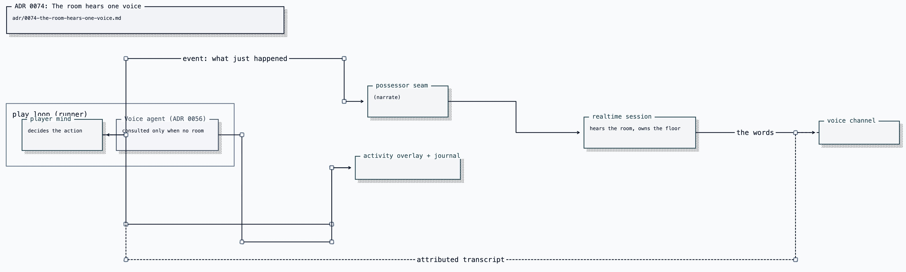

# ADR 0074: The room hears one voice

Status: accepted (2026-08-01). Resolves a contradiction between
[ADR 0064](0064-possessor-voice-seam.md) (the possessor supplies the event, the
persona supplies the words) and
[ADR 0067](0067-a-play-request-speaks-through-the-possessor-seam.md) (asked play
speaks by sending the Voice agent's lines through that seam). Narrows
[ADR 0056](0056-voice-is-a-separate-agent-from-the-player.md): the Voice agent
keeps its job, and loses one surface. The consent model
([ADR 0071](0071-presence-as-consent-voice-policy.md)), the swappable mouth
([ADR 0070](0070-external-voice-via-streaming-tts.md)), and the floor machine
([ADR 0057](0057-realtime-voice-with-captain-handoff.md)) are unchanged.
Amended by [ADR 0123](0123-the-room-inherits-the-games-experience.md): every
settled game turn reaches the room persona as silent experience, while
`speakWanted` still decides which turns may produce audio.

## Context

ADR 0064 defines the possessor voice seam around one property, stated in its
decision and enforced by its wire contract:

> The possessor supplies the event; the persona supplies the words. Narration is
> seeded with `createTextItem` and never spoken verbatim.

The protocol says the same thing to anyone who reads it — `text` "describes what
just happened in the body… It is **not** a script."

ADR 0067 sends `FreePlayTurn.speak` and `.reply` through that seam. Those values
are finished sentences authored by ADR 0056's Voice agent, not events. An event
seam treats them as observations and composes a second reply, so the room hears
the realtime model respond to a third-person report of words Clankie is already
saying. The wiring, not either agent, is the defect.

The design question is: **when a room is listening, who authors what it hears?**
ADR 0056 says the Voice agent. ADR 0064 says the persona in the realtime
session. Both are him and use the same persona, but they cannot author the same
moment in the same channel.

Two authors is not a stylistic problem. The realtime session is the one holding
the conversation: it hears the room, owns the floor, and answers when someone
speaks. A second author writing asides into the same channel produces a
character who interrupts himself with a different voice's phrasing, and who can
answer the same question twice with different words — once from the play loop's
`reply`, once from the realtime session that heard the same audio.

## Decision

**The realtime session is the sole author of everything the room hears.** The
play loop reports events and never sentences.

Three parts:

**1. The seam carries events, as its contract says.** The play host sends
what happened — the turn's effect, the objective it served — and never `speak`
or `reply`. The client method is renamed from `say()` to `narrate()` to match
the wire message and the contract; `say()` is the name that invited a script
through a seam that never accepted one.

**Authorship moves to the room; the judgement of what is worth remarking on
does not.** Every turn updates the room persona's game-side experience, but
only turns whose own volition fired (`speakWanted`) ask it to answer aloud. One
judgement of "is this worth a word" remains where the whole moment is visible.
The words are still never sent: volition says _whether_, the room says _what_.

**2. The Voice agent is not consulted while a room is listening.** The bridge
tells the possessor whether anyone can hear it, and the play loop skips ADR
0056's consultation when the answer is yes. This is not a downgrade of ADR 0056:
its agent still authors for the activity overlay and the journal, which are the
surfaces it is built for and the only surfaces it reaches when nobody is in
voice. It costs a model call it is already paying and buys back a call per turn
during voice sessions.

**3. Exactly one author per surface, always.**

When nobody is in voice, the Voice agent authors and the overlay is the only
surface — unchanged from ADR 0056. When a room is listening, the realtime
session authors, and it authors from events plus the audio it already hears.

## Consequences

- Double authorship cannot recur by construction: there is no path from an
  authored sentence into `narrate()`. The seam's bound and rate gate are
  unchanged; only what crosses it is.
- He can answer questions about the game. Events accumulate in the realtime
  session's context, so "what are you doing?" is answerable from state rather
  than from whatever quip is most recent.
- Events only land as sense if the persona knows a body is playing at all. The
  voice briefing therefore carries a live-embodiment card naming the game and
  saying reports of his own play arrive as text items.
- A narration and a real reply are separately visible in the latency line. Both
  take the fast path with a zero handoff, so the response receipt records which
  one triggered it; without that the two are byte-identical in the log.
- The overlay and the room can differ in wording while nobody is in voice and
  then converge on a single author when someone joins. That is intended: they
  are different surfaces with different audiences, and the alternative — piping
  realtime transcripts back to the overlay producer — crosses three services to
  fix a cosmetic seam. This remains open deliberately.
- A room-status message is an inbound surface on the possessor protocol. It
  carries a boolean and a channel-scoped count, never identities, so it adds no
  retention and no new consent question.
- Voice-session playthroughs cost one model call per turn instead of two. The
  saved calls stay measurable: they land in `FreePlayVolition.skipped`, which
  ADR 0056's amendment already counts.
- ADR 0067 remains authoritative for its inbound half: the transcript reaches
  the play loop as interjections, so the
  player needs to know what is said to it, even though it does not answer
  out loud.
