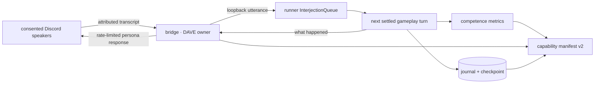

# ADR 0076: Social FireRed play has one operational proof

Status: accepted (2026-08-02). Builds on
[ADR 0045](0045-official-bot-dave-group-voice.md),
[ADR 0046](0046-versioned-unified-capability-evaluation.md),
[ADR 0063](0063-asked-embodiment-and-captain-started-play.md), and
[ADR 0074](0074-the-room-hears-one-voice.md).

## Context

Joining Discord voice, hearing people, speaking through one realtime persona,
starting FireRed, and driving the emulator all existed. Their separate tests
still allowed four operational failures:

- the cumulative voice evaluator selected the oldest DAVE join, so historical
  success could hide a newer broken session;
- a live playthrough could exchange voice without proving that a post-start
  transcript reached the gameplay turn that followed;
- SIGTERM could kill the runner without a journal summary or checkpoint, while
  the launcher could report a live runner whose repo/check configuration left
  mission execution disabled;
- the frozen scripted FireRed scenario proved mechanics but did not measure
  free-play stalls, repeated input, or efficient milestone progress.

A fixed 15-minute Codex adapter timeout also killed every implementation task
in the remediation wave at once despite longer bounded task estimates. That
made the runner look like three independent worker failures instead of one
adapter deadline defect.

## Decision

### Voice proof follows one coherent session

The live evaluator reconstructs joined→left sessions by guild/channel and
selects the latest ceremony candidate, including an incomplete or failed newer
session. A later clean reconnect-only session proves recovery without
displacing the main ceremony. The possessor listener emits content-free
attach/detach, room delivery, transcript delivery, accepted narration
submission, and refusal evidence. A refused narration never emits the accepted
submission receipt, and any refusal in the candidate session fails the two-way
gate. Transcript and narration text are unrepresentable in the receipt schema.

The production-shaped loopback test waits for the asked-play host to report
`running`, publishes a room utterance through the real WebSocket seam, observes
that utterance on the next gameplay turn, and observes a gameplay event return
through narration. While a room listens, the realtime session remains the sole
speech author and narration responses retain their existing interval gate.

### Runner shutdown is a lifecycle transition

SIGINT and SIGTERM request stop through the same `PlayHost` control used by an
operator ask. Once play is running, the host reports `stopping`; the loop ends
at a turn boundary, writes its journal summary and checkpoint, releases the body
lock, reports its terminal receipt, and then the process exits. The drain
deadline defaults to 15 seconds. Expiry reports an explicit failed terminal
state with a one-second best-effort reporting grace and exits nonzero. All
embodiment report requests also have a network timeout, so an unavailable
control plane cannot wedge shutdown indefinitely. A dead process's lock remains
safe because the next runner reclaims it by PID liveness and reconciles any
stale live session as `lease_lapsed`.

Gameplay-mind and gameplay-voice model streams each have a 60-second request
deadline. A provider that never closes its stream therefore records a failed
turn and returns control to the play loop instead of holding the body forever.

The supervised launcher supplies the repository path and dependency-free
architecture/docs-link verification checks unless the operator explicitly
overrides them. Process liveness no longer implies a runner was launched in a
configuration that necessarily disables or invalidates every mission.

### Competence is measurable, not rhetorical

`fixtures/free-play/competence-benchmark-v1.json` pins deterministic seeds and
an operator-local ROM state. A run passes only when it reaches every declared
milestone within budget, maintains the accepted-action floor, avoids a
repeat-only strategy, and closes every stall window. Control decisions derive
from current decoded observations, not an input transcript. The operator
receipt binds each run to its actual fixture or ROM/savestate/core hashes and
contains no ROM, savestate, frame, transcript, prompt, or decision content. The
live evaluator loads the canonical repository benchmark, recomputes all checks,
requires the exact ROM-gated state set and pins, reruns that state on fresh
operator-local ROM/core bytes, and requires the new report to match the stored
report byte-for-byte at the parsed-data boundary.

“Optimal” means reliable milestone progress with bounded stalls and efficient
state-derived macro-actions under this versioned benchmark. It does not mean a
globally shortest route, best battle strategy, or speedrun record. A stronger
claim requires a new benchmark version and explicit product acceptance.

Manifest v1 remains frozen. Manifest v2 adds the deterministic and ROM-gated
free-play gates beside the existing full rival-battle proof.

### Worker deadlines follow bounded task estimates

Codex turns default to 30 minutes and, when a task declares an estimate, receive
that duration plus 15 minutes of settlement headroom, capped at four hours. An
explicit adapter timeout still wins. This keeps the runner's deadline bounded
without contradicting the task contract that the scheduler already approved.

## Options weighed

- **Keep separate green package tests** — rejected because none proved the
  voice/game seam or process boundary as one sequence.
- **Treat a healthy PID as runner readiness** — rejected because the observed
  process had neither a repo path nor trusted checks and could not settle work.
- **Call any accepted emulator input competent play** — rejected because an
  agent can press one direction forever while every action is accepted.
- **Claim globally optimal Pokémon play** — rejected because no route corpus,
  strategy oracle, or cost function defines that claim.
- **Exit immediately on SIGTERM** — rejected because it discards the exact
  journal/checkpoint evidence needed to resume and diagnose play.

## Consequences

- Deterministic CI proves the two-way voice/game seam, graceful and forced
  runner shutdown, restart recovery, and ROM-free competence.
- Operator-local ROM evidence proves the same competence schema on the pinned
  real core without copying copyrighted bytes into the repository.
- The complete Discord row still requires a real ceremony with three consenting
  humans. Tests cannot manufacture consent, audible quality, overlap, barge-in,
  or DAVE reconnect evidence.
- A newer failed voice session correctly makes the live gate fail even when an
  older session passed.
