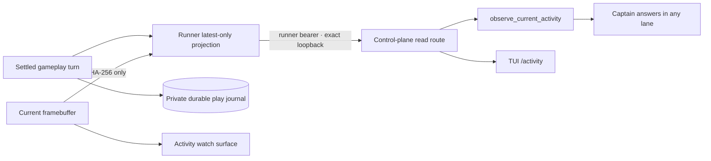

# ADR 0077: Current activity is a runner-owned self-observation

Status: accepted (2026-08-02). Builds on
[ADR 0047](0047-discord-activity-presence-plane.md),
[ADR 0054](0054-cross-lane-presence-and-episodic-self-memory.md),
[ADR 0063](0063-asked-embodiment-and-captain-started-play.md), and
[ADR 0068](0068-a-playthrough-leaves-a-durable-trail.md).

## Context

The captain knows that a gameplay room is open through `get_self_state`, and
people can watch the frame stream on the activity surface. Neither path tells a
captain turn what is happening inside the game. Asked “how is it going?”, the
truthful response is therefore only that play is running; any goal, effect, or
progress report would be invented.

Giving every captain lane the gameplay continuation token or transcript would
break the lane fence. Scraping the public activity viewer would make image and
overlay presentation an authority boundary. Replaying the durable free-play
journal into a conversation would expose unbounded historical model output
when the question only needs a present-tense answer.

## Decision

The runner owns a latest-only, memory-only `ActivityObservationSnapshot`. One
snapshot is published after each free-play turn settles and is cleared when
that embodiment session ends.

The strict snapshot separates two provenance classes:

- `selfAuthored` contains the current objective, intended next move, and bounded
  gameplay commentary. These are Clankie's own words, not world authority.
- `runnerObserved` contains the settled action outcome, effect, bounded progress
  counters, and framebuffer digest. These are execution facts.

The schema admits no frame bytes, raw decoded emulator state, action payload,
continuation token, prompt, or transcript. Raw frames remain on the rendered
surface media plane; the append-only journal remains the private durable
historical artifact. The present-tense projection does not enter semantic
events or control-plane persistence.

The runner serves the snapshot on an authenticated exact-loopback read gateway.
The control plane validates it against the authoritative live embodiment
session before returning one of three strict results: `snapshot`, `pending`
(live session, no settled turn), or `not_playing`. A stale session or environment
identity fails closed.

`observe_current_activity` gives the same authenticated read to the captain in
every lane. This is bounded self-observation, not access to another lane's
contents, so lane instructions direct the captain to use it for questions about
what he is doing or how play is going. The tool cannot act on the environment.

The TUI's `/activity` command renders the semantic snapshot with provenance
labels and links to the loopback activity viewer for the live frame. It strips
terminal control characters from every model-authored field.

## Options weighed

- **Add detail to `get_self_state`** — rejected because presence and activity
  content have different update rates, provenance, and exposure rules.
- **Share the gameplay Eve session or transcript across lanes** — rejected
  because it transfers continuation authority and unrelated private history.
- **Have the captain inspect the activity viewer** — rejected because the
  presentation/media plane is not a typed authority source and image tool
  results do not cross the authored Eve tool boundary.
- **Read the durable free-play journal through the control plane** — rejected
  because the question is present-tense and does not justify exposing an
  unbounded history or persisting a second copy.
- **Write every observation as a semantic domain event** — rejected because
  high-rate gameplay content does not belong in the mission control plane.

## Consequences

The captain can answer activity questions with recent evidence while remaining
honest about which fields are self-authored. The TUI can show the same facts and
the live visual surface without becoming an emulator client. A runner restart
or session start temporarily yields `pending`; there is deliberately no stale
fallback to an earlier playthrough. New activity types extend the discriminated
snapshot union and add their own bounded reducer without widening this GBA
contract.
