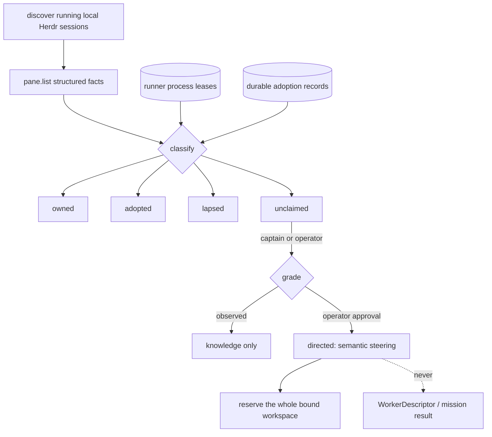

# ADR 0078: An agent he did not start can be adopted, not assumed

Status: accepted (2026-08-07). Extends process-lease recovery
([ADR 0019](0019-runner-pull-worker-execution.md)) from "reconcile what I
spawned" to "account for what is running"; grades status through
[ADR 0015](0015-tiered-agent-status-detection.md); and preserves the semantic
boundary in [ADR 0033](0033-terminal-wire-and-vt-restore-snapshots.md).

## Context

Clankie can execute and settle only workers the runner launches. Those workers
have a minted `workerRunId`, a runner-owned worktree, a reduced environment, a
process lease, semantic events, and a result protocol. A Codex or Claude agent
started by a person in Herdr has none of those attestations. Treating that
foreign process as a `WorkerDescriptor` would claim execution, containment,
scope enforcement, and result settlement that the runner does not possess.

Ignoring foreign agents is also unsafe. It hides live writers, encourages a
second worker to enter the same checkout, and makes startup report a quiet
machine while useful context is already present.

## Decision

Adoption is an explicit, workspace-bound relationship with a foreign agent. It
makes the agent visible and, at directed grade, steerable. It never makes the
foreign process an executable mission worker.

- **Discovery is session-independent.** The runner asks
  `herdr session list --json` for every running local session. An inherited
  `HERDR_SOCKET_PATH` remains a fallback, not a startup requirement. Each
  session receives a collision-safe `transportInstanceId`, so equal terminal
  ids in different Herdr sessions never alias.

- **The binding includes workspace identity.** A record binds
  `(transport, transportInstanceId, terminalId, harness, agentSessionId,
  workspaceId, canonicalWorkspaceRoot)`. The terminal id is the stable handle
  used to re-resolve the pane; the native agent session id identifies the agent;
  and the workspace pair prevents a census or command from crossing repositories.
  A changed session or workspace lapses the record instead of re-pointing it.

- **The census stays live.** Every census read observes and reconciles before it
  classifies. A vanished terminal remains visible as a durable `lapsed` entry
  until release. Transport failure lapses nothing because inability to observe
  is not evidence that a process stopped.

- **Grades separate knowledge from control.** `observed` needs no approval,
  carries no write scope, and grants no steering. `directed` requires an
  authenticated operator approval receipt plus a declared expected
  `writeScope`. The control plane derives the captain or operator principal from
  authentication; callers cannot supply audit identity or forge approval.

- **Declared scope is context; the workspace reservation is enforcement.** A
  foreign process is not sandboxed, so Clankie cannot honestly hold it to the
  declared glob. Every active directed adoption therefore exports the enforced
  reservation `reservedWriteScope: ["**"]` for its canonical workspace. The
  mission runner includes those reservations in each pull claim, and the
  scheduler leaves write tasks queued with `task.scope_contended` until the
  adoption lapses or is released. Read-only tasks remain eligible.

- **Steering uses Herdr's semantic agent API.** Direction re-verifies the exact
  session and workspace binding, then calls `agent.prompt`. It does not inject
  raw keystrokes into a pane. The audit event records who directed the agent and
  the text length, never the text.

- **Context is structured or cooperative, never scraped.** `runnerObserved`
  contains bounded Herdr facts. `selfDeclared` comes from a fresh declaration
  keyed by transport instance, terminal, and workspace. Pane scrollback and raw
  terminal bytes never become semantic context. Deeper context is obtained by
  asking a directed agent and keeping the answer's provenance in that agent
  session; it is not converted into a mission result automatically.

- **Unclaimed means offered, not taken.** Startup and routine census reads
  report all visible agents but never auto-adopt them. A plain shell remains
  reportable and is never adoptable.

## Options weighed

- **Treat every discovered pane as a worker** — rejected because the runner
  cannot execute, contain, settle, or independently verify it.
- **Route mission tasks directly to a directed adoption** — rejected because a
  prompt sent to a pre-existing session has no runner-owned attempt lifecycle,
  worktree, evidence capture, or deterministic result boundary.
- **Trust the declared write scope as enforcement** — rejected because a
  declaration cannot sandbox a foreign process. Whole-workspace reservation is
  conservative and truthful.
- **Require cooperative self-registration for discovery** — rejected as the
  only mechanism because it misses agents started before Clankie. Cooperative
  declarations remain useful as the advisory context channel.
- **Require one particular Herdr session** — rejected. Session enumeration plus
  exact transport-instance binding provides discovery from a normal shell and
  prevents cross-session aliasing.

## Consequences

- A downloaded Clankie can discover running local Herdr agents without being
  launched inside Herdr or inheriting one specific session. Use still depends
  on local Herdr access and authentication to Clankie's control surfaces.
- Adoption is workspace-aware rather than globally routable. An agent in
  another repository is visible, but its reservation and steering binding do
  not silently apply to this repository.
- Existing agents can be queried or redirected without pretending they satisfy
  a mission task contract. Mission execution continues through runner-owned
  workers.
- Directed adoption intentionally pauses new Clankie-owned writers in the same
  workspace. Releasing or lapsing the adoption removes that reservation on the
  next claim.
