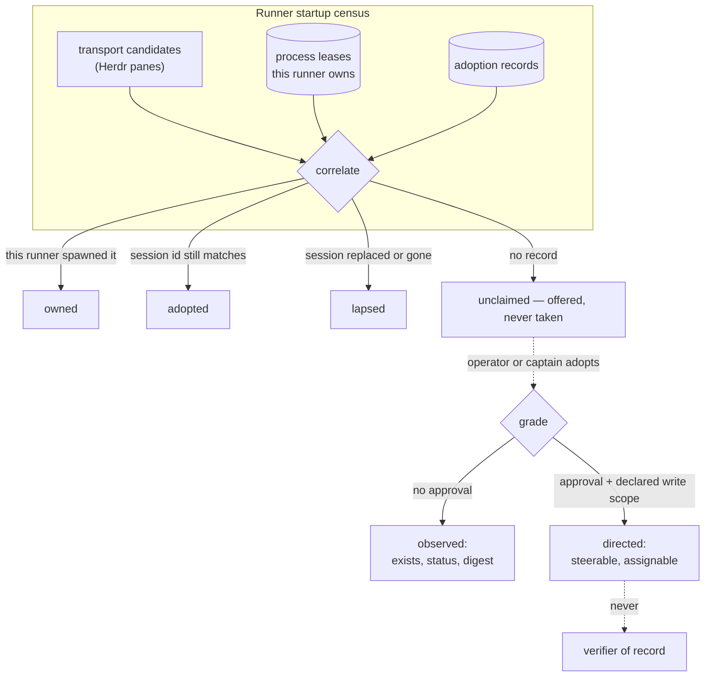

# ADR 0078: An agent he did not start can be adopted, not assumed

Status: accepted (2026-08-07). Extends the process-lease recovery contract
([ADR 0019](0019-runner-pull-worker-execution.md), implemented in
`apps/runner/src/process-leases.ts`) from "reconcile what I spawned" to "account
for what is running"; grades its status reporting through
[ADR 0015](0015-tiered-agent-status-detection.md); constrained by
[ADR 0033](0033-terminal-wire-and-vt-restore-snapshots.md) (terminal bytes are
not a semantic plane) and [ADR 0018](0018-captain-worker-control-parity.md)
(operator parity).

## Context

Clankie routes work he originated. `leaseReadyTask` mints a `workerRunId`, the
runner opens a worktree lease, registers a process lease keyed on pid plus
process start time, and every downstream surface — steering, transcripts,
harvest, evidence — keys on that `workerRunId`. Restart recovery is real but
symmetrical: `ProcessLeaseManager.reconcile()` re-adopts leases **this runner
previously wrote**, and fails the rest.

An agent the owner started by hand — a Herdr pane running Codex, a `claude`
session in a terminal, a sibling worker from another mission — has no lease
record and no `worker.leased` event. It is not merely unrouted; it is invisible.
Two concrete costs follow. Clankie cannot hand a Slack or Linear instruction to
the agent already holding that context, so he spawns a second worker into the
same files. And on startup he reports an empty fleet while six agents are
running, which is not a quiet gap — it is a false statement about the world, and
the same class of defect [ADR 0072](0072-the-harness-tells-him-the-truth.md)
already ruled against.

The tempting fix is to enumerate panes and treat them as workers. That fails on
four counts at once. Their write scope was never declared, so the "never allow
two workers to write the same path concurrently" invariant becomes
unenforceable rather than merely unenforced. Their worktree is usually the live
checkout. Their environment was never reduced by `buildWorkerEnvironment`, so
they may hold exactly the credentials the runner withholds from workers. And
their only output is terminal bytes, which doctrine forbids from becoming
semantic mission events.

## Decision

Adoption is real, explicit, and grades authority. An adopted agent is a
first-class _citizen of the census_ and a deliberately second-class _worker_.

- **Two grades, and the cheap one is the default.** `observed` requires no
  approval and grants exactly three things: that the agent exists, its declared
  and observed status, and a bounded digest. It grants no steering, no task
  assignment, and no evidentiary weight. `directed` is a privileged action
  requiring an authenticated operator approval, and it grants the existing
  operator-parity vocabulary — nothing new is invented for it. The census is
  useful at `observed`; only routing needs `directed`. Splitting them means the
  common case ("what is running?") costs no ceremony and takes no risk.

- **Write scope is declared by the adopter, never inferred.** `directed`
  adoption is refused without an explicit write scope. Clankie does not guess it
  from a pane title, a cwd, or a diff. An adopted worker with a declared scope
  participates in collision checks like any other; an `observed` agent has no
  declared scope and therefore blocks nothing and is assigned nothing. This
  keeps the concurrency invariant honest instead of nominally satisfied.

- **The binding is the agent, not its window.** Adoption mints a durable record
  (its own id, a minted `workerRunId`, grade, declared scope, adopting
  principal) and binds it to `(transport, terminalId, harness,
agentSessionId)`. The native provider session id is the identity because it
  survives pane and tab churn and changes exactly when the agent restarts —
  which is exactly when an adoption should end. Pane ids are session-local and
  reusable, so they are never stored; the terminal id is kept only as the handle
  to re-resolve. A binding whose session id no longer matches becomes `lapsed`
  and emits `worker.adoption.lapsed` — the honesty rule `worker.lost` already
  applies to owned leases. A lapsed adoption is never silently re-bound to
  whatever now occupies that pane.

- **A shell is not an agent.** Only a pane the transport can identify with a
  harness and a native session id is adoptable; the observation carries
  `adoptable` explicitly rather than leaving every reader to re-derive it. Plain
  terminals still appear in the census, because "what is running" includes them,
  but they can never be given mission identity.

- **An adopted worker is never the verifier of record.** It joins the excluded
  set for verification tasks unconditionally. Its results are worker claims, and
  a Clankie-owned worker must verify them independently. This is not distrust of
  the provider; it is that the runner cannot attest to an environment it did not
  build, so "independently verified" would be a claim it cannot support.

- **Context is declared or observed, never scraped.** The census carries what
  the transport already structures — sanitized label, harness, working
  directory, and its own status heuristic — plus any bounded record the agent
  wrote about itself into the runner's declaration directory. The two are kept
  in separate `runnerObserved` and `selfDeclared` sections, the same split
  [ADR 0077](0077-current-activity-is-a-runner-owned-self-observation.md)
  applies to current activity, so intention never reads as execution fact. Pane
  scrollback does not become context. Deep introspection is a `directed`
  capability exercised by asking the agent a bounded question through operator
  parity, which produces an answer with provenance, rather than by reading its
  terminal and inferring one.

- **The transport's status heuristic stays Tier 2.** `reportedStatus` is
  recorded as what the transport thinks, under
  [ADR 0015](0015-tiered-agent-status-detection.md)'s existing rule: it may fill
  `unknown` or raise attention, and it never overrides a Tier-0 protocol fact or
  a Tier-1 runner lease. An owned worker's status still comes from its own
  events, even when a pane claims otherwise.

- **The census is an authenticated runner surface, not the public terminal
  plane.** It travels the same loopback, runner-authenticated path as worker
  transcripts and current activity, so it may carry structured facts like `cwd`
  that the observe-only terminal gateway deliberately strips. What it may never
  carry is terminal bytes.

- **Unclaimed is offered, not taken.** The startup census classifies and
  reports; it never auto-adopts. Auto-adoption would make Clankie the owner of
  every stray terminal on the machine and is the same failure the lead protocol
  already forbids in the cleanup direction ("never clean up an unrelated pane
  merely because it appears idle").

## Options weighed

- **Treat every discovered pane as a worker** — rejected. It converts four
  enforced invariants into unenforced ones in a single step, and the resulting
  fleet view would be confidently wrong about scope and authority.
- **Cooperative-only adoption (the agent must announce itself)** — rejected as
  the sole mechanism. It cannot see the agents that matter most: ones already
  running, started before any announcement protocol existed. Kept as the
  _context_ channel, where cooperation is exactly the right trust model.
- **One grade, always requiring approval** — rejected. It puts an approval
  prompt in front of "what is running on this machine?", which is a read the
  owner should never have to authorize, and the friction would push the census
  back out of the loop entirely.
- **Reuse `worker.readopted` for foreign processes** — rejected. Re-adoption
  means "I am reclaiming a process I previously owned"; adoption means "I am
  taking bounded responsibility for a process I never owned". Collapsing them
  would make the audit log unable to answer which environments the runner
  actually built.

## Consequences

- The census answers the startup question honestly, including the uncomfortable
  answers: `unclaimed` and `lapsed` are reported rather than hidden, and an
  operator sees exactly what Clankie can and cannot speak for.
- Routing to an existing agent becomes possible, and its cost is visible: it
  requires an approval and a declared scope. Work that wants to skip that keeps
  spawning fresh workers, which remains the safe default.
- Every mission consuming an adopted worker's output carries a verification task
  it cannot satisfy internally. That is intended, and it makes adopted capacity
  cheaper for implementation than for review.
- The runner gains a second durable record type alongside process leases. Both
  reconcile at boot, and both fail explicitly rather than degrading.
