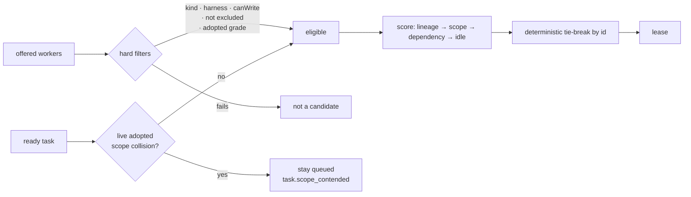

# ADR 0079: Routing prefers the worker that already holds the context

Status: accepted (2026-08-07). Refines the selection step of
[ADR 0019](0019-runner-pull-worker-execution.md) (runner pull execution) and
consumes the adopted-worker grades from
[ADR 0078](0078-adopted-workers.md). Verification independence
([ADR 0019](0019-runner-pull-worker-execution.md)) is unchanged and remains a
hard filter that preference can never override.

## Context

Both selection paths pick the first structurally capable worker.
`StaticWorkerRouter.select` returns `candidates[0]`; `leaseReadyTask` returns
`workers.find(isCapable)`. Capability is `kinds.includes(task.kind)`, an optional
`preferredHarness`, and `canWrite`. Nothing else is consulted.

That is adequate while the fleet is four fixed descriptors doing one mission, and
wrong the moment either grows. Three specific costs:

Retrying a failed task hands it to whichever descriptor sorts first, which is
frequently not the worker that just spent an attempt learning the failure. A
task that depends on a completed task is routed with no reference to who did the
dependency, so context that exists in a live session is discarded and rebuilt.
And selection is entirely blind to load: `codex-implementer` is chosen for every
implementation task whether it is idle or already running three, while a capable
peer sits unused.

Adoption ([ADR 0078](0078-adopted-workers.md)) makes the blindness unsafe rather
than merely wasteful. Plan-time validation already refuses parallel tasks with
overlapping write scopes (`parallel_write_scope_overlap`), but an adopted
worker's declared scope was never in any plan, so no plan-time check can see it.
Leasing a planned task whose scope collides with a live adopted worker would
break the one-writer-per-path invariant at runtime, in the one case the existing
validator structurally cannot catch.

## Decision

Selection becomes a hard filter, then a deterministic score. One implementation
serves both paths.

- **Hard filters keep their meaning and gain one.** Capability kinds,
  `preferredHarness`, `canWrite`, and the verification-independence exclusion set
  are unchanged. Added: an adopted worker is a candidate only at grade
  `directed`, and never for `verification` or `review` kinds
  ([ADR 0078](0078-adopted-workers.md)). No preference score can promote a worker
  that failed a hard filter — this is why affinity cannot erode verification
  independence.

- **Live adopted write scope blocks the lease, not the worker.** Before a ready
  task is offered to anyone, its write scope is checked against the declared
  scope of every live `directed` adoption using the existing
  `scopePatternsOverlap` predicate. An overlap leaves the task queued and emits
  `task.scope_contended` once per episode, matching the shape
  `task.verification_starved` already established for pull-path starvation. The
  task recovers silently when the adoption ends. Blocking the task rather than
  filtering the worker is deliberate: the collision is with the _path_, so
  routing around it to a different worker would still produce two writers.

- **Score is ordered, small, and explainable.** In descending weight: the worker
  ran a previous attempt of this exact task; the worker holds a recently settled
  assignment whose write scope overlaps this task's; the worker completed a task
  this one `dependsOn`; the worker currently has no live assignment. The first
  three are warmth, the fourth is load. Warmth outranks load because rebuilding
  context costs more than waiting for a lane.

- **Adoption is a penalty larger than every warmth signal combined.** A spawned
  worker always beats an adopted one when both are eligible. Adoption is a
  fallback, not a preference: an adopted worker runs in an environment the
  runner never built and drags a mandatory external verification behind it, so
  borrowing one while an owned worker is free is a strictly worse trade. The
  case where an adopted worker _must_ be used — it holds the write scope — is
  the hard filter above, not something the score is asked to express. Without
  this the tie-break alone would hand ordinary work to adopted capacity purely
  on alphabetical luck.

- **Ties break lexicographically by worker id.** The repository's evidence
  contracts assume byte-identical reruns; a scheduler that resolved ties by map
  order or wall clock would make identical missions produce different receipts.
  Every score input is drawn from the mission's own event-derived state, so the
  same log yields the same choice.

- **Recency is bounded by settled assignments, not by clock windows.** "Recently
  settled" means the assignment appears in this mission's runtime state, not that
  it happened within N minutes. A time window would make selection depend on how
  long the operator paused between tasks.

## Options weighed

- **Leave selection first-match and solve routing in the captain's prompt** —
  rejected. Worker choice is a scheduler concern with a deterministic-evidence
  obligation; moving it into model text makes it unreproducible and untestable,
  and the captain does not see live lane occupancy at all.
- **Full cost-based scheduling (queue depth, historical latency, token spend)** —
  rejected as premature. It needs metrics the event store does not yet project,
  and it would make the scheduler's behavior depend on history outside the
  current mission log, breaking replay determinism for a benefit no current
  mission shape needs.
- **Sticky sessions (a task lineage pins to its first worker permanently)** —
  rejected. It is affinity without an escape hatch: a wedged worker would hold
  its lineage forever, and the retry path exists precisely to change something.
  Preference degrades gracefully where a pin would deadlock.
- **Filter out workers colliding on write scope instead of blocking the task** —
  rejected, as above: it silently routes around a path conflict and lets a second
  writer start.

## Consequences

- Retries and dependent tasks land on the worker that already paid for the
  context, so provider sessions are reused instead of rebuilt; this is the
  mechanism that makes "route it to the agent already on that" true rather than
  aspirational.
- The scheduler now has a queued-but-eligible state caused by an adopted worker.
  `task.scope_contended` makes it visible; without that event the mission would
  appear stalled for no recorded reason.
- Selection gains inputs, so its tests gain obligations: each score tier needs a
  case proving preference, and each hard filter needs a case proving preference
  cannot override it.
- Existing single-worker and fixed-fleet missions select exactly as before —
  with one capable candidate the score is irrelevant, so the frozen scenario's
  evidence is unaffected.
